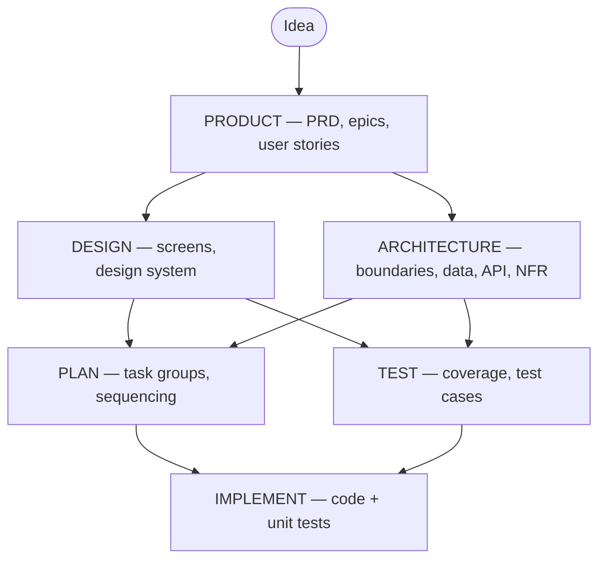
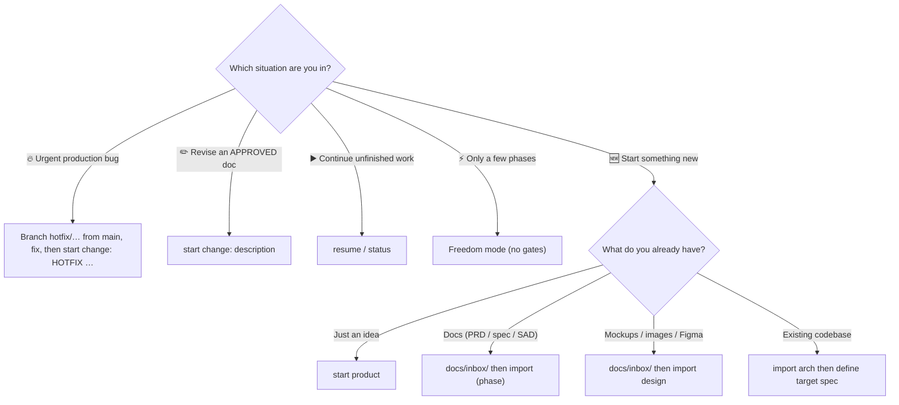
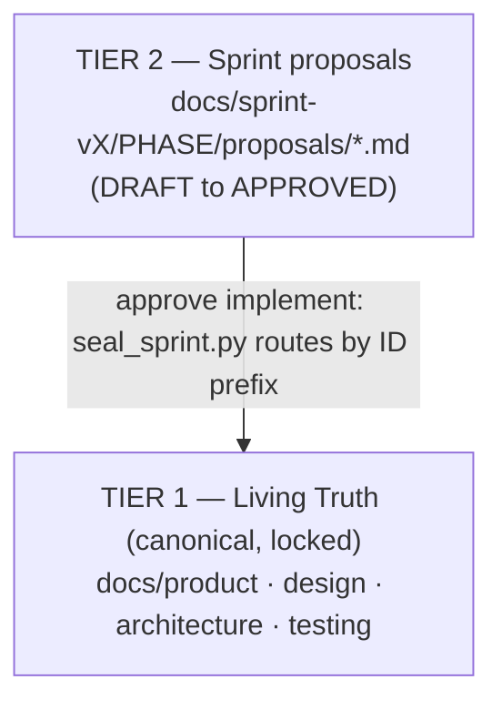

# PRISM

One phase. One prompt. One complete deliverable.

PRISM is an AI-SDLC framework you install into tools like Claude Code, GitHub Copilot, Codex, or Cursor. It helps teams move from idea to approved documents to implementation without reducing the AI to a stream of tiny tasks.

PRISM is built for both technical and non-technical contributors:
- Product and business people shape requirements.
- Designers produce design specs.
- Architects create architecture packages.
- QA defines test strategy and test cases.
- Developers plan and implement with cleaner inputs.

> Vietnamese version: [README_vi.md](README_vi.md)

---

<a id="quick-navigation"></a>
## Quick Navigation

### Start here

- [⚡ Understand PRISM In 60 Seconds](#understand-prism-in-60-seconds)
- [🧭 Where Do I Start?](#where-do-i-start) — pick your real situation
- [🔀 Choose A Mode](#choose-a-mode)
- [📦 Setup](#setup)
- [🚀 Your First 5 Minutes](#your-first-5-minutes)

### Use by scenario

- [🎯 Use PRISM By Scenario](#use-prism-by-scenario)
- [🌱 Start From A Raw Idea](#scenario-start-from-a-raw-idea)
- [📄 I Already Have Documents](#scenario-import-existing-documents)
- [🎨 I Already Have Mockups / Images](#scenario-i-already-have-mockups)
- [🏗️ I Already Have Code (Brownfield)](#scenario-i-already-have-code)
- [🔥 Hotfix — Urgent Production Bug](#scenario-hotfix)
- [✏️ Revise An Approved Document](#scenario-revise-an-approved-document)
- [🔧 Stale / Drifted Documents](#scenario-stale-docs)
- [⚡ Only A Few Phases](#scenario-partial-phases)
- [▶️ Resume Unfinished Work](#scenario-resume-work)
- [🚀 Move Into Implementation](#scenario-move-into-implementation)
- [🔄 Open The Next Sprint](#scenario-open-the-next-sprint)

### By role

- [👥 Use PRISM By Role](#use-prism-by-role)
- [Quick Role Map](#quick-role-map)

### Reference

- [🗺️ Simple Workflow](#simple-workflow)
- [📋 What Each Phase Produces](#what-each-phase-produces)
- [✅ Validate Before Approve](#validate-before-approve)
- [📐 Three Concepts To Know](#three-concepts-to-know)
- [🙋 For Non-Technical Users](#for-non-technical-users)
- [📂 Folder Structure](#folder-structure)
- [🤖 Supported AI Coding Tools](#platform-support)
- [📖 Command Reference](#command-reference)
- [❓ FAQ](#faq)
- [🔗 Need More Detail](#need-more-detail)

---

<a id="understand-prism-in-60-seconds"></a>
## ⚡ Understand PRISM In 60 Seconds

PRISM gives your AI tool a disciplined working loop:

1. You describe the outcome you want.
2. AI asks the important questions in one batch.
3. AI produces the full deliverable for that phase.
4. A human reviews and approves.
5. The next phase opens.

Instead of ten small prompts to assemble one result, PRISM aims for one strong prompt per phase.

The whole lifecycle in one picture:



The important behavior is simple:
- Product comes first.
- Design can start once Product work exists, even if Product is still DRAFT.
- `approve design` still requires `approve product`.
- Architecture still waits for Product approval.
- Plan and Test usually run in parallel.
- Implementation starts after the plan is approved.
- `approve implement` requires `test` to be approved.

Every phase requires a user-invoked audit before approval (see [Validate Before Approve](#validate-before-approve)):
- `approve product` requires `validate user story` (0 blockers).
- `approve design` requires `validate design` (0 blockers).
- `approve arch` requires `validate architecture` (0 blockers across all 3 layers).
- `approve plan` requires `validate plan` (0 blockers).
- `approve test` requires `validate test` (0 blockers).
- `approve implement` requires BOTH `validate implementation --mode spec` AND `--mode quality` (0 blockers each — running only one is not sufficient).

---

<a id="where-do-i-start"></a>
## 🧭 Where Do I Start?

This part is for newcomers. Don't read the README top to bottom — find your real situation and jump straight there.

### Decision tree



### Quick situation table

| Your situation | What you have | Start / Command | Suggested mode | Details |
|---|---|---|---|---|
| 🌱 Brand-new idea (greenfield) | Just an idea | `start product` | Guided | [↓](#scenario-start-from-a-raw-idea) |
| 📄 Existing requirements/design docs | PRD, spec, SAD files | `docs/inbox/` → `import [phase]` | Guided | [↓](#scenario-import-existing-documents) |
| 🎨 Existing mockups/images | Figma link, wireframe images | `docs/inbox/` → `import design` | Guided | [↓](#scenario-i-already-have-mockups) |
| 🏗️ Existing code (brownfield) | Running codebase | `import arch` → define target spec | Guided | [↓](#scenario-i-already-have-code) |
| 🔥 Production hotfix | Bug live in production | Branch `hotfix/…` → fix → `start change: [HOTFIX] …` | Outside phase flow | [↓](#scenario-hotfix) |
| ✏️ Revise an APPROVED doc | Approved doc needs edits | `start change: [desc]` | Guided | [↓](#scenario-revise-an-approved-document) |
| 🔧 Stale / drifted docs | Old doc no longer matches reality | `start change:` + Living Truth model | Guided | [↓](#scenario-stale-docs) |
| ⚡ Only a few phases | No need for full SDLC | Skip phases you don't need / Freedom mode | Freedom | [↓](#scenario-partial-phases) |
| ▶️ Continue unfinished work | Previous session left off | `resume` / `continue` | Either | [↓](#scenario-resume-work) |
| 🚀 Start coding | Plan approved | `start implement` | Guided | [↓](#scenario-move-into-implementation) |
| 🔄 Open the next sprint | Current sprint nearly done | `new sprint` | Guided | [↓](#scenario-open-the-next-sprint) |

> Not sure what to type? Just open your AI tool and run `status` — PRISM tells you where you are and what to do next.

---

<a id="choose-a-mode"></a>
## 🔀 Choose A Mode

Two modes — pick based on how much workflow structure you want:

| Mode | Best for | How it feels | Gates and approvals |
|---|---|---|---|
| `guided` | Teams, formal reviews, enterprise process | Explicit commands like `start product`, plus natural-language shortcuts for the same intent | Strict |
| `freedom` | Fast exploration with no workflow enforcement | Work in any phase, any order | No gates, no approval |

- Choose `guided` if you want approvals, frozen baselines, and natural-language input that still resolves to the standard commands.
- Choose `freedom` only if you intentionally want zero workflow control.

`guided` is the default. `freedom` is permanent (you cannot switch from `freedom` back to `guided`).

---

<a id="setup"></a>
## 📦 Setup

Recommended flow: unzip a private PRISM release into the root of the project where you want to use it. No npm, pip, Homebrew, or global install is required.

### 1. Put PRISM in the project

Private release install:

macOS / Linux:

```bash
cd /path/to/your-project
unzip prism-vX.Y.Z.zip
```

Windows PowerShell:

```powershell
cd C:\path\to\your-project
Expand-Archive prism-vX.Y.Z.zip -DestinationPath . -Force
```

The zip expands to `.prism/` at the project root, plus root-level `README.md`, `README_vi.md`, `diagram.xml`, and `qa-tools/` when the release includes the optional standalone tester toolkit. Open the root README first if you need setup commands before running the installer.

### 2. Run setup

macOS / Linux:

```bash
./.prism/setup.sh
```

Windows PowerShell:

```powershell
powershell -ExecutionPolicy Bypass -File .\.prism\setup.ps1
```

If you use PowerShell 7+, this also works:

```powershell
pwsh -File .\.prism\setup.ps1
```

By default, setup installs the 4 core adapters (`claude`, `copilot`, `codex`, `cursor`) and uses `guided` mode. To install all 11 platforms, pass `--platform all`. To install a single tool, pass `--platform <key>`.

Only use Freedom if you intentionally want no gates and no approvals:

```bash
./.prism/setup.sh --style freedom
```

```powershell
powershell -ExecutionPolicy Bypass -File .\.prism\setup.ps1 -Style freedom
```

If you prefer, you can also `cd .prism` and run `./setup.sh` or `.\setup.ps1` from there.

### What setup creates

- The correct adapter file at the project root for your AI tool
- `prism-config.md` at the project root for minimal project context and sprint state
- `docs/inbox/` at the project root for imported material
- `docs/sprint-v1/` at the project root for generated artifacts (with `product/`, `design/`, `architecture/`, `planning/`, `testing/`, `tempo/`, `changes/` subfolders)
- `.prism/` as the PRISM framework home (`core/`, `adapters/`, guides, installer)
- `qa-tools/sdlc-testing-skills/` as an optional standalone toolkit for external testers; PRISM core does not load it

The **15 root Living Truth files** under `/docs/{product,design,architecture,testing}/` (e.g., `product/prd.md`, `product/glossary.md`, `design/design-system.md`, `architecture/architecture.md`, `architecture/nfr.md`, `testing/test-cases.md`, etc.) and per-epic files `product/epics/EP-NNN-{slug}.md` are NOT created by setup — they're scaffolded from templates the first time `seal_sprint.py` runs (at `approve implement` on sprint-v1). See "Three Concepts To Know" below.

PRISM tools that run as Python scripts (`seal_sprint.py`, `validate_proposal.py`, `effective_truth.py`, etc.) require `pyyaml`. Install with `pip install -r .prism/requirements.txt` once after `setup.sh`.

Framework version vs project version:

- Framework release version lives in `.prism/VERSION`
- Installed version for the current project lives in project-root `prism-config.md` under `prism.version`
- `setup.sh` / `setup.ps1` writes the installed version into the project config automatically

### Upgrade an existing install

macOS / Linux:

```bash
unzip -o prism-vX.Y.Z.zip
./.prism/setup.sh --upgrade
```

Windows PowerShell:

```powershell
Expand-Archive prism-vX.Y.Z.zip -DestinationPath . -Force
powershell -ExecutionPolicy Bypass -File .\.prism\setup.ps1 -Upgrade
```

Upgrade keeps your mode, documents, and project-specific config values. It writes rollback backups to project-root `.prism-backups/` with a local `.gitignore`, moves any legacy `.prism/backups/` there, refreshes the framework files inside `.prism/`, removes stale managed `.prism` files that are no longer shipped in the new release manifest, updates the installed adapter, updates `prism.version`, and normalizes legacy installs from older releases to `guided`. PRISM prompts ignore `.prism-backups/**` unless you explicitly ask for rollback or upgrade debugging.

**What upgrade does, in detail:**

- **Version tracking** — `.prism/VERSION` is the authoritative framework version; `prism.json → version` is the manifest copy; project-root `prism-config.md → prism.version` is the version installed in your project.
- **Core files** (`core/**` — orchestrator, phase engines, templates, validators) are safe-overwritten; the next AI session picks up new behaviour automatically.
- **Adapter** (e.g. `CLAUDE.md`) — if it still matches a known PRISM version it is overwritten; if you customised it, the old copy is preserved under `.prism-backups/pre-upgrade-<date>/` and you are warned to re-add your custom rules.
- **Config** — only `prism.version` is updated; every user-filled field is preserved.
- **Mode is preserved and not switchable by upgrade** — Guided stays Guided, Freedom stays Freedom. **Freedom → Guided is not possible** (Freedom is permanent; to use Guided, start a new project with `./setup.sh`).
- **Documents are never touched** — `docs/sprint-v{X}/`, `docs/inbox/`, and any source outside the adapter and `prism-config.md` are left exactly as-is. APPROVED docs stay valid forever; DRAFTs simply get new template sections flagged (never blocked) on the next `resume` / `validate`.
- **Rollback** — restore from `.prism-backups/pre-upgrade-<date>/`; documents need no rollback.

---

<a id="your-first-5-minutes"></a>
## 🚀 Your First 5 Minutes

1. Open `prism-config.md` and fill in only the basics: project name, plus an optional one-line summary.
2. Do not pre-fill tech stack, team names, or delivery conventions. PRISM asks for those in the phase where they actually matter.
3. Open your AI tool.
4. Open [🧭 Where Do I Start?](#where-do-i-start) to pick the scenario that matches your real starting point instead of reading the README top to bottom.

A few copy-paste-ready prompts:

```text
start product
I want to define the requirements for an internal HR portal.
feedback: keep MVP to login, checkout, and order history
validate user story
approve product
status
```

---

<a id="use-prism-by-scenario"></a>
## 🎯 Use PRISM By Scenario

Each scenario below uses `guided` syntax. In `freedom`, expressing the same intent in natural language is enough.

<a id="scenario-start-from-a-raw-idea"></a>
### 🌱 Start From A Raw Idea

**When:** A brand-new project (greenfield); you only have an idea in your head.

**Steps:**
1. Open your AI tool.
2. In `guided`, run `start product` or describe the problem in plain language. In `freedom`, describe the problem, users, and outcome in plain language and PRISM will proceed without gates.
3. Answer PRISM's question batch in one pass.
4. Review the DRAFT product package, refine with `feedback: ...`, then `approve product`.
5. If UX work needs to start early, run `start design` now. The Design draft can start from the current Product draft, but `approve design` still waits for `approve product`.
6. Continue with `start arch`, or return to finalize Design after Product is approved.

<a id="scenario-import-existing-documents"></a>
### 📄 I Already Have Documents (Import)

**When:** A client/team handed you existing material — a messy Word doc, a few PDF pages, a BRD, workshop notes, or specs from Notion/Confluence.

**Steps:**
1. Put those raw documents into the `docs/inbox/` folder (supports .md, .txt, or pdf/docx if your AI tool can read them).
2. Open your AI tool.
3. Run the matching command so the AI reads and normalizes them to the PRISM standard: `import product` (POs), `import design` (UX/UI), `import arch`, `import plan`, `import test`.
4. PRISM processes your inbox documents, extracts the strong parts, flags what is weak or contradictory, and asks targeted follow-up questions.
5. Review the resulting DRAFT in `docs/sprint-v1/[phase]/`, refine with `feedback: ...`, then `approve [phase]`.

**Note:** Import **never auto-approves** — the result is always a DRAFT for you to review. See file-naming details in [Import File Naming Reference](#import-existing-documents).

<a id="scenario-i-already-have-mockups"></a>
### 🎨 I Already Have Mockups / Images

**When:** The design team already has Figma links, wireframes, prototype screenshots, or design-system material — and you want to normalize them into a delivery-ready design spec.

**Steps:**
1. Put the design sources into `docs/inbox/`: a `design.md` that describes/links the Figma, wireframe images, prototype notes, or design tokens.
2. Open your AI tool and run `import design`.
3. PRISM reads the sources, keeps what is clear, flags what is missing (states, responsiveness, accessibility...), and asks targeted follow-ups.
4. Review the DRAFT design spec, refine with `feedback design: ...`, run `validate design`, then `approve design` (after Product is approved).

**Note:** For images/Figma, describe the intent in `design.md` and attach links/paths; the ability to "read" images directly depends on the AI tool you use.

<a id="scenario-i-already-have-code"></a>
### 🏗️ I Already Have Code (Brownfield)

**When:** The project already has a running codebase and you want to bring it into the PRISM workflow.

**Steps:**
1. Use `import arch` so PRISM reads and documents the **current** architecture (put any existing SAD/ADR/diagrams/API sketches into `docs/inbox/`).
2. Run Product / Design / Architecture to define the **target spec** (desired state), not just snapshot the current state.
3. `start implement` so PRISM writes new code aligned to the approved spec.

**Note:** PRISM is a **spec-first** framework — it does not auto-extract your whole legacy codebase into docs. It builds a clear spec, then generates/changes code per the approved plan. Safety Guard still protects your existing code.

<a id="scenario-hotfix"></a>
### 🔥 Hotfix — Urgent Production Bug

**When:** A production bug needs an urgent fix. **Bug-fix only, never new features.**

**Steps:**
1. **Fix the code through your normal dev process, OUTSIDE PRISM:** create a `hotfix/{desc}` branch from `main`, fix, test (include a regression test that prevents recurrence), commit, deploy. Safety Guard + Git hygiene stay fully active.
2. **Reflect the doc impact with a change:** if the fix touches requirement / design / architecture, run `start change: [HOTFIX] <summary>` and **specify the affected sprint**. The change pack records the changed anchored items (`## Updated` / `## Removed`); they re-enter Living Truth at that sprint's seal.
3. **Sealed-sprint rule:** a change pack cannot open in an already-sealed sprint. If the latest sprint is sealed, run `new sprint` first and open the change there. The hotfix change pack **must be APPROVED before** that sprint seals.
4. If the hotfix affects architecture or API, flag it for Architect review.

<a id="scenario-revise-an-approved-document"></a>
### ✏️ Revise An Approved Document

**When:** A document is already `APPROVED` but you need to adjust it, within the same sprint, without opening a new sprint.

**Steps:**
1. Run `start change: [what changed]`.
2. PRISM creates a change pack instead of rewriting the approved base document.
3. Iterate with `feedback: ...` until the pack is correct.
4. Run `validate changes [pack-id-or-slug]` to audit the selected pack against its proposed truth.
5. Run `approve changes [pack-id-or-slug]` when the pack is ready. If only one DRAFT pack is in scope, `validate changes` and `approve changes` also work without repeating the id.

<a id="scenario-stale-docs"></a>
### 🔧 Stale / Drifted Documents

**When:** A doc was approved but has drifted from reality over time — you want to realign it while keeping traceability.

**Steps:**
1. Don't edit Living Truth files directly (the pre-commit hook blocks it). Open `start change: [the drifted part]`.
2. PRISM creates a change pack that records deltas against the right anchored items without breaking the base.
3. `validate changes`, then `approve changes`. Deltas re-enter Living Truth at sprint seal, so the change history stays traceable.

**Note:** The 2-tier Living Truth model (see [Three Concepts](#three-concepts-to-know)) is exactly what prevents silent doc drift: the canonical copy is locked, and every change flows through an audited proposal/change pack.

<a id="scenario-partial-phases"></a>
### ⚡ Only A Few Phases

**When:** You don't need all 6 phases — e.g. only Product + Architecture, or just a quick design sketch.

**Steps:**
- **Guided:** you are not required to run every phase. Just run the phases you need (e.g. `start product` → `approve product` → `start arch`). Gates only apply to the phases you actually run (e.g. `approve design` still needs `approve product`).
- **Freedom:** work in any phase, any order, no gates, no approvals. Great when you just want fast exploration.

**Note:** If you skip a phase, downstream phases run on whatever exists — weigh that trade-off.

<a id="scenario-resume-work"></a>
### ▶️ Resume Unfinished Work

**When:** A previous session was left off and you want to pick it up.

**Steps:**
1. Use `status` if you want the full current project state.
2. Use `resume` or `continue` if you want PRISM to pick up the active DRAFT or selected change pack.
3. If PRISM asks you to choose between multiple targets, reply with a phase, sprint, change-pack id, or slug.
4. Continue with `feedback: ...`, `validate [phase]`, or `approve [phase]`.

<a id="scenario-move-into-implementation"></a>
### 🚀 Move Into Implementation

**When:** The plan is approved and you are ready to write code.

**Steps:**
1. Make sure `plan` is approved.
2. Run `start implement`.
3. PRISM reads the approved implementation plan and supporting artifacts, then works on code and unit tests.
4. Implementation can start after `approve plan`, but `approve implement` still requires `approve test`.

<a id="scenario-open-the-next-sprint"></a>
### 🔄 Open The Next Sprint

**When:** The current sprint is nearly done and you want to open the next baseline.

**Steps:**
1. Approve `product` and `design` in the current sprint.
2. Make sure no DRAFT change pack is still open in that latest sprint.
3. Run `new sprint`.
4. PRISM opens the next baseline. Product, design, and architecture can start there immediately; plan, test, and implement stay gated until the previous sprint seals.

---

<a id="use-prism-by-role"></a>
## 👥 Use PRISM By Role

<a id="quick-role-map"></a>
### Quick Role Map

| Role | Start when | First move | Typical next step |
|---|---|---|---|
| PO / BA | You have a raw idea, business problem, or scope question | `start product` | Review, refine, run `validate user story`, then `approve product` |
| UX / UI | Product work has started, or you already have UX material | `start design` or `import design` | Review, refine, run `validate design`, then `approve design` once Product is approved |
| Architect | Product is approved, or you already have architecture material | `start arch` or `import arch` | Review, refine, run `validate architecture`, then `approve arch` |
| QA | You need test strategy and cases, usually after product, design, and architecture are ready | `start test` or `import test` | Review, refine, run `validate test`, then `approve test` |
| Tech Lead / Dev Lead | Design and architecture are ready and you need delivery sequencing | `start plan` or `import plan` | Review, refine, run `validate plan`, then `approve plan` (requires Delivery Traceability Index plus each task group's architecture-contract fields, code surfaces, QA intent, repo test delta, review mode, validation commands) |
| Developer | There is an approved plan and you want code plus unit tests | `start implement` | Finish work, run BOTH `validate implementation --mode spec` and `--mode quality`, then `approve implement` after testing is approved |

The flows below use explicit command syntax from `guided`. In `freedom`, you can express the same intent in natural language.

<a id="role-product-owner-and-business-analyst"></a>
### Product Owner And Business Analyst

PO / BA usually opens the first real workflow of the project and owns the business scope for the team.

Commands you will actually type:

```text
start product
import product
feedback product: keep MVP to login, checkout, and order history
validate user story
approve product
new sprint
```

- `start product`: type this when the idea is still rough and you want PRISM to interrogate users, scope, constraints, dependencies, and success metrics.
- `import product`: type this when the client already gave you a brief, BRD, workshop notes, Word doc, PDF, or Notion export in `docs/inbox/`.
- `feedback product: ...`: type this when you need to narrow scope, rewrite acceptance criteria, reprioritize stories, or clarify business rules without restarting.
- `validate user story`: type this right before approval — required audit that cross-checks every Must Have story against PRD / epics / glossary / personas. `approve product` is blocked until this returns 0 blockers on the current DRAFT.
- `approve product`: type this when the scope is stable enough for Design and Architecture to move.
- `new sprint`: usually typed by the PO / Product Lead when the current sprint is ready and you want to open the next product baseline.

<a id="role-ux-and-ui"></a>
### UX And UI

UX / UI can begin as soon as Product work exists in the current sprint, or when there is already Figma, wireframe, or UX material that needs to be normalized into a delivery-ready spec.

If Product is still `DRAFT`, Design can still move forward, but `approve design` stays blocked until Product is approved and Product-dependent assumptions are re-validated.

Commands you will actually type:

```text
start design
import design
feedback design: make onboarding three steps, mobile-first, WCAG AA
validate design
approve design
```

- `start design`: type this when you want PRISM to generate the design spec from the current Product package. If Product is still `DRAFT`, PRISM flags Product-dependent assumptions and keeps Design in `DRAFT` until Product is approved.
- `import design`: type this when you already have wireframes, Figma notes, prototype descriptions, or design-system material in `docs/inbox/`.
- `feedback design: ...`: type this when you need to adjust flows, screen states, responsiveness, accessibility, or design tokens.
- `validate design`: type this right before approval — required audit for Product fit, implementation-ready design, test-observable states, and pending Product markers.
- `approve design`: type this when the design spec is clear enough for Architecture, Planning, QA, and Development to consume, and Product is already approved.

<a id="role-architect"></a>
### Architect

Architecture owns the technical shape of the solution once Product is clear: boundaries, contracts, data, integrations, deployment, and NFR decisions.

Commands you will actually type:

```text
start arch
import arch
feedback architecture: move notifications to queue-based delivery and add retry policy
validate architecture
approve arch
```

- `start arch`: type this when you want PRISM to synthesize the architecture package from approved Product scope.
- `import arch`: type this when you already have a SAD, ADR notes, API sketches, diagrams, or infrastructure notes in `docs/inbox/`.
- `feedback architecture: ...`: type this when you need to refine component boundaries, contracts, data models, integrations, deployment shape, or performance / security budgets.
- `validate architecture`: type this right before approval — required audit across 3 layers (internal consistency, product fit, standards compliance). `approve arch` is blocked until this returns 0 blockers on the current DRAFT.
- `approve arch`: type this when the architecture package is strong enough to unblock Planning and Testing alongside approved Design.

<a id="role-qa"></a>
### QA

QA usually enters when upstream documents are clear enough for serious coverage design, or when an existing test strategy must be normalized into PRISM.

Commands you will actually type:

```text
start test
import test
feedback test: add cases for timeout, permission, retry, and rollback
validate test
approve test
start change: clarify refund rules discovered during test design
```

- `start test`: type this when you want PRISM to generate the full test plan and test cases from approved upstream inputs.
- `import test`: type this when you already have a test strategy, spreadsheet, checklist, or QA notes in `docs/inbox/`.
- `feedback test: ...`: type this when you need to tighten coverage, add missing scenarios, or rebalance manual vs automated work.
- `validate test`: type this right before approval — required audit for Coverage Traceability Index, execution-ready handoff, and implementation-consumable test cases.
- `approve test`: type this when QA artifacts are ready for the delivery team to rely on.
- `start change: ...`: type this when testing exposes a real defect in an already approved upstream document and you need a change pack instead of silent drift.

<a id="role-tech-lead-and-dev-lead"></a>
### Tech Lead And Dev Lead

Tech leads and dev leads enter when Design and Architecture are ready and the team needs execution order, release slices, and a plan that can actually ship.

Commands you will actually type:

```text
start plan
import plan
feedback plan: split release 1 into API, migration, frontend shell, and observability
validate plan
approve plan
```

- `start plan`: type this when you want PRISM to build the implementation plan from approved Product, Design, and Architecture.
- `import plan`: type this when you already have sprint notes, sequencing drafts, or rollout planning material in `docs/inbox/`.
- `feedback plan: ...`: type this when you need to restructure milestones, dependencies, sequencing, staffing assumptions, or release slices.
- `validate plan`: type this right before approval — required audit for Delivery Traceability Index, task-group field contract, sequencing, QA intent, and repo-test-delta targets.
- `approve plan`: type this when the plan is clear enough for developers to start implementation. The plan must include a Delivery Traceability Index, and each task group must declare `target_modules_packages`, `public_entrypoints_impacted`, `inherited_architecture_obligations`, `allowed_diff_boundary`, `affected_code_surfaces`, `qa_test_refs`, `repo_test_delta_target`, `review_mode`, and `validation commands to run` — `approve plan` refuses if any field is missing or if a `no test delta` line lacks substantive justification.

<a id="role-developer"></a>
### Developer

Developers enter after the plan is approved and should stay focused on code plus unit tests, not accidentally reopen business scope debates.

Commands you will actually type:

```text
start implement
feedback implement: extract the validator, add unit tests for the retry path, and simplify the service boundary
validate implementation --mode spec
validate implementation --mode quality
start change: clarify webhook retry policy from approved docs
approve implement
```

- `start implement`: type this when `plan` is approved and you want PRISM to work from the implementation plan plus supporting documents.
- `feedback implement: ...`: type this when you want targeted changes inside the current implementation lane without confusing that work with another draft or change pack.
- `validate implementation --mode spec`: type this first — does the code do what it should? Cross-checks the current code scope against Product / Design / Architecture / Plan / repo test delta. Required before `approve implement`.
- `validate implementation --mode quality`: type this after the spec mode is clean — does the code meet the quality bar? Cross-checks against coding / security / devsecops / architecture standards plus repo and maintainability rules. Also required before `approve implement`. Run spec first; spec fixes usually shift quality findings.
- `start change: ...`: type this when implementation reveals a defect or gap in approved Product, Design, Architecture, Plan, or Test and you need a tracked correction.
- `approve implement`: type this only when the implementation pass is complete, `test` is already approved, and BOTH validate modes have cleared with 0 blockers (running only one is not sufficient).

---

<a id="simple-workflow"></a>
## 🗺️ Simple Workflow

This is the default flow for `guided`. In `freedom`, you can work without gates or approvals.

```text
PRODUCT
  validate user story
  approve product

DESIGN + ARCHITECTURE
  validate design
  approve design
          ↑ new sprint available here — sprint-v2 product/design/arch can start now
  validate architecture
  approve arch

PLAN + TEST
  validate plan
  approve plan
  validate test
  approve test

IMPLEMENT
  validate implementation --mode spec
  validate implementation --mode quality
  approve implement   ← sprint seals here; sprint-v2 plan/test/implement unlocks
```

Notes:
- Design and Architecture can move in parallel.
- Design drafting can start from a Product draft; only `approve design` waits for `approve product`.
- Plan and Test can move in parallel.
- Development can start once the plan is approved.
- The implementation pass cannot close until testing is approved.
- `validate user story` / `validate architecture` / `validate implementation` are user-invoked audits gating their corresponding `approve` actions. Implement requires BOTH spec and quality modes to clear.
- `new sprint` is available once product + design are approved — even while plan, test, and implement are running.
- `plan`, `test`, and `implement` in the next sprint are gated until the current sprint seals.

---

<a id="what-each-phase-produces"></a>
## 📋 What Each Phase Produces

PRISM uses a 2-tier model with nested per-phase layout: each sprint writes split **proposal** files by Living Truth target, and `approve implement` routes each anchored item by ID prefix to the correct **Living Truth file** under `/docs/{product,design,architecture,testing}/`. The Living Truth files contain only content from sealed sprints; proposals stay in the sprint folder as the audit trail. See "Three Concepts To Know" for details.

| Phase | Sprint output (`docs/sprint-v{X}/...`) | Routes to Living Truth files (`/docs/...`) at sprint seal |
|---|---|---|
| Product | `product/sprint-brief-v{X}.md` + `product/proposals/{prd,glossary,personas,market-research}-v{X}.md` + `product/proposals/epics/EP-NNN-{slug}-v{X}.md` | `PRD-OVERVIEW-001` + `BR-NNN→product/prd.md`; `GLOSS→glossary.md`; `PERSONA→personas.md`; `MR→market-research.md`; `EP-NNN→epics/EP-NNN-{slug}.md` (new file); `FR/US/AC` with `<!-- EPIC: -->` routing tag → inside epic file |
| Design | `design/proposals/design-system-v{X}.md` | `DESIGN-OVERVIEW-001`, `SCREEN`, `DS-COMP → design/design-system.md` |
| Architecture | `architecture/sprint-brief-v{X}.md` + `architecture/proposals/{architecture,nfr,sequence,erd,adr,data-flow,api-specs,events,project-reference}-v{X}.md` | `ARCH-OVERVIEW-001`, `ARCH/ARCH-COMP→architecture.md`; `NFR→nfr.md`; `SEQ→sequence.md`; `ENT→erd.md`; `ADR→adr.md`; `FLOW→data-flow.md`; `API→api-specs.md`; `EVT→events.md`; `PR→project-reference.md` |
| Plan | `planning/implementation-plan-v{X}.md` | (sprint-only, never promotes) |
| Test | `testing/test-plan-v{X}.md` + `testing/proposals/test-cases-v{X}.md` | test-plan sprint-only; `TC-NNN → testing/test-cases.md` |
| Implement | Code changes and unit tests | (lives in repo) |

---

<a id="validate-before-approve"></a>
## ✅ Validate Before Approve

Every phase approval requires a user-invoked validate audit first. These commands are read-only against code and phase artifacts. Each run writes or updates one active validate file per command in `docs/sprint-v{X}/tempo/in-progress/`. `approve [phase]` first requires those active files to be present, clean, and fresh, then re-runs the required validate command(s) in console-only mode as a final full confirmation pass before deciding whether to approve.

| Phase | Required validate command | Blocks `approve` when |
|---|---|---|
| Product | `validate user story` | active validate file missing, stale, explicit validate still has blockers, or approval-time re-run finds new gaps |
| Design | `validate design` | active validate file missing, stale, explicit validate still has blockers, or approval-time re-run finds new gaps |
| Architecture | `validate architecture` (3 layers: internal consistency, product fit, standards compliance) | active validate file missing, stale, explicit validate still has blockers, or approval-time re-run finds new gaps |
| Plan | `validate plan` | active validate file missing, stale, explicit validate still has blockers, or approval-time re-run finds new gaps |
| Test | `validate test` | active validate file missing, stale, explicit validate still has blockers, or approval-time re-run finds new gaps |
| Implement | `validate implementation --mode spec` AND `--mode quality` (BOTH required) | either active validate file missing, either stale, either explicit validate still has blockers, or either approval-time re-run finds new gaps |

There is no separate `review [phase]` command. If you ask PRISM to review or audit a phase, it normalizes that request to the matching `validate *` command. Typical flow: draft or import → `feedback: ...` while shaping content → explicit `validate *` to create a clean active validate file → `approve`, which re-runs the required validate command(s) one more time. If that approval-time re-run finds new gaps, PRISM refuses approval, shows the findings in console, and asks whether to update the active validate file as the next checklist.

For Implement, run `--mode spec` first (does the code do what it should?), then `--mode quality` (does the code meet the quality bar?). Spec failures usually produce code or contract changes that affect quality findings.

---

<a id="three-concepts-to-know"></a>
## 📐 Three Concepts To Know

### Living Truth

Under `/docs/{product,design,architecture,testing}/` lives the project's canonical, sprint-agnostic state — **15 root LT files + N per-epic files**:

- **Product**: `prd.md`, `glossary.md`, `personas.md`, `market-research.md`, `epics/EP-NNN-{slug}.md` (one file per epic, contains epic info + FR + US + AC anchored)
- **Design**: `design-system.md`
- **Architecture**: `architecture.md`, `nfr.md`, `sequence.md`, `erd.md`, `adr.md`, `data-flow.md`, `api-specs.md`, `events.md`, `project-reference.md`
- **Testing**: `test-cases.md`

AI never writes them directly. They are updated by `seal_sprint.py`, which atomically routes each anchored item from the sprint's split proposals to the correct LT file by ID prefix at sprint seal (`approve implement`); it also regenerates each LT file's `## Index` from the anchored items (IDs preserved). New epic files are created on-demand when a proposal `## New` introduces `EP-NNN`. A pre-commit hook (`core/tools/precommit_living_truth.py`) blocks accidental direct edits.

When AI needs context for an active sprint, it reads the **effective truth** = Living Truth + APPROVED proposals from earlier unsealed sprints + the active sprint's proposals + APPROVED change-pack deltas. The composer is `core/tools/effective_truth.py`.

The 2-tier model at a glance:



### Sprint

A sprint is one versioned working cycle.

Example:
- `sprint-v1` = current baseline
- `sprint-v2` = next major baseline

A new sprint can begin once `product` and `design` are approved in the current sprint — even if `plan`, `test`, and `implement` are still running. This allows product, design, and architecture teams to start the next baseline while dev and QA finish the current one.

`plan`, `test`, and `implement` in the new sprint are gated until the previous sprint seals (`approve implement` is done).

### Change pack

If a document is already approved and you need to adjust it without creating a new sprint, use:

```text
start change: clarify checkout acceptance criteria
```

PRISM creates a branch-friendly change pack such as `docs/sprint-v1/changes/v1.3.8-clarify-checkout/` and keeps the approved base document frozen.

Validate the pack before approving it:

```text
validate changes v1.3.8-clarify-checkout
approve changes v1.3.8-clarify-checkout
```

If more than one DRAFT change pack exists, `status` still works normally, shows each pack's related phases and pack files, and PRISM asks which pack you mean before applying `resume`, `feedback:`, `validate changes`, or `approve changes`. You can answer with a sprint (`sprint-v1`), an id prefix (`v1.3.8`), or a slug (`clarify-checkout`).

---

<a id="for-non-technical-users"></a>
## 🙋 For Non-Technical Users

You can use PRISM even if you do not want to talk about code.

The easiest approach is:
- choose `guided` if you want to speak naturally but still keep approvals and structure
- start with Product or Design
- answer the AI in business language, user language, or review language
- use `feedback: ...` exactly like you would leave review comments on a document

Examples of perfectly valid prompts:
- `I want to define the requirements for an internal HR portal.`
- `Help me write the product package for a mobile loyalty app.`
- `The design should feel premium, simple, and accessible for older users.`
- `feedback: simplify the onboarding flow and reduce scope for v1.`

If PRISM asks which draft or target you mean, you can answer in plain language too: `the design one`, `implement`, `sprint-v2 product`, or simply `1` / `2` from the list it showed.

You do not need to provide technical solutions unless you want to.

---

<a id="folder-structure"></a>
## 📂 Folder Structure

After extracting a release and running `setup.sh` or `setup.ps1`, a project typically looks like this:

```text
your-project/
├── .prism/                PRISM framework files
│   ├── adapters/          platform-specific instruction files
│   ├── core/              PRISM rules and templates
│   │   ├── standards/     company engineering standards loaded per phase
│   │   └── templates/     document templates per artifact type
│   ├── docs/              PRISM guides bundled with the framework
│   ├── VERSION            framework release version source
│   ├── prism-config.md    template source kept inside the release bundle
│   ├── prism.json
│   ├── requirements.txt   Python dependencies for PRISM tools
│   ├── setup.sh           macOS / Linux installer
│   └── setup.ps1          Windows PowerShell installer
├── qa-tools/              optional standalone tools not loaded by PRISM core
│   └── sdlc-testing-skills/
│       ├── skills/        tester-facing workflows
│       └── references/    tester-facing templates and references
├── docs/                  Living Truth + sprint working files (per-phase nested layout)
│   ├── product/           Created at first sprint seal:
│   │   ├── prd.md           - Vision, BR-NNN, exec, epic index
│   │   ├── glossary.md      - GLOSS-NNN terms
│   │   ├── personas.md      - PERSONA-NNN profiles
│   │   ├── market-research.md - MR-NNN findings
│   │   └── epics/           - One file per epic (created on-demand at seal)
│   │       └── EP-NNN-{slug}.md
│   ├── design/
│   │   └── design-system.md - SCREEN-NNN, DS-COMP-NNN
│   ├── architecture/      9 LT files: architecture.md, nfr.md, sequence.md, erd.md,
│   │                        adr.md, data-flow.md, api-specs.md, events.md, project-reference.md
│   ├── testing/
│   │   └── test-cases.md   - TC-NNN with VERIFIES tag
│   ├── inbox/             import files here
│   │   └── processed/     source files moved here after import
│   └── sprint-v1/         active sprint working files
│       ├── product/       sprint-brief-v1.md + proposals/
│       ├── design/        proposals/design-system-v1.md
│       ├── architecture/  sprint-brief-v1.md + proposals/
│       ├── planning/      implementation-plan-v1.md (sprint-only)
│       ├── testing/       test-plan-v1.md + proposals/test-cases-v1.md
│       ├── tempo/         in-progress / completed working notes
│       ├── changes/       same-sprint change packs
│       └── snapshots/     nested mirrors LT — byte-for-byte clones at seal (chmod 444)
├── prism-config.md        live project config used by PRISM
├── CLAUDE.md              or AGENTS.md / .cursorrules / .github/copilot-instructions.md
└── your normal project files
```

If your project already has a `docs/` folder, PRISM only adds `docs/inbox/` and `docs/sprint-v1/`. The Living Truth tree under `docs/product/`, `docs/design/`, `docs/architecture/`, and `docs/testing/` is added the first time `seal_sprint.py` runs. PRISM does not replace the rest of your project documentation.

---

<a id="platform-support"></a>
## 🤖 Supported AI Coding Tools

PRISM ships adapters for **11 AI coding tools**. By default `setup.sh` installs the **4 core platforms** (`claude` / `copilot` / `codex` / `cursor`) — covers the majority of users without polluting projects with adapters they don't use. To install all 11, pass `--platform all`. To install a single tool, pass `--platform <key>`. Duplicate destinations (e.g. `AGENTS.md` shared by `codex` / `kiro` / `opencode` / `antigravity`) are deduped. You can re-run `setup.sh --platform <key>` later to add any of the 7 extended platforms (`gemini` / `windsurf` / `roo` / `trae` / `kiro` / `opencode` / `antigravity`).

| Tool | `--platform` key | Adapter file installed | Confirmed by |
|---|---|---|---|
| **Claude Code** | `claude` | `CLAUDE.md` | [docs.claude.com](https://docs.claude.com/en/docs/claude-code/memory) |
| **GitHub Copilot** | `copilot` | `.github/copilot-instructions.md` | [docs.github.com](https://docs.github.com/en/copilot/how-tos/configure-custom-instructions/add-repository-instructions) |
| **OpenAI Codex** | `codex` | `AGENTS.md` | [agents.md spec](https://agents.md) |
| **Cursor** | `cursor` | `.cursor/rules/prism.mdc` (`alwaysApply: true`) | [cursor.com/docs](https://cursor.com/docs/context/rules) |
| **Gemini CLI** | `gemini` | `GEMINI.md` | [geminicli.com/docs](https://geminicli.com/docs/cli/gemini-md/) |
| **Windsurf** | `windsurf` | `.windsurf/rules/prism.md` | [docs.windsurf.com](https://docs.windsurf.com/windsurf/cascade/memories) |
| **Roo Code** | `roo` | `.roo/rules/prism.md` | [docs.roocode.com](https://docs.roocode.com/features/custom-instructions) |
| **Trae** | `trae` | `.trae/rules/project_rules.md` | [docs.trae.ai](https://docs.trae.ai/ide/rules) |
| **Kiro CLI** (AWS) | `kiro` | `AGENTS.md` | [kiro.dev/docs/steering](https://kiro.dev/docs/steering/) |
| **OpenCode** | `opencode` | `AGENTS.md` | [opencode.ai/docs/rules](https://opencode.ai/docs/rules/) |
| **Antigravity** (Google) | `antigravity` | `AGENTS.md` | [Antigravity codelab](https://codelabs.developers.google.com/autonomous-ai-developer-pipelines-antigravity) |

### Notes per tool

- **AGENTS.md is shared** by `codex`, `kiro`, `opencode`, and `antigravity` (the agents.md cross-tool spec). Installing any one of them is enough — the file is deduped on write.
- **Cursor** uses the modern `.cursor/rules/*.mdc` layout with YAML frontmatter (`description`, `alwaysApply: true`). The legacy `.cursorrules` is auto-migrated to `.prism-backups/<timestamp>/.cursorrules.legacy` and removed during upgrade — Cursor's Agent mode silently ignores the legacy file.
- **Windsurf has a hard 12,000-character limit per rule file.** PRISM's guided adapter is ~31,000 chars, so Windsurf will silently truncate after ~12K. The installer prints a warning when this happens. If Windsurf is your primary tool, prefer `--style freedom` (~19,000 chars — still over but closer) or split the rule file manually.
- **Copilot's 4,000-char limit applies only to Code Review**, not to Copilot Chat. Chat uses a 64K-token context window and loads the full PRISM adapter without truncation. If you rely on Copilot Code Review, expect rules past byte 4,000 to be ignored by that surface.
- **Gemini CLI vs Antigravity** — Antigravity 2.0 (Google's 2026 agent IDE) reads `AGENTS.md` instead of `GEMINI.md`. PRISM installs both so users can switch tools without re-running setup. Gemini CLI continues to read `GEMINI.md`.
- **Kiro** supports both `.kiro/steering/*.md` (with YAML inclusion modes) and `AGENTS.md` (always-on). PRISM uses `AGENTS.md` for simplicity and cross-tool sharing.

### Installer support

- macOS / Linux: `./.prism/setup.sh`
- Windows: `.\.prism\setup.ps1` (Windows PowerShell or PowerShell 7+)
- Python 3.8+ required on PATH (used to read `adapters/platforms.json` — the declarative platform registry)

### Adding a new platform

Adding a new AI tool requires editing only one file: [`adapters/platforms.json`](adapters/platforms.json). Add an entry with `key`, `label`, `dest`, `adapter_subdir`, `guided_filename`, and `freedom_filename`. Optional fields: `legacy_dests`, `shares_dest_with`, `frontmatter` (for tools like Cursor that need YAML wrap), `size_warning_chars` (soft size limit). No edits to `setup.sh`, `setup.ps1`, or `generate_adapters.py` needed.

---

<a id="command-reference"></a>
## 📖 Command Reference

Here is the complete list of PRISM commands grouped by purpose, making it obvious *when* to use what. This part is long — expand it when you need a reference.

<details>
<summary><b>Open the full command list</b></summary>

### 1. Working on New Deliverables
| Command | When to use |
|---|---|
| `start [phase]` | To begin writing a new phase for `product`, `design`, `arch`, `plan`, `test`, or `implement`. |
| `import [phase]` | When you already have draft content in `docs/inbox/` (from Notion or written manually) and you want PRISM to standardize it. |

### 2. Editing While DRAFT
| Command | When to use |
|---|---|
| `feedback: [changes]` | When the AI generated something but you need it modified (e.g., `feedback: add a user profile section`). |

### 3. Auditing Before Approval (Validate)
| Command | When to use |
|---|---|
| `validate user story` | Required before `approve product`. Read-only audit of user stories cross-checked against PRD / epics / glossary / personas. |
| `validate design` | Required before `approve design`. Read-only audit of Product fit, implementation-ready design, test-observable states, and pending markers. |
| `validate architecture` | Required before `approve arch`. Read-only audit across 3 layers: internal consistency, product fit, standards compliance. |
| `validate plan` | Required before `approve plan`. Read-only audit of Delivery Traceability Index, task-group field contract, sequencing, QA intent, and repo-test-delta targets. |
| `validate test` | Required before `approve test`. Read-only audit of Coverage Traceability Index, execution-ready handoff, and implementation-consumable test cases. |
| `validate implementation --mode spec` | Required before `approve implement`. Does the code do what it should? Cross-checks against Product / Design / Architecture / Plan / repo test delta. |
| `validate implementation --mode quality` | Required before `approve implement`. Does the code meet the quality bar? Cross-checks against coding / security / devsecops / architecture standards plus repo and maintainability rules. |
| `validate changes [pack-id-or-slug]` | Required before `approve changes`. Audits the selected DRAFT change pack using the pack's proposed truth: base artifact + approved deltas + this pack's DRAFT delta. |

For `approve implement`, BOTH spec and quality modes must clear with 0 blockers — running only one is not sufficient.

### 4. Approving Deliverables
| Command | When to use |
|---|---|
| `approve [phase]` | When the draft is accurate and you are ready to freeze it (APPROVED) and move to the next phase. The corresponding validate result must be clean for the current phase. |

### 5. Modifying APPROVED Documents
| Command | When to use |
|---|---|
| `start change: [desc]` | When a phase is already `APPROVED` but requirements change. PRISM creates a *change pack* instead of destroying the base document. |
| `validate changes [pack-id-or-slug]` | When a selected change pack is ready for audit. If PRISM can resolve exactly one current DRAFT pack, the id/slug can be omitted. |
| `approve changes [pack-id-or-slug]` | When your selected change pack is complete, validated, and ready to be merged into the effective truth. If PRISM can resolve exactly one current DRAFT pack, the id/slug can be omitted. |

### 6. Versioning
| Command | When to use |
|---|---|
| `new sprint` | When starting the next major baseline structure (`sprint-v2`, `sprint-v3`, etc.). |
| `diff [phase]` | When you want to see how the current phase differs from the previous sprint. |

### 7. Session Management
| Command | When to use |
|---|---|
| `status` | When you first open your machine, or you've lost track of the active target, DRAFT change packs, the phases/files touched by those packs, sprint states, phase output files, blockers, and the next suggested step. |
| `resume` / `continue` | When continuing work you left unfinished in a previous session. |

### Change-Pack Targeting

When only one active target exists, PRISM works directly. If that single target is a DRAFT change pack, `resume`, `feedback:`, `validate changes`, and `approve changes` work on it without asking again.

If the current session already has one selected target and no unrelated target competes with it, PRISM reuses that target automatically.

When more than one DRAFT change pack exists, PRISM asks which one you mean. You can answer with any of these forms:

| Command / Reply | Meaning |
|---|---|
| `resume v1.3.8` | Continue the pack whose id starts with `v1.3.8` |
| `validate changes v1.3.8` | Validate the selected pack by id prefix |
| `approve changes v1.3.8` | Approve the selected pack by id prefix |
| `resume in sprint-v1` | Continue the relevant DRAFT work in `sprint-v1` |
| `resume fix-payment` | Continue the pack by slug |
| `validate changes fix-payment` | Validate the selected pack by slug |
| `approve changes fix-payment` | Approve the selected pack by slug |

### Feedback Targeting

`feedback:` must resolve to exactly one target.

PRISM applies feedback directly only when the target is obvious:
- the command names it explicitly
- the current session already has one sticky active target and no unrelated target competes with it
- or there is exactly one plausible active target in scope

If your message could reasonably affect more than one unrelated target, PRISM asks you to clarify first and does not guess.

Common examples:

| Command / Reply | Meaning |
|---|---|
| `feedback implement: split the validator and rename the service` | Apply feedback to the current implementation lane |
| `feedback plan: break milestone 2 into two releases` | Apply feedback to the active Plan draft |
| `feedback sprint-v2 product: reduce scope for v2` | Apply feedback to Product in `sprint-v2` |
| `feedback v1.3.8: narrow this pack to checkout only` | Apply feedback to the change pack whose id starts with `v1.3.8` |
| `feedback 2: keep only the risk-based cases` | Apply feedback to option 2 from PRISM's ambiguity prompt |

If PRISM is mid-implementation but an open draft or change pack is also a plausible target, plain `feedback: ...` triggers a clarification prompt. In that case, reply with a phase, `implement`, a sprint + phase, a pack id / slug, or the number PRISM showed.

### Common Examples

| Example | What happens |
|---|---|
| `start product` | Start Product phase |
| `start change: clarify checkout acceptance criteria` | Open a change pack in the current or explicit sprint |
| `feedback: tighten the acceptance criteria and reduce scope` | Revise the resolved active target; if more than one plausible target exists, PRISM asks first |
| `feedback: fix the API contract, approve arch` | Apply feedback, show diff, approve if the change is small and safe |
| `validate design` | Audit the Design draft without editing it |
| `validate changes v1.3.8-clarify-checkout` | Audit a DRAFT change pack before `approve changes` |
| `status` | Show the standard status block: active target, DRAFT change packs with related phases/files, sprint states with phase output files, blockers, and next step |
| `resume v2.7.2` | Continue a specific change pack |
| `new sprint` | Open the next sprint when its guard conditions pass |

</details>

You do not need to memorize all of these on day one. Most teams start with only:
- `start product`
- `feedback: ...`
- `approve product`
- `status`
- `resume`

In `freedom` mode, you will usually skip `approve ...` commands.

<a id="import-existing-documents"></a>
### Import File Naming Reference

PRISM supports teams who already have material. The basic pattern is simple: put files into `docs/inbox/`, then run `import [phase]`.

Common imports:

| Phase | Put these in `docs/inbox/` |
|---|---|
| Product | `product.md`, optionally `epics.md`, `user-stories.md`, `glossary.md`, `personas.md`, `market-research.md` |
| Design | `design.md`, optionally `design-system.md`, `wireframes.md`, `user-flows.md`, `prototype.md` |
| Architecture | `architecture.md` or `sad.md`, optionally `sequence.md`, `erd.md`, `adr.md`, `data-flow.md`, `api-specs.md`, `events.md`, `nfr.md` |
| Plan | `implementation-plan.md` |
| Test | `test-plan.md`, `test-cases.md` |

PRISM will audit what you provided against the phase standard, keep what is already strong, normalize what can be safely cleaned up, surface what is missing, unclear, conflicting, redundant, or still below the quality bar, ask only the targeted follow-up questions that remain, and save the synthesized result as DRAFT.

---

<a id="faq"></a>
## ❓ FAQ

**Does PRISM force me to do all 6 phases?**
No. In `guided`, you only run the phases you need; gates apply only to the phases you actually run (e.g. `approve design` needs `approve product`). In `freedom`, you work in any phase, any order, with no gates. See [Only A Few Phases](#scenario-partial-phases).

**I already have docs / images / code — how do I start?**
Docs → `import [phase]`; mockups → `import design`; existing code → `import arch` then define the target spec. See the matching scenarios in [Where Do I Start?](#where-do-i-start).

**There's an urgent production bug — how do I use PRISM?**
Fix the code on a `hotfix/…` branch through your normal dev process (outside PRISM), then reflect the doc impact with `start change: [HOTFIX] …`. See [Hotfix](#scenario-hotfix).

**What if I accidentally edit a Living Truth file directly?**
The pre-commit hook (`precommit_living_truth.py`) blocks it. Every change must flow through a sprint proposal or change pack — that's how PRISM prevents doc drift. See [Stale / Drifted Documents](#scenario-stale-docs).

**Does import auto-approve documents?**
No. Import always produces a DRAFT for you to review, refine with `feedback:`, then `validate` + `approve`.

**Can I switch from `guided` to `freedom`?**
You can choose `freedom` at setup, but `freedom` is **permanent** (no switching back to `guided`).

**I installed one tool — can I later use another?**
Usually without re-running setup (duplicate destinations like `AGENTS.md` are deduped). To add a new tool: `./.prism/setup.sh --platform <key>`.

**I don't see the Living Truth files in `docs/` yet.**
That's normal — the 15 root LT files + per-epic files are only created the first time sprint-v1 seals (`approve implement`).

**Lost track of where you are?**
Type `status` to see the active target, DRAFT change packs, sprint states, blockers, and the next step.

---

<a id="need-more-detail"></a>
## 🔗 Need More Detail?

Start here only if you want the deeper rules:
- `.prism/docs/freedom-guide.md`
- `.prism/core/orchestrator.md`
- `.prism/core/import-validator.md`
- `.prism/core/safety-guard.md`

For most users, this README and the setup script for their OS are enough to get started.
