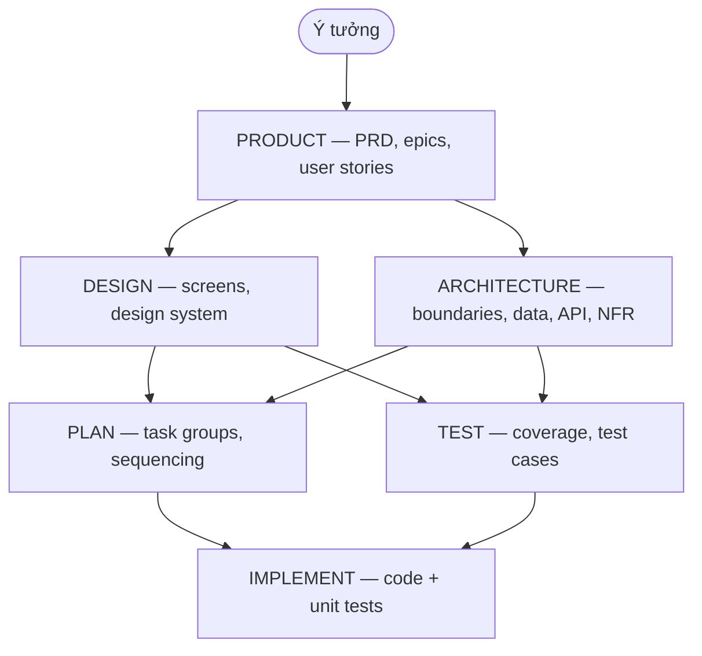
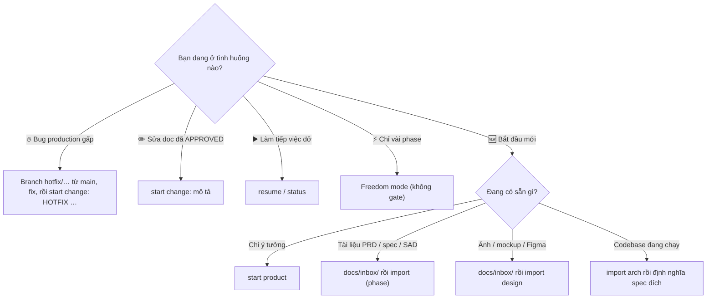
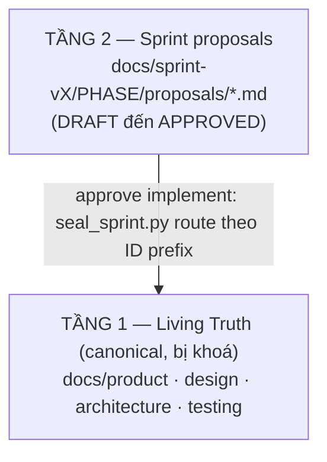

# PRISM

Một phase. Một prompt. Một deliverable hoàn chỉnh.

PRISM là framework AI-SDLC được cài vào các tool như Claude Code, GitHub Copilot, Codex hoặc Cursor. Nó giúp team đi từ ý tưởng, sang tài liệu đã duyệt, rồi đến triển khai mà không biến AI thành công cụ xử lý từng việc lặt vặt.

PRISM phù hợp cho cả người technical lẫn non-technical:
- PO / BA dùng để làm rõ requirements.
- UX / UI dùng để tạo design spec.
- Architect dùng để tạo architecture package.
- QA dùng để xây test strategy và test cases.
- Developer dùng để lập plan và triển khai với đầu vào rõ ràng hơn.

> English version: [README.md](README.md)

---

<a id="dieu-huong-nhanh"></a>
## Điều Hướng Nhanh

### Bắt đầu ở đây

- [⚡ Hiểu PRISM Trong 60 Giây](#hieu-prism-60-giay)
- [🧭 Bắt Đầu Từ Đâu?](#bat-dau-tu-dau) — chọn đúng tình huống của bạn
- [🔀 Chọn Mode Nào](#chon-mode-nao)
- [📦 Cài Đặt](#cai-dat)
- [🚀 5 Phút Đầu Tiên](#nam-phut-dau-tien)

### Dùng theo tình huống

- [🎯 Dùng PRISM Theo Tình Huống](#dung-prism-theo-tinh-huong)
- [🌱 Bắt Đầu Từ Ý Tưởng Thô](#scenario-y-tuong-tho)
- [📄 Đã Có Sẵn Tài Liệu](#scenario-co-tai-lieu)
- [🎨 Đã Có Sẵn Ảnh / Mockup](#scenario-co-mockup)
- [🏗️ Đã Có Sẵn Code (Brownfield)](#scenario-co-code)
- [🔥 Hotfix — Bug Production Gấp](#scenario-hotfix)
- [✏️ Sửa Tài Liệu Đã Approve](#scenario-sua-tai-lieu)
- [🔧 Tài Liệu Bị Lỗi Thời / Lệch Thực Tế](#scenario-drift)
- [⚡ Chỉ Muốn Chạy Một Vài Phase](#scenario-partial)
- [▶️ Tiếp Tục Việc Đang Dở](#scenario-tiep-tuc)
- [🚀 Đi Vào Giai Đoạn Implement](#scenario-implement)
- [🔄 Mở Sprint Mới](#scenario-sprint-moi)

### Theo vai trò

- [👥 Dùng PRISM Theo Vai Trò](#dung-prism-theo-vai-tro)
- [Bản Đồ Vai Trò Nhanh](#ban-do-vai-tro-nhanh)

### Tra cứu

- [🗺️ Workflow Đơn Giản](#workflow-don-gian)
- [📋 Mỗi Phase Sinh Ra Gì](#moi-phase-sinh-ra-gi)
- [✅ Validate Trước Khi Approve](#validate-truoc-khi-approve)
- [📐 Ba Khái Niệm Cần Biết](#ba-khai-niem-can-biet)
- [🙋 Dành Cho Người Không Technical](#danh-cho-nguoi-khong-technical)
- [📂 Cấu Trúc Thư Mục](#cau-truc-thu-muc)
- [🤖 Hỗ Trợ AI Coding Tools](#ho-tro-platform)
- [📖 Danh Sách Lệnh](#danh-sach-lenh)
- [❓ FAQ](#faq)
- [🔗 Muốn Đào Sâu Hơn](#muon-dao-sau-hon)

---

<a id="hieu-prism-60-giay"></a>
## ⚡ Hiểu PRISM Trong 60 Giây

PRISM cho AI một vòng làm việc rất rõ:

1. Bạn mô tả outcome mình cần.
2. AI hỏi toàn bộ câu hỏi quan trọng trong một lượt.
3. AI tạo ra deliverable đầy đủ cho phase đó.
4. Con người review và approve.
5. Phase tiếp theo được mở.

Thay vì phải ghép 10 prompt nhỏ để ra 1 kết quả, PRISM hướng đến 1 prompt mạnh cho mỗi phase.

Toàn bộ vòng đời rút gọn trong một hình:



Logic chính rất đơn giản:
- Product đi trước.
- Design có thể bắt đầu ngay khi Product đã có draft, kể cả khi Product chưa approve.
- `approve design` vẫn yêu cầu `approve product` trước.
- Architecture vẫn chờ Product được approve.
- Plan và Test thường chạy song song.
- Implement bắt đầu sau khi plan được approve.
- `approve implement` yêu cầu `test` đã được approve.

Mọi phase đều yêu cầu một bước audit do user chủ động chạy trước khi approve (xem [Validate Trước Khi Approve](#validate-truoc-khi-approve)):
- `approve product` yêu cầu `validate user story` (0 blockers).
- `approve design` yêu cầu `validate design` (0 blockers).
- `approve arch` yêu cầu `validate architecture` (0 blockers ở cả 3 layers).
- `approve plan` yêu cầu `validate plan` (0 blockers).
- `approve test` yêu cầu `validate test` (0 blockers).
- `approve implement` yêu cầu CẢ HAI `validate implementation --mode spec` VÀ `--mode quality` (mỗi mode 0 blockers — chạy 1 mode là chưa đủ).

---

<a id="bat-dau-tu-dau"></a>
## 🧭 Bắt Đầu Từ Đâu?

Đây là phần dành cho người mới. Đừng đọc README từ trên xuống — hãy tìm đúng tình huống của bạn rồi nhảy thẳng tới đó.

### Cây quyết định



### Bảng tra nhanh tình huống

| Tình huống của bạn | Bạn đang có | Bắt đầu / Lệnh | Mode gợi ý | Chi tiết |
|---|---|---|---|---|
| 🌱 Ý tưởng mới tinh (greenfield) | Chỉ ý tưởng | `start product` | Guided | [↓](#scenario-y-tuong-tho) |
| 📄 Đã có tài liệu yêu cầu/thiết kế | File PRD, spec, SAD | `docs/inbox/` → `import [phase]` | Guided | [↓](#scenario-co-tai-lieu) |
| 🎨 Đã có ảnh / mockup | Figma link, ảnh wireframe | `docs/inbox/` → `import design` | Guided | [↓](#scenario-co-mockup) |
| 🏗️ Đã có code sẵn (brownfield) | Codebase đang chạy | `import arch` → định nghĩa spec đích | Guided | [↓](#scenario-co-code) |
| 🔥 Hotfix production | Bug đang chạy trên prod | Branch `hotfix/…` → fix → `start change: [HOTFIX] …` | Ngoài luồng phase | [↓](#scenario-hotfix) |
| ✏️ Sửa tài liệu đã APPROVED | Doc đã chốt cần chỉnh | `start change: [mô tả]` | Guided | [↓](#scenario-sua-tai-lieu) |
| 🔧 Tài liệu lỗi thời / lệch | Doc cũ không khớp thực tế | `start change:` + mô hình Living Truth | Guided | [↓](#scenario-drift) |
| ⚡ Chỉ muốn chạy vài phase | Không cần full SDLC | Bỏ qua phase không cần / Freedom mode | Freedom | [↓](#scenario-partial) |
| ▶️ Tiếp tục việc đang dở | Phiên trước bỏ ngang | `resume` / `continue` | Cả hai | [↓](#scenario-tiep-tuc) |
| 🚀 Bắt đầu viết code | Plan đã approve | `start implement` | Guided | [↓](#scenario-implement) |
| 🔄 Mở sprint kế tiếp | Sprint hiện tại gần xong | `new sprint` | Guided | [↓](#scenario-sprint-moi) |

> Không chắc gõ gì? Cứ mở AI tool lên và gõ `status` — PRISM sẽ cho biết bạn đang ở đâu và nên làm gì tiếp.

---

<a id="chon-mode-nao"></a>
## 🔀 Chọn Mode Nào

Hai mode — chọn theo mức độ chặt chẽ bạn muốn:

| Mode | Phù hợp với | Cảm giác sử dụng | Gates và approvals |
|---|---|---|---|
| `guided` | Team, review chính thức, quy trình enterprise | Dùng lệnh rõ ràng như `start product`, kèm shortcut ngôn ngữ tự nhiên cho cùng ý định | Chặt |
| `freedom` | Khám phá nhanh, không muốn workflow ép buộc | Làm phase nào cũng được, theo thứ tự nào cũng được | Không có |

- Chọn `guided` nếu bạn vẫn muốn approvals, baseline được khoá, nhưng có thể nói tự nhiên thay vì nhớ đúng câu lệnh.
- Chọn `freedom` chỉ khi bạn thật sự muốn không có kiểm soát workflow.

`guided` là mặc định. `freedom` là lựa chọn vĩnh viễn (không thể chuyển ngược từ `freedom` về `guided`).

---

<a id="cai-dat"></a>
## 📦 Cài Đặt

Cách khuyến nghị: giải nén bản phát hành private của PRISM ngay tại thư mục gốc của project. Không cần npm, pip, Homebrew hay cài global.

### 1. Đưa PRISM vào project

Cài từ bản release private:

macOS / Linux:

```bash
cd /duong-dan/toi/project-cua-ban
unzip prism-vX.Y.Z.zip
```

Windows PowerShell:

```powershell
cd C:\duong-dan\toi\project-cua-ban
Expand-Archive prism-vX.Y.Z.zip -DestinationPath . -Force
```

File zip sẽ bung ra thành thư mục `.prism/` ở root project, kèm `README.md`, `README_vi.md`, `diagram.xml` ở root để xem hướng dẫn ngay, và có thêm `qa-tools/` nếu release đi kèm bộ toolkit standalone cho tester.

### 2. Chạy setup

macOS / Linux:

```bash
./.prism/setup.sh
```

Windows PowerShell:

```powershell
powershell -ExecutionPolicy Bypass -File .\.prism\setup.ps1
```

Nếu dùng PowerShell 7+, bạn cũng có thể chạy:

```powershell
pwsh -File .\.prism\setup.ps1
```

Mặc định setup cài **4 adapter core** (`claude`, `copilot`, `codex`, `cursor`) và dùng mode `guided`. Muốn cài cả 11 tool thì thêm `--platform all`; muốn đúng 1 tool thì dùng `--platform <key>` (ví dụ `--platform gemini`).

Chỉ dùng Freedom nếu bạn thật sự muốn bỏ gate và approval:

```bash
./.prism/setup.sh --style freedom
```

```powershell
powershell -ExecutionPolicy Bypass -File .\.prism\setup.ps1 -Style freedom
```

Nếu thích, bạn cũng có thể `cd .prism` rồi chạy `./setup.sh` hoặc `.\setup.ps1` từ trong đó.

### Setup sẽ tạo gì

- Adapter file đúng với AI tool của bạn ở root project
- `prism-config.md` ở root project để lưu ngữ cảnh dự án tối thiểu và trạng thái sprint
- `docs/inbox/` ở root project để bỏ tài liệu import
- `docs/sprint-v1/` ở root project để chứa artifact của sprint đầu tiên (kèm subfolder `product/`, `design/`, `architecture/`, `planning/`, `testing/`, `tempo/`, `changes/`)
- `.prism/` là nơi chứa framework PRISM (`core/`, `adapters/`, guides, installer)
- `qa-tools/sdlc-testing-skills/` là toolkit standalone tuỳ chọn cho tester ngoài PRISM; PRISM core không load thư mục này

**15 file Living Truth root** dưới `/docs/{product,design,architecture,testing}/` (vd `product/prd.md`, `product/glossary.md`, `design/design-system.md`, `architecture/architecture.md`, `architecture/nfr.md`, `testing/test-cases.md`, v.v.) cùng các file per-epic `product/epics/EP-NNN-{slug}.md` KHÔNG được setup tạo — chúng được `seal_sprint.py` scaffold từ template lần đầu chạy (lúc `approve implement` của sprint-v1). Xem "Ba Khái Niệm Cần Biết" bên dưới.

Các tool Python của PRISM (`seal_sprint.py`, `validate_proposal.py`, `effective_truth.py`, v.v.) cần `pyyaml`. Cài một lần sau `setup.sh`: `pip install -r .prism/requirements.txt`.

Phân biệt version framework và version của project đang dùng:

- Version của framework PRISM nằm trong `.prism/VERSION`
- Version đã cài cho project hiện tại nằm trong `prism-config.md` ở root project, tại `prism.version`
- `setup.sh` / `setup.ps1` sẽ tự ghi version đã cài vào project config

### Nâng cấp bản đã cài

macOS / Linux:

```bash
unzip -o prism-vX.Y.Z.zip
./.prism/setup.sh --upgrade
```

Windows PowerShell:

```powershell
Expand-Archive prism-vX.Y.Z.zip -DestinationPath . -Force
powershell -ExecutionPolicy Bypass -File .\.prism\setup.ps1 -Upgrade
```

Upgrade giữ nguyên mode, tài liệu, và các giá trị bạn đã điền trong config. Nó ghi rollback backup vào `.prism-backups/` ở root project kèm `.gitignore` riêng, move mọi legacy `.prism/backups/` sang đó, làm mới framework bên trong `.prism/`, xoá các file managed `.prism` cũ không còn nằm trong manifest của release mới, cập nhật adapter đã cài, cập nhật `prism.version`, và chuẩn hoá các bản cài legacy từ release cũ về `guided`. PRISM prompt sẽ ignore `.prism-backups/**` trừ khi bạn yêu cầu rollback hoặc debug upgrade rõ ràng.

---

<a id="nam-phut-dau-tien"></a>
## 🚀 5 Phút Đầu Tiên

1. Mở `prism-config.md` và chỉ điền phần tối thiểu: tên dự án, thêm một câu tóm tắt nếu thấy hữu ích.
2. Không cần điền trước tech stack, tên team, hay delivery conventions. PRISM sẽ hỏi chúng ở đúng phase cần dùng.
3. Mở AI tool của bạn.
4. Mở [🧭 Bắt Đầu Từ Đâu?](#bat-dau-tu-dau) để chọn đúng tình huống thực tế của bạn, thay vì đọc README theo kiểu từ trên xuống dưới.

Một số prompt mẫu copy-paste được luôn:

```text
start product
Tôi muốn định nghĩa requirements cho một cổng HR nội bộ.
feedback: chốt MVP chỉ gồm login, checkout, và order history
validate user story
approve product
status
```

---

<a id="dung-prism-theo-tinh-huong"></a>
## 🎯 Dùng PRISM Theo Tình Huống

Mỗi tình huống dưới đây dùng cú pháp `guided`. Nếu bạn đang ở `freedom`, nói cùng ý đó bằng ngôn ngữ tự nhiên là được.

<a id="scenario-y-tuong-tho"></a>
### 🌱 Bắt Đầu Từ Ý Tưởng Thô

**Khi nào:** Dự án mới hoàn toàn (greenfield), bạn chỉ có ý tưởng trong đầu.

**Các bước:**
1. Mở AI tool của bạn.
2. Với `guided`, gõ `start product` hoặc mô tả bài toán bằng ngôn ngữ tự nhiên. Với `freedom`, mô tả bài toán, người dùng, và outcome bạn muốn rồi để PRISM chạy không qua gates.
3. Trả lời trọn bộ câu hỏi của PRISM trong một lượt.
4. Review bản DRAFT product package, chỉnh bằng `feedback: ...`, rồi `approve product`.
5. Nếu muốn cho UX chạy sớm, gõ `start design` ngay. Design draft có thể đi từ Product draft hiện tại, nhưng `approve design` vẫn phải chờ `approve product`.
6. Sau đó chuyển sang `start arch`, hoặc quay lại chốt Design sau khi Product đã được approve.

<a id="scenario-co-tai-lieu"></a>
### 📄 Đã Có Sẵn Tài Liệu (Import)

**Khi nào:** Khách hàng/team đã đưa bạn tài liệu có sẵn — file Word dở dang, vài trang PDF tóm tắt yêu cầu, BRD, note workshop, hoặc spec từ Notion/Confluence.

**Các bước:**
1. Copy các tài liệu thô đó vào thư mục `docs/inbox/` (hỗ trợ .md, .txt, hoặc tuỳ AI tool có thể đọc pdf/docx).
2. Mở AI tool lên.
3. Gõ lệnh tương ứng để AI đọc và chuyển hoá theo chuẩn PRISM: `import product` (PO), `import design` (UX/UI), `import arch`, `import plan`, `import test`.
4. PRISM sẽ đọc tài liệu trong inbox, lọc ra cái đã rõ, chỉ ra cái còn thiếu/mâu thuẫn, và hỏi thêm bạn những câu trọng tâm.
5. Review bản DRAFT vừa tạo ở `docs/sprint-v1/[phase]/`, chỉnh bằng `feedback: ...`, rồi `approve [phase]`.

**Lưu ý:** Import **không bao giờ tự approve** — kết quả luôn là DRAFT để bạn review. Xem thêm quy ước đặt tên file ở mục [Import Tài Liệu Có Sẵn](#import-tai-lieu-co-san).

<a id="scenario-co-mockup"></a>
### 🎨 Đã Có Sẵn Ảnh / Mockup Thiết Kế

**Khi nào:** Team design đã có sẵn Figma link, wireframe, ảnh prototype, hoặc design-system material — bạn muốn chuẩn hoá thành design spec dùng được cho delivery.

**Các bước:**
1. Bỏ các nguồn thiết kế vào `docs/inbox/`: file `design.md` mô tả/đính link Figma, ảnh wireframe, ghi chú prototype, hoặc design tokens.
2. Mở AI tool, gõ `import design`.
3. PRISM đọc các nguồn, giữ phần đã rõ, chỉ ra phần thiếu (state, responsive, accessibility...), và hỏi thêm các điểm cần làm rõ.
4. Review bản DRAFT design spec, chỉnh bằng `feedback design: ...`, chạy `validate design`, rồi `approve design` (sau khi Product được approve).

**Lưu ý:** Với ảnh/Figma, hãy mô tả ý đồ trong `design.md` và đính link/đường dẫn ảnh; khả năng "đọc" ảnh trực tiếp tuỳ thuộc AI tool bạn dùng.

<a id="scenario-co-code"></a>
### 🏗️ Đã Có Sẵn Code (Brownfield)

**Khi nào:** Dự án đã có codebase đang chạy và bạn muốn đưa nó vào quy trình PRISM.

**Các bước:**
1. Dùng `import arch` để PRISM đọc và mô tả kiến trúc **hiện trạng** (bỏ SAD/ADR/sơ đồ/API sketch hiện có vào `docs/inbox/` nếu có).
2. Chạy Product / Design / Architecture để định nghĩa **spec đích** (trạng thái mong muốn), không chỉ chụp lại hiện trạng.
3. `start implement` để PRISM viết phần code mới bám theo spec đã approve.

**Lưu ý:** PRISM là framework **spec-first** — nó không tự "trích xuất" toàn bộ code cũ thành tài liệu. Nó lập spec rõ ràng rồi mới sinh/sửa code theo plan đã approve. Safety Guard vẫn bảo vệ code hiện có của bạn.

<a id="scenario-hotfix"></a>
### 🔥 Hotfix — Bug Production Gấp

**Khi nào:** Bug đang chạy trên production, cần fix gấp. **Chỉ sửa bug, không thêm tính năng.**

**Các bước:**
1. **Fix code theo quy trình dev của bạn, NGOÀI PRISM:** tạo branch `hotfix/{mô-tả}` từ `main`, fix, test (kèm 1 regression test chống tái diễn), commit, deploy. Safety Guard + Git hygiene vẫn áp dụng đầy đủ.
2. **Phản ánh tác động lên tài liệu bằng change:** nếu fix chạm tới requirement / design / architecture, gõ `start change: [HOTFIX] <tóm tắt>` và **chỉ rõ sprint bị ảnh hưởng**. Change pack ghi lại các anchored item bị đổi (`## Updated` / `## Removed`); chúng quay lại Living Truth khi sprint đó seal.
3. **Quy tắc sprint đã seal:** không thể mở change pack trong một sprint đã seal. Nếu sprint mới nhất đã seal, chạy `new sprint` trước rồi mở change trong đó. Change pack hotfix **phải được APPROVED trước khi** sprint đó seal.
4. Nếu hotfix ảnh hưởng architecture hoặc API, đánh dấu để Architect review.

<a id="scenario-sua-tai-lieu"></a>
### ✏️ Sửa Tài Liệu Đã Approve

**Khi nào:** Tài liệu đã `APPROVED` nhưng bạn cần điều chỉnh, trong cùng sprint mà chưa muốn mở sprint mới.

**Các bước:**
1. Gõ `start change: [mô tả thay đổi]`.
2. PRISM sẽ tạo change pack thay vì sửa đè base document đã được approve.
3. Chỉnh dần bằng `feedback: ...` cho tới khi change pack đúng ý.
4. Gõ `validate changes [pack-id-hoặc-slug]` để audit pack theo proposed truth của chính pack đó.
5. Gõ `approve changes [pack-id-hoặc-slug]` khi sẵn sàng chốt. Nếu chỉ có đúng một DRAFT pack trong scope, `validate changes` và `approve changes` cũng hoạt động mà không cần lặp lại id.

<a id="scenario-drift"></a>
### 🔧 Tài Liệu Bị Lỗi Thời / Lệch Thực Tế

**Khi nào:** Tài liệu đã approve nhưng theo thời gian không còn khớp với thực tế (drift) — bạn muốn sửa cho khớp mà vẫn giữ trace.

**Các bước:**
1. Đừng sửa thẳng file Living Truth (pre-commit hook sẽ chặn). Mở `start change: [mô tả phần lệch]`.
2. PRISM tạo change pack ghi delta vào đúng anchored item, không phá base.
3. `validate changes` rồi `approve changes`. Delta quay lại Living Truth khi sprint seal, nên lịch sử thay đổi luôn truy được.

**Lưu ý:** Chính mô hình 2-tier Living Truth (xem [Ba Khái Niệm](#ba-khai-niem-can-biet)) là thứ ngăn doc drift âm thầm: bản canonical bị khoá, mọi thay đổi đi qua proposal/change pack có audit trail.

<a id="scenario-partial"></a>
### ⚡ Chỉ Muốn Chạy Một Vài Phase

**Khi nào:** Bạn không cần đủ 6 phase — ví dụ chỉ cần Product + Architecture, hoặc chỉ muốn nháp design nhanh.

**Các bước:**
- **Guided:** bạn không bắt buộc chạy mọi phase. Cứ chạy phase bạn cần (vd `start product` → `approve product` → `start arch`). Các gate chỉ áp dụng cho những phase bạn thực sự chạy (vd `approve design` vẫn cần `approve product`).
- **Freedom:** làm bất kỳ phase nào, theo thứ tự nào, không gate, không approval. Phù hợp khi bạn chỉ muốn khám phá nhanh.

**Lưu ý:** Nếu bạn bỏ qua một phase, các phase phía sau sẽ chạy dựa trên những gì đang có — hãy cân nhắc trade-off đó.

<a id="scenario-tiep-tuc"></a>
### ▶️ Tiếp Tục Việc Đang Dở

**Khi nào:** Phiên trước bỏ ngang, hôm nay mở máy lên muốn làm tiếp.

**Các bước:**
1. Dùng `status` nếu bạn muốn xem toàn bộ trạng thái hiện tại của project.
2. Dùng `resume` hoặc `continue` nếu bạn muốn PRISM nhặt đúng draft hoặc change pack đang active.
3. Nếu PRISM yêu cầu chọn giữa nhiều target, trả lời bằng phase, sprint, id, hoặc slug của change pack.
4. Tiếp tục bằng `feedback: ...`, `validate [phase]`, hoặc `approve [phase]`.

<a id="scenario-implement"></a>
### 🚀 Đi Vào Giai Đoạn Implement

**Khi nào:** Plan đã approve, sẵn sàng viết code.

**Các bước:**
1. Đảm bảo `plan` đã được approve.
2. Gõ `start implement`.
3. PRISM sẽ đọc implementation plan đã approve cùng các tài liệu hỗ trợ, rồi tập trung vào code và unit tests.
4. Bạn có thể bắt đầu code sau `approve plan`, nhưng chỉ được đóng implement pass sau khi `approve test`.

<a id="scenario-sprint-moi"></a>
### 🔄 Mở Sprint Mới

**Khi nào:** Sprint hiện tại gần xong và bạn muốn mở baseline tiếp theo.

**Các bước:**
1. Approve `product` và `design` trong sprint hiện tại.
2. Đảm bảo sprint mới nhất đó không còn DRAFT change pack đang mở.
3. Gõ `new sprint`.
4. PRISM sẽ mở baseline tiếp theo. Product, design, và architecture của sprint mới có thể bắt đầu ngay; plan, test, và implement vẫn bị gate cho tới khi sprint trước seal.

---

<a id="dung-prism-theo-vai-tro"></a>
## 👥 Dùng PRISM Theo Vai Trò

<a id="ban-do-vai-tro-nhanh"></a>
### Bản Đồ Vai Trò Nhanh

| Vai trò | Khi nên vào | Bước đầu tiên | Sau khi approve thường làm gì |
|---|---|---|---|
| PO / BA | Khi có ý tưởng thô, business problem, hoặc cần chốt scope | `start product` | Review, chỉnh bằng `feedback: ...`, chạy `validate user story`, rồi `approve product` |
| UX / UI | Khi Product đã có draft, hoặc đã có sẵn tài liệu UX | `start design` hoặc `import design` | Review, chỉnh, chạy `validate design`, rồi `approve design` sau khi Product được approve |
| Architect | Khi product đã xong, hoặc đã có sẵn draft kiến trúc | `start arch` hoặc `import arch` | Review, chỉnh, chạy `validate architecture`, rồi `approve arch` |
| QA | Khi cần test strategy và test cases, thường sau khi upstream docs đã rõ | `start test` hoặc `import test` | Review, chỉnh, chạy `validate test`, rồi `approve test` |
| Tech Lead / Dev Lead | Khi design và architecture đã rõ và cần delivery sequencing | `start plan` hoặc `import plan` | Review, chỉnh, chạy `validate plan`, rồi `approve plan` (cần Delivery Traceability Index và mỗi task group phải khai báo đủ architecture-contract fields, code surfaces, QA intent, repo test delta, review mode, validation commands) |
| Developer | Khi đã có plan được approve và cần bắt đầu code | `start implement` | Hoàn tất implement pass, chạy CẢ HAI `validate implementation --mode spec` và `--mode quality`, rồi `approve implement` sau khi test đã được approve |

Các flow bên dưới dùng cú pháp lệnh rõ ràng của `guided`. Nếu bạn đang ở `freedom`, bạn có thể nói cùng ý đó bằng ngôn ngữ tự nhiên.

<a id="vai-tro-po-va-ba"></a>
### PO Và BA

PO / BA thường là người mở luồng thật sự đầu tiên của dự án và giữ scope business cho cả team.

Các lệnh bạn thực sự sẽ gõ:

```text
start product
import product
feedback product: chốt MVP chỉ gồm login, checkout, và order history
validate user story
approve product
new sprint
```

- `start product`: gõ khi ý tưởng còn thô và bạn muốn PRISM hỏi ngược để làm rõ user, scope, constraints, dependencies, và success metrics.
- `import product`: gõ khi khách hàng đã đưa sẵn brief, BRD, file Word, PDF, hoặc note từ workshop trong `docs/inbox/`.
- `feedback product: ...`: gõ khi cần siết scope, sửa acceptance criteria, đổi ưu tiên story, hoặc làm rõ business rule mà không phải làm lại từ đầu.
- `validate user story`: gõ ngay trước khi approve — audit bắt buộc, cross-check mỗi Must Have story với PRD / epics / glossary / personas. `approve product` sẽ bị chặn cho tới khi lệnh này trả về 0 blocker trên DRAFT hiện tại.
- `approve product`: gõ khi scope đã đủ chắc để Design và Architecture bắt đầu.
- `new sprint`: thường chính PO / Product Lead sẽ gõ khi sprint hiện tại đã đủ điều kiện và bạn muốn mở baseline sản phẩm kế tiếp.

<a id="vai-tro-ux-va-ui"></a>
### UX Và UI

UX / UI có thể vào ngay khi Product đã có work trong sprint hiện tại, hoặc khi đã có sẵn Figma, wireframe, hay UX notes cần chuẩn hoá thành spec dùng được cho team delivery.

Nếu Product vẫn đang `DRAFT`, Design vẫn có thể chạy tiếp nhưng `approve design` sẽ bị chặn cho tới khi Product được approve và các giả định phụ thuộc Product đã được validate lại.

Các lệnh bạn thực sự sẽ gõ:

```text
start design
import design
feedback design: đổi onboarding thành 3 bước, mobile-first, WCAG AA
validate design
approve design
```

- `start design`: gõ khi bạn muốn PRISM tạo design spec từ Product package hiện tại. Nếu Product vẫn đang `DRAFT`, PRISM sẽ đánh dấu các giả định phụ thuộc Product và giữ Design ở trạng thái `DRAFT` cho tới khi Product được approve.
- `import design`: gõ khi bạn đã có wireframe, Figma notes, prototype notes, hoặc design-system material trong `docs/inbox/`.
- `feedback design: ...`: gõ khi cần chỉnh flow, state, responsive behavior, accessibility, hoặc design tokens.
- `validate design`: gõ ngay trước khi approve — audit bắt buộc về độ khớp Product, readiness cho Implement, state quan sát được cho QA, và các marker phụ thuộc Product.
- `approve design`: gõ khi spec đã đủ rõ để Architect, QA, và Dev dùng tiếp, và Product đã được approve.

<a id="vai-tro-architect"></a>
### Architect

Architect giữ technical shape của solution sau khi Product đã rõ: boundaries, contracts, data, integrations, deployment, và các quyết định NFR.

Các lệnh bạn thực sự sẽ gõ:

```text
start arch
import arch
feedback architecture: chuyển notification sang queue và thêm retry policy
validate architecture
approve arch
```

- `start arch`: gõ khi bạn muốn PRISM dựng architecture package từ Product package đã approve.
- `import arch`: gõ khi đã có SAD, ADR notes, API sketches, sơ đồ, hoặc infra notes trong `docs/inbox/`.
- `feedback architecture: ...`: gõ khi cần chỉnh component boundary, contract, data model, integration rule, deployment shape, hoặc budget về hiệu năng / bảo mật.
- `validate architecture`: gõ ngay trước khi approve — audit bắt buộc qua 3 layers (internal consistency, product fit, standards compliance). `approve arch` sẽ bị chặn cho tới khi lệnh này trả về 0 blocker ở mọi layer trên DRAFT hiện tại.
- `approve arch`: gõ khi package kiến trúc đã đủ chắc để Plan và Test đi tiếp cùng với Product + Design đã approve.

<a id="vai-tro-qa"></a>
### QA

QA thường vào khi upstream docs đã đủ rõ để xây coverage nghiêm túc, hoặc khi đã có sẵn test strategy cần chuẩn hoá theo format PRISM.

Các lệnh bạn thực sự sẽ gõ:

```text
start test
import test
feedback test: thêm case cho timeout, permission, retry, và rollback
validate test
approve test
start change: làm rõ refund rule vì test design phát hiện lỗ hổng
```

- `start test`: gõ khi bạn muốn PRISM sinh đầy đủ test plan và test cases từ các tài liệu upstream đã approve.
- `import test`: gõ khi bạn đã có test strategy, spreadsheet, checklist, hoặc QA notes trong `docs/inbox/`.
- `feedback test: ...`: gõ khi cần siết coverage, thêm scenario thiếu, hoặc cân lại ranh giới manual / automation.
- `validate test`: gõ ngay trước khi approve — audit bắt buộc về Coverage Traceability Index, execution-ready handoff, và test cases đủ rõ cho Implement.
- `approve test`: gõ khi artifact QA đã đủ tin cậy để team delivery bám vào.
- `start change: ...`: gõ khi việc thiết kế test làm lộ ra lỗi thật trong tài liệu upstream đã approve và bạn cần mở change pack thay vì để doc drift.

<a id="vai-tro-tech-lead-va-dev-lead"></a>
### Tech Lead Và Dev Lead

Tech Lead / Dev Lead vào khi Design và Architecture đã đủ rõ, còn việc của bạn là biến chúng thành thứ tự triển khai, release slices, và delivery plan khả thi.

Các lệnh bạn thực sự sẽ gõ:

```text
start plan
import plan
feedback plan: tách release 1 thành API, migration, frontend shell, và observability
validate plan
approve plan
```

- `start plan`: gõ khi bạn muốn PRISM tạo implementation plan từ Product, Design, và Architecture đã approve.
- `import plan`: gõ khi đã có sprint notes, sequencing draft, hoặc rollout plan nháp trong `docs/inbox/`.
- `feedback plan: ...`: gõ khi cần chỉnh milestone, dependencies, rollout order, staffing assumptions, hoặc chia lại release slice.
- `validate plan`: gõ ngay trước khi approve — audit bắt buộc về Delivery Traceability Index, task-group field contract, sequencing, QA intent, và repo-test-delta targets.
- `approve plan`: gõ khi plan đã đủ rõ để Developer bắt đầu implement. Plan phải có Delivery Traceability Index, và mỗi task group phải khai báo đủ `target_modules_packages`, `public_entrypoints_impacted`, `inherited_architecture_obligations`, `allowed_diff_boundary`, `affected_code_surfaces`, `qa_test_refs`, `repo_test_delta_target`, `review_mode`, và `validation commands to run` — `approve plan` sẽ từ chối nếu thiếu field nào hoặc nếu dòng `no test delta` không có lý do thuyết phục.

<a id="vai-tro-developer"></a>
### Developer

Developer vào sau khi plan đã approve và nên giữ focus vào code + unit tests, không vô tình kéo cả team quay lại tranh luận scope business.

Các lệnh bạn thực sự sẽ gõ:

```text
start implement
feedback implement: tách validator, thêm unit test cho retry path, và đơn giản hoá service boundary
validate implementation --mode spec
validate implementation --mode quality
start change: làm rõ webhook retry policy trong tài liệu đã approve
approve implement
```

- `start implement`: gõ khi `plan` đã approve và bạn muốn PRISM làm việc từ implementation plan cùng các tài liệu hỗ trợ liên quan.
- `feedback implement: ...`: gõ khi bạn muốn sửa đúng implementation lane hiện tại mà không lẫn với draft hoặc change pack khác.
- `validate implementation --mode spec`: chạy mode này trước — code có làm đúng yêu cầu chưa? Cross-check code scope hiện tại với Product / Design / Architecture / Plan / repo test delta. Bắt buộc trước `approve implement`.
- `validate implementation --mode quality`: chạy mode này sau khi spec đã sạch — code có đạt chất lượng và standards chưa? Cross-check với coding / security / devsecops / architecture standards cộng repo và maintainability rules. Cũng bắt buộc trước `approve implement`. Chạy spec trước; spec fix thường kéo theo thay đổi quality.
- `start change: ...`: gõ khi lúc code bạn phát hiện Product, Design, Architecture, Plan, hoặc Test đã approve nhưng đang sai / thiếu và cần một correction có trace.
- `approve implement`: chỉ gõ khi implement pass đã hoàn tất, `test` đã được approve, và CẢ HAI mode validate đều clear với 0 blocker (chạy 1 mode là chưa đủ).

---

<a id="workflow-don-gian"></a>
## 🗺️ Workflow Đơn Giản

Đây là flow mặc định cho `guided`. Với `freedom`, bạn có thể làm việc mà không cần gates hay approvals.

```text
PRODUCT
  validate user story
  approve product

DESIGN + ARCHITECTURE
  validate design
  approve design
          ↑ new sprint có thể bắt đầu tại đây — sprint-v2 product/design/arch mở ngay
  validate architecture
  approve arch

PLAN + TEST
  validate plan
  approve plan
  validate test
  approve test

IMPLEMENT
  validate implementation --mode spec
  validate implementation --mode quality
  approve implement   ← sprint seal tại đây; sprint-v2 plan/test/implement mở khoá
```

Lưu ý:
- Design và Architecture có thể đi song song.
- Design có thể draft sớm từ Product draft; chỉ có `approve design` là phải chờ `approve product`.
- Plan và Test có thể đi song song.
- Dev có thể bắt đầu sau khi plan được approve.
- Lượt implement chỉ được đóng khi test đã approve.
- `validate user story` / `validate architecture` / `validate implementation` là các audit do user chạy, gate cho `approve` tương ứng. Implement yêu cầu CẢ HAI mode spec và quality đều clear.
- `new sprint` có thể bắt đầu ngay khi product + design được approve — kể cả khi plan, test, implement đang chạy.
- `plan`, `test`, và `implement` trong sprint mới bị gate cho đến khi sprint hiện tại seal.

---

<a id="moi-phase-sinh-ra-gi"></a>
## 📋 Mỗi Phase Sinh Ra Gì

PRISM dùng mô hình 2-tier với layout nested per-phase: mỗi sprint ghi các **proposal** tách theo từng Living Truth target, và `approve implement` sẽ route từng anchored item theo ID prefix vào file **Living Truth** đúng dưới `/docs/{product,design,architecture,testing}/`. Living Truth chỉ chứa nội dung từ các sprint đã seal; proposal vẫn nằm trong folder sprint làm audit trail. Xem "Ba Khái Niệm Cần Biết" để biết chi tiết.

| Phase | Output sprint (`docs/sprint-v{X}/...`) | Route vào Living Truth files (`/docs/...`) lúc sprint seal |
|---|---|---|
| Product | `product/sprint-brief-v{X}.md` + `product/proposals/{prd,glossary,personas,market-research}-v{X}.md` + `product/proposals/epics/EP-NNN-{slug}-v{X}.md` | `PRD-OVERVIEW-001` + `BR→product/prd.md`; `GLOSS→glossary.md`; `PERSONA→personas.md`; `MR→market-research.md`; `EP→epics/EP-NNN-{slug}.md` (file mới); `FR/US/AC` với `<!-- EPIC: -->` routing tag → vào file epic |
| Design | `design/proposals/design-system-v{X}.md` | `DESIGN-OVERVIEW-001`, `SCREEN`, `DS-COMP → design/design-system.md` |
| Architecture | `architecture/sprint-brief-v{X}.md` + `architecture/proposals/{architecture,nfr,sequence,erd,adr,data-flow,api-specs,events,project-reference}-v{X}.md` | `ARCH-OVERVIEW-001`, `ARCH/ARCH-COMP→architecture.md`; `NFR→nfr.md`; `SEQ→sequence.md`; `ENT→erd.md`; `ADR→adr.md`; `FLOW→data-flow.md`; `API→api-specs.md`; `EVT→events.md`; `PR→project-reference.md` |
| Plan | `planning/implementation-plan-v{X}.md` | (sprint-only, không promote) |
| Test | `testing/test-plan-v{X}.md` + `testing/proposals/test-cases-v{X}.md` | test-plan sprint-only; `TC-NNN → testing/test-cases.md` |
| Implement | Code changes và unit tests | (sống trong repo) |

---

<a id="validate-truoc-khi-approve"></a>
## ✅ Validate Trước Khi Approve

Mọi phase approval đều yêu cầu user chủ động chạy validate trước. Các lệnh này ở chế độ read-only đối với code và phase artifacts. Mỗi lần chạy sẽ ghi hoặc cập nhật đúng 1 active validate file cho từng command trong `docs/sprint-v{X}/tempo/in-progress/`. `approve [phase]` chỉ được bắt đầu khi các active validate file đó đang sạch và còn fresh, sau đó sẽ re-run lại các validate command bắt buộc ở chế độ chỉ hiện trên console như một lượt xác nhận cuối cùng trước khi approve.

| Phase | Lệnh validate bắt buộc | `approve` bị chặn khi |
|---|---|---|
| Product | `validate user story` | thiếu active validate file, file stale, explicit validate còn blocker, hoặc approval-time re-run phát hiện gap mới |
| Design | `validate design` | thiếu active validate file, file stale, explicit validate còn blocker, hoặc approval-time re-run phát hiện gap mới |
| Architecture | `validate architecture` (3 layers: internal consistency, product fit, standards compliance) | thiếu active validate file, file stale, explicit validate còn blocker, hoặc approval-time re-run phát hiện gap mới |
| Plan | `validate plan` | thiếu active validate file, file stale, explicit validate còn blocker, hoặc approval-time re-run phát hiện gap mới |
| Test | `validate test` | thiếu active validate file, file stale, explicit validate còn blocker, hoặc approval-time re-run phát hiện gap mới |
| Implement | `validate implementation --mode spec` VÀ `--mode quality` (BẮT BUỘC cả hai) | thiếu một active validate file, file của một mode bị stale, explicit validate của một mode còn blocker, hoặc approval-time re-run của một mode phát hiện gap mới |

Không còn command `review [phase]` riêng. Nếu bạn yêu cầu PRISM review hoặc audit một phase, PRISM sẽ normalize sang command `validate *` tương ứng. Flow điển hình: draft hoặc import → chỉnh bằng `feedback: ...` → chạy explicit `validate *` để tạo active validate file sạch → `approve`, lúc này PRISM sẽ re-run lại validate bắt buộc thêm 1 lần nữa. Nếu lượt re-run trong approve phát hiện gap mới, PRISM sẽ từ chối approve, hiện findings ở console, và hỏi user có muốn cập nhật active validate file thành checklist tiếp theo hay không.

Với Implement, chạy `--mode spec` trước (code có làm đúng yêu cầu chưa?), rồi mới `--mode quality` (code có đạt chất lượng chưa?). Spec fix thường tạo ra thay đổi code hoặc contract làm dịch chuyển kết quả quality.

---

<a id="ba-khai-niem-can-biet"></a>
## 📐 Ba Khái Niệm Cần Biết

### Living Truth

Dưới `/docs/{product,design,architecture,testing}/` là trạng thái canonical, không gắn với sprint nào của project — **15 file Living Truth root + N file per-epic**:

- **Product**: `prd.md`, `glossary.md`, `personas.md`, `market-research.md`, `epics/EP-NNN-{slug}.md` (mỗi epic 1 file, chứa epic info + FR + US + AC anchored)
- **Design**: `design-system.md`
- **Architecture**: `architecture.md`, `nfr.md`, `sequence.md`, `erd.md`, `adr.md`, `data-flow.md`, `api-specs.md`, `events.md`, `project-reference.md`
- **Testing**: `test-cases.md`

AI KHÔNG bao giờ ghi trực tiếp. Chúng được cập nhật bởi `seal_sprint.py`, atomically route từng anchored item từ các split proposal của sprint vào đúng file LT theo ID prefix tại sprint seal (`approve implement`). File epic mới được tạo on-demand khi proposal `## New` chứa `EP-NNN`. Pre-commit hook (`core/tools/precommit_living_truth.py`) chặn mọi chỉnh sửa trực tiếp.

Khi AI cần context cho một sprint đang chạy, nó đọc **effective truth** = Living Truth + các proposal APPROVED từ những sprint trước chưa seal + proposal của sprint hiện tại + các change-pack delta APPROVED. Composer là `core/tools/effective_truth.py`.

Mô hình 2 tầng minh hoạ:



### Sprint

Sprint là một vòng làm việc có version.

Ví dụ:
- `sprint-v1` = baseline hiện tại
- `sprint-v2` = baseline major tiếp theo

Sprint mới có thể bắt đầu ngay khi `product` và `design` được approve trong sprint hiện tại — kể cả khi `plan`, `test`, `implement` vẫn đang chạy. Điều này cho phép đội Product, Design, Arch bắt đầu baseline tiếp theo trong khi Dev và QA vẫn đang hoàn thiện sprint cũ.

`plan`, `test`, và `implement` trong sprint mới bị gate cho đến khi sprint trước seal (`approve implement` hoàn tất).

### Change pack

Nếu tài liệu đã approve nhưng bạn cần chỉnh trong cùng sprint mà chưa muốn mở sprint mới, dùng:

```text
start change: clarify checkout acceptance criteria
```

PRISM sẽ tạo change pack kiểu `docs/sprint-v1/changes/v1.3.8-clarify-checkout/` và giữ nguyên base document đã approve.

Validate pack trước khi approve:

```text
validate changes v1.3.8-clarify-checkout
approve changes v1.3.8-clarify-checkout
```

Nếu có nhiều change pack đang `DRAFT`, `status` vẫn chạy bình thường, sẽ hiện luôn phase/file liên quan của từng pack, và PRISM sẽ hỏi lại bạn đang muốn thao tác pack nào trước khi `resume`, `feedback:`, `validate changes`, hoặc `approve changes`. Bạn có thể trả lời bằng sprint (`sprint-v1`), id prefix (`v1.3.8`), hoặc slug (`clarify-checkout`).

---

<a id="danh-cho-nguoi-khong-technical"></a>
## 🙋 Dành Cho Người Không Technical

Bạn hoàn toàn có thể dùng PRISM mà không cần bàn sâu về code.

Cách dễ nhất là:
- chọn `guided` nếu bạn muốn nói chuyện tự nhiên nhưng vẫn giữ approvals và cấu trúc
- bắt đầu từ Product hoặc Design
- trả lời AI bằng ngôn ngữ business, user, hoặc review
- dùng `feedback: ...` như khi bạn comment trên tài liệu

Ví dụ prompt hoàn toàn hợp lệ:
- `Tôi muốn định nghĩa requirements cho một cổng HR nội bộ.`
- `Hãy giúp tôi viết product package cho một app loyalty trên mobile.`
- `Design cần cảm giác cao cấp, đơn giản, và dễ dùng cho người lớn tuổi.`
- `feedback: đơn giản hóa onboarding flow và giảm scope cho v1.`

Nếu PRISM hỏi bạn đang muốn sửa target nào, bạn có thể trả lời rất tự nhiên: `bản design`, `implement`, `sprint-v2 product`, hoặc đơn giản là `1` / `2` theo danh sách PRISM vừa hiện ra.

Bạn không cần đưa giải pháp kỹ thuật nếu không muốn.

---

<a id="cau-truc-thu-muc"></a>
## 📂 Cấu Trúc Thư Mục

Sau khi giải nén bản release và chạy `setup.sh` hoặc `setup.ps1`, project thường sẽ có dạng như sau:

```text
project-cua-ban/
├── .prism/                file framework của PRISM
│   ├── adapters/          file hướng dẫn theo từng platform
│   ├── core/              rules và templates của PRISM
│   │   ├── standards/     tiêu chuẩn kỹ thuật của công ty
│   │   └── templates/     templates cho từng loại tài liệu
│   ├── docs/              guide của PRISM đi kèm framework
│   ├── VERSION            version nguồn của framework
│   ├── prism-config.md    file template giữ lại trong gói release
│   ├── prism.json
│   ├── requirements.txt   dependency Python cho các tool PRISM
│   ├── setup.sh           installer cho macOS / Linux
│   └── setup.ps1          installer cho Windows PowerShell
├── qa-tools/              tool standalone tuỳ chọn, không được PRISM core load
│   └── sdlc-testing-skills/
│       ├── skills/        workflow dành cho tester
│       └── references/    template và tài liệu tham chiếu cho tester
├── docs/                  Living Truth + sprint working files (per-phase nested)
│   ├── product/           Tạo lúc seal sprint đầu tiên:
│   │   ├── prd.md           - Vision, BR-NNN, exec, epic index
│   │   ├── glossary.md      - GLOSS-NNN terms
│   │   ├── personas.md      - PERSONA-NNN profiles
│   │   ├── market-research.md - MR-NNN findings
│   │   └── epics/           - Mỗi epic 1 file (tạo on-demand lúc seal)
│   │       └── EP-NNN-{slug}.md
│   ├── design/
│   │   └── design-system.md - SCREEN-NNN, DS-COMP-NNN
│   ├── architecture/      9 file LT: architecture.md, nfr.md, sequence.md, erd.md,
│   │                        adr.md, data-flow.md, api-specs.md, events.md, project-reference.md
│   ├── testing/
│   │   └── test-cases.md   - TC-NNN với VERIFIES tag
│   ├── inbox/             thả file import vào đây
│   │   └── processed/     file nguồn được chuyển vào đây sau khi import
│   └── sprint-v1/         file đang làm việc của sprint hiện tại
│       ├── product/       sprint-brief-v1.md + proposals/
│       ├── design/        proposals/design-system-v1.md
│       ├── architecture/  sprint-brief-v1.md + proposals/
│       ├── planning/      implementation-plan-v1.md (sprint-only)
│       ├── testing/       test-plan-v1.md + proposals/test-cases-v1.md
│       ├── tempo/         note in-progress / completed
│       ├── changes/       change pack cùng sprint
│       └── snapshots/     nested mirrors LT — clone byte-for-byte lúc seal (chmod 444)
├── prism-config.md        file config live của project mà PRISM sẽ đọc
├── CLAUDE.md              hoặc AGENTS.md / .cursorrules / .github/copilot-instructions.md
└── các file project bình thường của bạn
```

Nếu project của bạn đã có sẵn thư mục `docs/`, PRISM chỉ thêm `docs/inbox/` và `docs/sprint-v1/`. Cây Living Truth (per-phase nested) dưới `docs/product/`, `docs/design/`, `docs/architecture/`, `docs/testing/` (gồm 15 file LT root + per-epic files) được thêm vào lần đầu `seal_sprint.py` chạy. PRISM không đè phần tài liệu khác của project.

---

<a id="ho-tro-platform"></a>
## 🤖 Hỗ Trợ AI Coding Tools

PRISM ship adapter sẵn cho **11 AI coding tools**. Mặc định `setup.sh` cài **4 tool core** (`claude`, `copilot`, `codex`, `cursor`). Thêm `--platform all` để cài cả 11; các đích trùng (vd `AGENTS.md`) được dedupe, nên bạn có thể giữ 1 tool hoặc đổi tool mà không cần chạy lại setup. Chỉ định 1 tool cụ thể bằng `--platform <key>`.

| Tool | `--platform` key | File cài | Verify từ |
|---|---|---|---|
| **Claude Code** | `claude` | `CLAUDE.md` | [docs.claude.com](https://docs.claude.com/en/docs/claude-code/memory) |
| **GitHub Copilot** | `copilot` | `.github/copilot-instructions.md` | [docs.github.com](https://docs.github.com/en/copilot/how-tos/configure-custom-instructions/add-repository-instructions) |
| **OpenAI Codex** | `codex` | `AGENTS.md` | [agents.md spec](https://agents.md) |
| **Cursor** | `cursor` | `.cursor/rules/prism.mdc` (`alwaysApply: true`) | [cursor.com/docs](https://cursor.com/docs/context/rules) |
| **Gemini CLI** | `gemini` | `GEMINI.md` | [geminicli.com/docs](https://geminicli.com/docs/cli/gemini-md/) |
| **Windsurf** | `windsurf` | `.windsurf/rules/prism.md` | [docs.windsurf.com](https://docs.windsurf.com/windsurf/cascade/memories) |
| **Roo Code** | `roo` | `.roo/rules/prism.md` | [docs.roocode.com](https://docs.roocode.com/features/custom-instructions) |
| **Trae** | `trae` | `.trae/rules/project_rules.md` | [docs.trae.ai](https://docs.trae.ai/ide/rules) |
| **Kiro CLI** (AWS) | `kiro` | `AGENTS.md` | [kiro.dev/docs/steering](https://kiro.dev/docs/steering/) |
| **OpenCode** | `opencode` | `AGENTS.md` | [opencode.ai/docs/rules](https://opencode.ai/docs/rules/) |
| **Antigravity** (Google) | `antigravity` | `AGENTS.md` | [Antigravity codelab](https://codelabs.developers.google.com/autonomous-ai-developer-pipelines-antigravity) |

### Lưu ý từng tool

- **AGENTS.md dùng chung** cho `codex`, `kiro`, `opencode`, `antigravity` (theo spec [agents.md](https://agents.md)). Cài 1 trong 4 là đủ — file được dedupe khi ghi.
- **Cursor** dùng layout hiện đại `.cursor/rules/*.mdc` kèm YAML frontmatter (`description`, `alwaysApply: true`). File legacy `.cursorrules` tự động được backup về `.prism-backups/<timestamp>/.cursorrules.legacy` rồi xoá khi upgrade — Agent mode của Cursor sẽ âm thầm bỏ qua file cũ.
- **Windsurf có giới hạn cứng 12,000 ký tự/file rule.** Adapter guided của PRISM ~31,000 ký tự nên Windsurf sẽ âm thầm cắt sau ~12K. Installer in cảnh báo khi điều này xảy ra. Nếu Windsurf là tool chính, dùng `--style freedom` (~19,000 ký tự — vẫn quá nhưng gần hơn) hoặc tự tay tách rule file.
- **Giới hạn 4,000 ký tự của Copilot chỉ áp dụng cho Code Review**, KHÔNG ảnh hưởng Copilot Chat. Chat dùng context window 64K tokens và load toàn bộ adapter PRISM không cắt. Nếu bạn dùng Copilot Code Review thì rule sau byte 4,000 sẽ bị surface đó bỏ qua.
- **Gemini CLI vs Antigravity** — Antigravity 2.0 (agent IDE 2026 của Google) đọc `AGENTS.md` thay cho `GEMINI.md`. PRISM cài cả 2 để bạn đổi tool không cần chạy lại setup. Gemini CLI vẫn đọc `GEMINI.md`.
- **Kiro** hỗ trợ cả `.kiro/steering/*.md` (kèm YAML inclusion modes) và `AGENTS.md` (luôn-on). PRISM dùng `AGENTS.md` cho đơn giản + chia sẻ cross-tool.

### Installer

- macOS / Linux: `./.prism/setup.sh`
- Windows: `.\.prism\setup.ps1` (Windows PowerShell hoặc PowerShell 7+)
- Python 3.8+ cần có trong PATH (đọc `adapters/platforms.json` — registry platform declarative)

### Thêm platform mới

Thêm 1 AI tool mới chỉ cần sửa 1 file: [`adapters/platforms.json`](adapters/platforms.json). Thêm entry với `key`, `label`, `dest`, `adapter_subdir`, `guided_filename`, `freedom_filename`. Field tuỳ chọn: `legacy_dests`, `shares_dest_with`, `frontmatter` (cho tool kiểu Cursor cần YAML wrap), `size_warning_chars` (limit mềm). Không cần sửa `setup.sh`, `setup.ps1` hay `generate_adapters.py`.

---

<a id="danh-sach-lenh"></a>
## 📖 Danh Sách Lệnh (Command Reference)

Dưới đây là toàn bộ lệnh của PRISM, chia theo từng mục đích để bạn biết *khi nào nên dùng lệnh nào*. Phần này dài — bấm để mở khi cần tra cứu.

<details>
<summary><b>Mở toàn bộ danh sách lệnh</b></summary>

### 1. Khi làm tài liệu mới
| Lệnh | Khi nào dùng |
|---|---|
| `start [phase]` | Bắt đầu viết nội dung mới cho `product`, `design`, `arch`, `plan`, `test`, hoặc `implement`. |
| `import [phase]` | Khi bạn đã có sẵn tài liệu (viết tay, từ Notion/Confluence) để ở thư mục `docs/inbox/` và muốn PRISM chuẩn hóa. |

### 2. Khi chỉnh sửa DRAFT
| Lệnh | Khi nào dùng |
|---|---|
| `feedback: [nội dung]` | Khi AI viết xong mà bạn muốn sửa đổi, thêm bớt ý (vd: `feedback: thêm mục user profile`). |

### 3. Khi audit trước khi approve (Validate)
| Lệnh | Khi nào dùng |
|---|---|
| `validate user story` | Bắt buộc trước `approve product`. Audit read-only user stories, cross-check với PRD / epics / glossary / personas. |
| `validate design` | Bắt buộc trước `approve design`. Audit read-only độ khớp Product, implementation-ready design, test-observable states, và pending markers. |
| `validate architecture` | Bắt buộc trước `approve arch`. Audit read-only qua 3 layers: internal consistency, product fit, standards compliance. |
| `validate plan` | Bắt buộc trước `approve plan`. Audit read-only Delivery Traceability Index, task-group field contract, sequencing, QA intent, và repo-test-delta targets. |
| `validate test` | Bắt buộc trước `approve test`. Audit read-only Coverage Traceability Index, execution-ready handoff, và implementation-consumable test cases. |
| `validate implementation --mode spec` | Bắt buộc trước `approve implement`. Code có làm đúng yêu cầu chưa? Cross-check với Product / Design / Architecture / Plan / repo test delta. |
| `validate implementation --mode quality` | Bắt buộc trước `approve implement`. Code có đạt chất lượng và standards chưa? Cross-check với coding / security / devsecops / architecture standards cộng repo và maintainability rules. |
| `validate changes [pack-id-hoặc-slug]` | Bắt buộc trước `approve changes`. Audit selected DRAFT change pack theo proposed truth của pack: base artifact + approved deltas + DRAFT delta của chính pack này. |

Với `approve implement`, CẢ HAI mode spec và quality phải clear với 0 blocker — chạy 1 mode là chưa đủ.

### 4. Khi chốt kết quả
| Lệnh | Khi nào dùng |
|---|---|
| `approve [phase]` | Khi tài liệu đã đúng ý và bạn muốn khoá nó lại (APPROVED) để chuyển sang phase tiếp theo. Kết quả validate của phase hiện tại phải sạch trước khi approve. |

### 5. Khi cần thay đổi tài liệu ĐÃ CHỐT cứng
| Lệnh | Khi nào dùng |
|---|---|
| `start change: [mô tả]` | Khi phase đã `APPROVED` nhưng bạn có yêu cầu mới. PRISM sẽ tạo một *change pack* (bản vá đính kèm) để không làm hỏng file gốc. |
| `validate changes [pack-id-hoặc-slug]` | Khi selected change pack đã sẵn sàng để audit. Nếu PRISM resolve được đúng một current DRAFT pack, có thể bỏ id/slug. |
| `approve changes [pack-id-hoặc-slug]` | Khi change pack đã hoàn thiện, đã validate sạch, và bạn muốn duyệt nhóm thay đổi này. Nếu PRISM resolve được đúng một current DRAFT pack, có thể bỏ id/slug. |

### 6. Khi quản lý phiên bản (Version Control)
| Lệnh | Khi nào dùng |
|---|---|
| `new sprint` | Khi chuẩn bị làm version 2, version 3 của sản phẩm. Sinh ra baseline mới. |
| `diff [phase]` | Để xem tài liệu phase hiện tại khác gì so với sprint trước đó. |

### 7. Khi quản lý phiên làm việc (Session)
| Lệnh | Khi nào dùng |
|---|---|
| `status` | Khi bạn vừa mở máy lên, hoặc quên mất active target hiện tại, các DRAFT change pack, phase/file mà pack đó đang chạm tới, trạng thái các sprint, file output của từng phase, blockers, và bước tiếp theo nên làm gì. |
| `resume` / `continue` | Khi hôm qua làm chưa xong, nay mở máy lên muốn AI làm tiếp bài cũ. |

### Chỉ Định Change Pack

Khi chỉ có một active target, PRISM sẽ chạy thẳng. Nếu target duy nhất đó là một change pack `DRAFT`, `resume`, `feedback:`, `validate changes`, và `approve changes` sẽ áp vào nó mà không cần hỏi lại.

Nếu session hiện tại đã có đúng một target đang được chọn và không có target không liên quan nào cạnh tranh với nó, PRISM sẽ tự reuse target đó.

Khi có nhiều change pack `DRAFT`, PRISM sẽ hỏi lại bạn muốn thao tác pack nào. Bạn có thể trả lời theo các dạng sau:

| Command / Reply | Ý nghĩa |
|---|---|
| `resume v1.3.8` | Tiếp tục pack có id bắt đầu bằng `v1.3.8` |
| `validate changes v1.3.8` | Validate pack theo id prefix |
| `approve changes v1.3.8` | Duyệt pack theo id prefix |
| `resume in sprint-v1` | Tiếp tục DRAFT work trong `sprint-v1` |
| `resume fix-payment` | Tiếp tục pack theo slug |
| `validate changes fix-payment` | Validate pack theo slug |
| `approve changes fix-payment` | Duyệt pack theo slug |

### Chỉ Định Target Cho `feedback:`

`feedback:` phải resolve đúng một target.

PRISM chỉ tự áp feedback khi target là hiển nhiên:
- command đã chỉ rõ target
- session hiện tại đã có một sticky active target và không có target không liên quan nào cạnh tranh với nó
- hoặc trong scope hiện tại chỉ có đúng một target hợp lý

Nếu câu chat của bạn có thể ảnh hưởng đến hơn một target không liên quan, PRISM sẽ hỏi lại để bạn chỉ rõ và sẽ không đoán.

Ví dụ thường gặp:

| Command / Reply | Ý nghĩa |
|---|---|
| `feedback implement: tách validator và đổi tên service` | Áp feedback vào implementation lane hiện tại |
| `feedback plan: tách milestone 2 thành hai release` | Áp feedback vào Plan draft đang active |
| `feedback sprint-v2 product: giảm scope cho v2` | Áp feedback vào Product của `sprint-v2` |
| `feedback v1.3.8: chỉ giữ scope checkout` | Áp feedback vào change pack có id bắt đầu bằng `v1.3.8` |
| `feedback 2: chỉ giữ các case theo risk` | Áp feedback vào lựa chọn số 2 trong prompt PRISM vừa đưa ra |

Nếu PRISM đang ở giữa implementation nhưng đồng thời còn một draft hoặc change pack khác cũng là target hợp lý, `feedback: ...` dạng thường sẽ kích hoạt prompt hỏi lại. Khi đó bạn chỉ cần trả lời bằng phase, `implement`, sprint + phase, id / slug của pack, hoặc số PRISM vừa đưa ra.

### Ví Dụ Hay Dùng

| Ví dụ | PRISM sẽ làm gì |
|---|---|
| `start product` | Bắt đầu Product phase |
| `start change: clarify checkout acceptance criteria` | Mở change pack trong sprint hiện tại hoặc sprint được chỉ định |
| `feedback: tighten the acceptance criteria and reduce scope` | Sửa active target đã resolve; nếu còn nhiều target hợp lý thì PRISM hỏi lại trước |
| `feedback: fix the API contract, approve arch` | Áp dụng feedback, show diff, approve nếu thay đổi nhỏ và an toàn |
| `validate design` | Audit Design draft mà không chỉnh sửa |
| `validate changes v1.3.8-clarify-checkout` | Audit một DRAFT change pack trước `approve changes` |
| `status` | Hiển thị block trạng thái chuẩn: active target, DRAFT change packs kèm phase/file liên quan, trạng thái sprint kèm file output của phase, blockers, và bước tiếp theo |
| `resume v2.7.2` | Tiếp tục một change pack cụ thể |
| `new sprint` | Mở sprint tiếp theo khi đủ điều kiện |

</details>

Bạn không cần nhớ tất cả ngay ngày đầu. Phần lớn team bắt đầu chỉ với:
- `start product`
- `feedback: ...`
- `approve product`
- `status`
- `resume`

Trong `freedom` mode, bạn thường sẽ không cần dùng các lệnh `approve ...`.

<a id="import-tai-lieu-co-san"></a>
### Quy Ước File Khi Import

PRISM hỗ trợ rất tốt cho trường hợp team đã có tài liệu từ trước. Mẫu chung rất đơn giản: bỏ file vào `docs/inbox/`, sau đó chạy `import [phase]`.

Các import thường gặp:

| Phase | Bỏ các file này vào `docs/inbox/` |
|---|---|
| Product | `product.md`, thêm nếu có: `epics.md`, `user-stories.md`, `glossary.md`, `personas.md`, `market-research.md` |
| Design | `design.md`, thêm nếu có: `design-system.md`, `wireframes.md`, `user-flows.md`, `prototype.md` |
| Architecture | `architecture.md` hoặc `sad.md`, thêm nếu có: `sequence.md`, `erd.md`, `adr.md`, `data-flow.md`, `api-specs.md`, `events.md`, `nfr.md` |
| Plan | `implementation-plan.md` |
| Test | `test-plan.md`, `test-cases.md` |

PRISM sẽ audit những gì bạn cung cấp theo chuẩn của phase, giữ lại phần đã tốt, chuẩn hoá phần có thể làm sạch an toàn, chỉ ra phần còn thiếu, chưa rõ, mâu thuẫn, thừa, hoặc chưa đạt mức tốt nhất theo quality bar, chỉ hỏi thêm đúng các điểm còn cần làm rõ, rồi tổng hợp kết quả cuối thành DRAFT.

---

<a id="faq"></a>
## ❓ FAQ

**PRISM có bắt tôi làm đủ 6 phase không?**
Không. Trong `guided`, bạn chỉ chạy phase mình cần; gate chỉ áp dụng cho phase bạn thực sự chạy (vd `approve design` cần `approve product`). Trong `freedom`, bạn làm bất kỳ phase nào, theo thứ tự nào, không gate. Xem [Chỉ Muốn Chạy Một Vài Phase](#scenario-partial).

**Tôi đã có tài liệu / ảnh / code sẵn thì bắt đầu thế nào?**
Tài liệu → `import [phase]`; ảnh/mockup → `import design`; code sẵn → `import arch` rồi định nghĩa spec đích. Xem các tình huống tương ứng ở [Bắt Đầu Từ Đâu?](#bat-dau-tu-dau).

**Có bug production gấp, dùng PRISM thế nào?**
Fix code trên branch `hotfix/…` theo quy trình dev bình thường (ngoài PRISM), rồi phản ánh tác động tài liệu bằng `start change: [HOTFIX] …`. Xem [Hotfix](#scenario-hotfix).

**Tôi lỡ tay sửa thẳng file Living Truth thì sao?**
Pre-commit hook (`precommit_living_truth.py`) sẽ chặn. Mọi thay đổi phải đi qua sprint proposal hoặc change pack — đó là cách PRISM chống doc drift. Xem [Tài Liệu Bị Lỗi Thời](#scenario-drift).

**Import có tự approve tài liệu không?**
Không. Import luôn cho ra bản DRAFT để bạn review, chỉnh bằng `feedback:`, rồi mới `validate` + `approve`.

**Đổi từ `guided` sang `freedom` được không?**
`guided` → `freedom` được khi setup, nhưng `freedom` là **vĩnh viễn** (không quay ngược về `guided`).

**Tôi cài cho 1 tool, sau muốn dùng tool khác?**
Phần lớn không cần chạy lại setup (các đích trùng như `AGENTS.md` được dedupe). Muốn thêm tool mới: `./.prism/setup.sh --platform <key>`.

**Chưa thấy file Living Truth trong `docs/`?**
Bình thường — 15 file LT root + file per-epic chỉ được tạo lần đầu khi sprint-v1 seal (`approve implement`).

**Quên mình đang ở đâu?**
Gõ `status` để xem active target, DRAFT change packs, trạng thái sprint, blockers, và bước tiếp theo.

---

<a id="muon-dao-sau-hon"></a>
## 🔗 Muốn Đào Sâu Hơn?

Nếu bạn muốn đọc luật chi tiết hơn, xem tiếp ở đây:
- `.prism/docs/freedom-guide.md`
- `.prism/core/orchestrator.md`
- `.prism/core/import-validator.md`
- `.prism/core/safety-guard.md`

Với đa số người dùng, README này và setup script đúng với hệ điều hành là đủ để bắt đầu.
