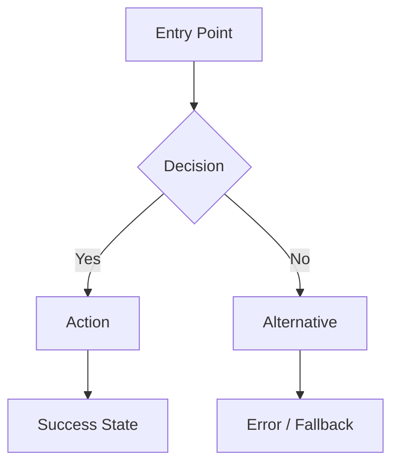

# Design Specification — {{PROJECT_NAME}}

<!-- ## Stable ID Anchor Convention (Phase 9+)
     Per-item design sections carry stable IDs (SCREEN-NNN for §4 Wireframe Descriptions,
     DS-COMP-NNN for §8 UI Component Specifications). Each is preceded by an HTML-comment anchor on its own line:
         <!-- ID: SCREEN-NNN -->
         ### Screen: Login
         ...
     Tables (§2 Screen Inventory, §5 Message Copy, etc.) remain non-anchored narrative.
     Atomic ID (all modes — Guided AND Freedom): `python .prism/core/tools/get_next_id.py --type {SCREEN|DS-COMP}`.
     NB: `DS-COMP` is split from the former `COMP` prefix to disambiguate from `ARCH-COMP` (architecture component boundaries).
     (Guided seal only) The anchors make §4 / §8 blocks mergeable by `apply_proposal.py` at sprint seal, and the
     design narrative is the singleton `DESIGN-OVERVIEW-001` block (`## New` sprint 1, `## Updated` later) — Freedom
     has no seal / no overview singleton; it still issues the IDs above and keeps the anchors. -->

<!-- PRISM:LT-SKELETON-END -->

<!-- AUTHORING NOTE (everything below this line is reference only — stripped from the Living
     Truth skeleton at bootstrap). Emit the narrative below (design principles, brand / system
     overview) as ONE anchored block `<!-- ID: DESIGN-OVERVIEW-001 -->` + `### Design Overview`
     in `design/proposals/design-system-v{X}.md` — `## New` in sprint 1, `## Updated` (replace
     in place, ID fixed) later. `SCREEN` / `DS-COMP` remain separate anchored items. -->

## 1. Design Principles & Brand Guidelines

### Design Principles

<!-- 3-5 guiding principles for all design decisions. Example: -->
<!-- 1. Clarity over cleverness — every interaction should be self-explanatory -->
<!-- 2. Consistency — same action, same result, everywhere -->
<!-- 3. Accessibility-first — inclusive design is not optional -->

### Brand Guidelines

| Element | Value | Notes |
|---------|-------|-------|
| Primary Color | `{{PRIMARY_COLOR}}` | |
| Secondary Color | `{{SECONDARY_COLOR}}` | |
| Accent Color | `{{ACCENT_COLOR}}` | |
| Error Color | `{{ERROR_COLOR}}` | |
| Typography — Headings | `{{HEADING_FONT}}` | |
| Typography — Body | `{{BODY_FONT}}` | |
| Border Radius | `{{BORDER_RADIUS}}` | |
| Spacing Unit | `{{SPACING_UNIT}}` | e.g., 4px base unit |
| Logo Usage | | Link to brand guide |

## 2. Screen Inventory

<!-- Liệt kê TẤT CẢ screens trước khi đi vào chi tiết — đây là nguồn sự thật về coverage. -->
<!-- Nếu FR-xxx không có screen nào → ghi rõ "Out of Scope sprint này" trong cột Notes. -->
<!-- Số dòng trong bảng này = số screens phải được wireframe trong §4. -->

| Screen ID | Tên Screen | URL / Route | Entry From | Exit To | Auth Required | FR liên quan | Notes |
|---|---|---|---|---|---|---|---|
| SCR-001 | <!-- VD: Login --> | <!-- /login --> | <!-- Any auth-required screen, direct URL --> | <!-- /dashboard, /checkout (redirect) --> | No | FR-001 | |
| SCR-002 | <!-- VD: Dashboard --> | <!-- /dashboard --> | <!-- Login, direct URL --> | <!-- Orders, Profile, Settings --> | Yes | FR-002, FR-003 | |
| SCR-003 | | | | | | | |

> **Assumption**: <!-- Giả định về platform / navigation pattern. VD: "Single Page App với React Router. Nếu chuyển sang SSR → cần revisit URL structure." -->  
> **Validate**: <!-- VD: "Confirm với Tech Lead trước khi wireframe." -->  
> **Change trigger**: <!-- VD: "Nếu thêm màn hình mới → cập nhật bảng này trước khi vẽ wireframe." -->

---

## 3. User Flows

<!-- One flow diagram per major feature. Use Mermaid or textual description. -->

### Flow: {{FEATURE_NAME}}

<!-- Reference: FR-xxx from PRD -->
<!-- BẮT BUỘC: Mỗi Must Have FR phải có ít nhất 1 flow. -->



**Steps:**

<!-- QUAN TRỌNG: Cột "Edge Cases" PHẢI được điền cho mỗi bước có decision point (B{Decision}). Không để trống. -->

| Step | Screen | User Action | System Response | Edge Cases |
|------|--------|------------|----------------|-----------|
| 1 | | | | <!-- VD: Session expired → redirect /login?redirect=/current-path --> |
| 2 | | | | <!-- VD: Network timeout → show retry button --> |

<!-- Repeat for each major user flow. -->

## 4. Wireframe Descriptions

<!-- Screen-by-screen description. If visual wireframes exist in Figma/Sketch, reference the link. Otherwise, describe layout in detail. -->
<!-- Mỗi screen trong Screen Inventory (§2) PHẢI có một entry tương ứng ở đây. -->

<!-- ID: SCREEN-NNN -->
### Screen: {{SCREEN_NAME}}

- **Screen ID**: SCR-xxx <!-- Ref sang §2 Screen Inventory -->
- **Purpose**: <!-- What user accomplishes on this screen -->
- **Entry**: <!-- How user arrives here -->
- **Layout**:
  - Header: <!-- Navigation, branding -->
  - Main content: <!-- Primary UI elements, their arrangement -->
  - Sidebar (if any): <!-- Secondary navigation, filters -->
  - Footer: <!-- Actions, links -->
- **Key interactions**: <!-- Buttons, forms, modals, tooltips -->
- **Exit**: <!-- Where user goes next -->

**States**

<!-- Test-observable rule: every state needs Stable identifier, Visible signal, and Exit condition. -->

#### Empty State

- Stable identifier: `data-testid="orders-empty-state"` or role/aria hook
- Visible signal: illustration + heading + CTA, or exact visible copy
- Exit condition: data appears → Populated; fetch starts → Loading
- Illustration / icon: <!-- asset description or Figma link -->
- Heading: "<!-- VD: Chưa có đơn hàng nào -->"
- Subtext: "<!-- VD: Bắt đầu mua sắm để xem đơn hàng tại đây -->"
- CTA: <!-- Button label + destination/action -->
- Distinction: <!-- empty because no data vs empty because filter returned no result -->

#### Loading State

- Stable identifier: `data-testid="orders-loading"` or `aria-busy="true"`
- Visible signal: skeleton/spinner shape, disabled controls, loading copy
- Exit condition: fetch resolved → Populated / Empty / Error
- Skeleton / spinner: <!-- e.g. 3 rows, each with circle + 2 text lines -->
- Delay threshold: <!-- e.g. show skeleton after 200ms to avoid flash -->

#### Populated State

- Stable identifier: `data-testid="orders-list"` with row hooks when applicable
- Visible signal: rows/cards/content visible, count badge, enabled filters
- Exit condition: filter returns 0 → Empty; refresh fails → Error
- Content layout: <!-- normal wireframe when data exists -->

#### Error State

- Stable identifier: `data-testid="orders-error"` or `role="alert"`
- Visible signal: exact error copy + retry/support action
- Exit condition: retry succeeds → Populated / Empty
- Message: "<!-- VD: Không thể tải đơn hàng. Vui lòng thử lại. -->"
- Primary action: <!-- Button "Thử lại" → retry API call -->
- Secondary action: <!-- Link "Liên hệ hỗ trợ" → /support -->
- Distinction: <!-- 4xx non-retryable vs 5xx/network retryable, if different -->

> **Assumption**: <!-- Giả định về screen này. VD: "Navigation pattern là bottom tab bar trên mobile. Nếu chuyển sang drawer → cần cập nhật header spec." -->  
> **Validate**: <!-- VD: "UX Lead review trước khi dev bắt đầu." -->  
> **Change trigger**: <!-- VD: "Nếu thêm role Admin với view khác → tách thành 2 screens riêng." -->

<!-- Khi Product vẫn đang DRAFT và quyết định design phụ thuộc vào field Product có thể di chuyển (scope, persona, AC priority, KPI thresholds), thêm marker này ngay tại quyết định liên quan: -->
<!-- PENDING: validate against product -->

<!-- Repeat for each screen. -->

## 5. Error & Success Message Copy

<!-- Tất cả error, warning, success messages phải có exact copy ở đây. -->
<!-- Copy không có trong design → frontend tự viết → inconsistent tone → PO reject → revision loop. -->
<!-- Nếu chưa có copywriter → ghi placeholder text và mark "TBD — cần copy review". -->

| Context | Trigger | Message Text | Type | Notes |
|---|---|---|---|---|
| <!-- VD: Login form --> | <!-- Sai mật khẩu 3 lần --> | <!-- "Tài khoản bị khóa tạm thời. Vui lòng thử lại sau 15 phút hoặc [reset mật khẩu](/reset)." --> | error | <!-- Button Login disabled trong lockout period --> |
| <!-- VD: Login form --> | <!-- Email không tồn tại --> | <!-- "Email này chưa được đăng ký. [Tạo tài khoản mới](/register)?" --> | error | |
| <!-- VD: Checkout --> | <!-- Thanh toán thành công --> | <!-- "Thanh toán thành công! Đơn hàng #{{order_id}} sẽ được giao trong 2–3 ngày làm việc." --> | success | <!-- Toast tự dismiss sau 5s --> |
| <!-- VD: Form validation --> | <!-- Email sai format --> | <!-- "Email không đúng định dạng. VD: ten@gmail.com" --> | error | <!-- Show onBlur --> |

---

## 6. Form Validation Spec

<!-- Mỗi form trong ứng dụng PHẢI được spec đầy đủ ở đây. -->
<!-- Frontend cần biết: field nào required, validate khi nào, error message là gì, multi-field rules. -->

### Form: {{TÊN_FORM}} *(VD: Đăng ký tài khoản)*

| Field | Required | Validation Rules | Trigger | Error Message |
|---|---|---|---|---|
| `full_name` | Có | maxLength=100, không chứa ký tự đặc biệt | onBlur | "Vui lòng nhập họ và tên" |
| `email` | Có | format=email, maxLength=255 | onChange | "Email không đúng định dạng. VD: ten@gmail.com" |
| `password` | Có | minLength=8, chứa ít nhất 1 chữ hoa, 1 số | onBlur | "Mật khẩu phải ≥ 8 ký tự, gồm chữ hoa và số" |
| `confirm_password` | Có | phải khớp với `password` | onBlur | "Mật khẩu xác nhận không khớp" |
| `phone` | Không | format=VN phone (0[3-9]xxxxxxxx) | onBlur | "Số điện thoại không đúng định dạng" |

**Multi-field rules:**
- Submit button: disabled khi có bất kỳ validation error nào, hoặc required field còn trống
- <!-- VD: Nếu `password` thay đổi sau khi `confirm_password` đã điền → re-validate `confirm_password` -->

**Submit behavior:**
- Loading: Button chuyển thành spinner, disabled trong lúc gọi API
- Success: <!-- Redirect / toast / next step -->
- Server error (400): <!-- Hiển thị server-side validation errors inline per field nếu có -->
- Server error (5xx): <!-- Toast "Đã có lỗi xảy ra. Vui lòng thử lại." — form data giữ nguyên -->

<!-- Repeat section "Form:" cho mỗi form trong ứng dụng. -->

---

## 7. Design-to-FR Traceability

<!-- Bảng này chứng minh rằng mọi Must Have FR đều được cover trong design. -->
<!-- Cập nhật mỗi khi thêm/bỏ FR hoặc thêm screen mới. -->

| FR ID | Mô tả | Screen(s) | Flow(s) | Component(s) | Status |
|---|---|---|---|---|---|
| FR-001 | <!-- VD: User login --> | SCR-001 (/login) | Login flow | LoginForm | Designed |
| FR-002 | <!-- VD: View dashboard --> | SCR-002 (/dashboard) | — | DashboardLayout, StatCard | Designed |
| FR-010 | <!-- VD: Export CSV --> | N/A | N/A | N/A | Out of Scope sprint này |
| FR-xxx | | | | | TBD |

---

## 8. UI Component Specifications

<!-- List reusable components. Each component = a contract for implementation.

     Phase 9 (Living Truth merge): every component PHẢI có anchored block dạng:
       <!-- ID: DS-COMP-NNN -->
       ### Component: <Name>
     để `apply_proposal.py` có thể route từ sprint proposal vào `/docs/design/design-system.md`.

     Quick reference table dưới đây là VIEW (giúp scan nhanh), KHÔNG phải nguồn truth.
     Source of truth nằm trong các anchored block bên dưới. Khi thêm/sửa component
     PHẢI update cả block lẫn dòng tương ứng trong table. -->

| Component | Props / Variants | Behavior | Accessibility Notes |
|-----------|-----------------|----------|-------------------|
| Button | primary, secondary, ghost, disabled, loading | Click → action, loading state during async | `role="button"`, keyboard focusable, aria-label |
| Input Field | text, email, password, error, disabled | Focus ring, validation on blur | `aria-describedby` for error messages |
| Modal | size (sm/md/lg), closable | ESC to close, trap focus inside | `role="dialog"`, `aria-modal="true"` |
| Toast | success, error, warning, info | Auto-dismiss 5s, manual dismiss | `role="alert"`, `aria-live="polite"` |

<!-- ID: DS-COMP-NNN -->
### Component: {{COMPONENT_NAME}}

- **Props / Variants**: <!-- e.g., primary, secondary, ghost, disabled, loading -->
- **Behavior**: <!-- click handler, state transitions, async loading semantics -->
- **States covered**: <!-- default, hover, focus, active, disabled, loading, error -->
- **Accessibility**: <!-- role, aria-*, keyboard interaction, focus management -->
- **Tokens consumed**: <!-- e.g., color.primary, typography.body, radius.md (link §9) -->
- **Stable identifier hook**: <!-- e.g., data-testid="cta-button" — QA-observable -->
- **Used by screens**: <!-- SCREEN-NNN, SCREEN-NNN (back-ref §4) -->

<!-- Repeat one anchored block per project-specific component. Atomic ID:
     `python .prism/core/tools/get_next_id.py --type DS-COMP`. -->

## 9. Design Tokens

<!-- Machine-readable design values. These become CSS variables or theme config. -->

```json
{
  "color": {
    "primary": "{{PRIMARY_COLOR}}",
    "secondary": "{{SECONDARY_COLOR}}",
    "accent": "{{ACCENT_COLOR}}",
    "background": { "default": "#FFFFFF", "subtle": "#F5F5F5" },
    "text": { "primary": "#1A1A1A", "secondary": "#666666", "inverse": "#FFFFFF" },
    "border": { "default": "#E0E0E0", "focus": "{{PRIMARY_COLOR}}" },
    "status": { "success": "#22C55E", "error": "#EF4444", "warning": "#F59E0B", "info": "#3B82F6" }
  },
  "typography": {
    "fontFamily": { "heading": "{{HEADING_FONT}}", "body": "{{BODY_FONT}}", "mono": "monospace" },
    "fontSize": { "xs": "0.75rem", "sm": "0.875rem", "base": "1rem", "lg": "1.125rem", "xl": "1.25rem", "2xl": "1.5rem", "3xl": "2rem" },
    "fontWeight": { "normal": 400, "medium": 500, "semibold": 600, "bold": 700 },
    "lineHeight": { "tight": 1.25, "normal": 1.5, "relaxed": 1.75 }
  },
  "spacing": { "unit": "{{SPACING_UNIT}}", "scale": [0, 4, 8, 12, 16, 24, 32, 48, 64, 96] },
  "borderRadius": { "sm": "4px", "md": "8px", "lg": "12px", "full": "9999px" },
  "shadow": {
    "sm": "0 1px 2px rgba(0,0,0,0.05)",
    "md": "0 4px 6px rgba(0,0,0,0.1)",
    "lg": "0 10px 15px rgba(0,0,0,0.15)"
  },
  "breakpoints": { "sm": "640px", "md": "768px", "lg": "1024px", "xl": "1280px" }
}
```

## 10. Responsive & Multi-Platform Notes

<!-- How the design adapts across screen sizes and platforms. -->

| Breakpoint | Layout Changes | Navigation | Key Differences |
|-----------|---------------|-----------|-----------------|
| Mobile (< 640px) | Single column, stacked | Bottom tab bar / hamburger | Touch targets ≥ 44px |
| Tablet (640–1024px) | Two column where appropriate | Sidebar collapsible | |
| Desktop (> 1024px) | Full layout | Persistent sidebar | Hover states active |

### Platform-Specific Notes

<!-- iOS, Android, Web differences if applicable. -->

## 11. Accessibility Requirements

| Requirement | Standard | Implementation Notes |
|------------|----------|---------------------|
| Color contrast | WCAG 2.1 AA (4.5:1 text, 3:1 large text) | Verify all color combinations |
| Keyboard navigation | Full keyboard access | Tab order follows visual flow |
| Screen reader | Semantic HTML + ARIA where needed | Test with VoiceOver / NVDA |
| Focus indicators | Visible focus ring on all interactive elements | Minimum 2px, high contrast |
| Motion | `prefers-reduced-motion` respected | Disable animations when set |
| Text sizing | Readable at 200% zoom | Use rem units, no fixed heights on text containers |
| Alt text | All images have descriptive alt text | Decorative images: `alt=""` |
| Form labels | Every input has associated label | Use `<label for="">` or `aria-label` |

---

## Self-Review Checklist

- [ ] Quality Contract refs satisfied: `DOC-1`, `DOC-2`, `DOC-3`, `LINK-1`, `LINK-2`, `ORB-1`, `DES-1`, `DES-2`
- [ ] §2 Screen Inventory đầy đủ — số dòng trong bảng = số screens được wireframe trong §4
- [ ] Mỗi Must Have FR có ít nhất 1 flow trong §3 và 1 wireframe trong §4
- [ ] Cột "Edge Cases" trong flow tables KHÔNG để trống tại các decision points
- [ ] Mỗi screen trong §4 có spec đầy đủ cho TẤT CẢ 4 states (Empty, Loading, Populated, Error) — không chỉ label
- [ ] Mỗi state có đủ `Stable identifier`, `Visible signal`, `Exit condition` (Test-Observable Design Rule)
- [ ] §5 Error & Success Message Copy có exact text cho TẤT CẢ error / success messages — không có placeholder vague
- [ ] §6 Form Validation Spec có entry cho từng form: required fields, trigger, error messages, submit behavior
- [ ] §7 Design-to-FR Traceability phủ hết mọi Must Have FR — FR chưa design ghi rõ "TBD" hoặc "Out of Scope"
- [ ] §8 Component specs có Accessibility Notes cho mọi interactive component
- [ ] Design tokens đầy đủ và nhất quán với brand guidelines
- [ ] Responsive breakpoints định nghĩa rõ layout changes
- [ ] Không có quyết định design nào mâu thuẫn với PRD constraints
- [ ] Assumption blocks đã được viết cho các quyết định design quan trọng (navigation pattern, platform choice, UX approach)
- [ ] Khi Product là DRAFT, mọi quyết định phụ thuộc Product đều có cả Assumption block VÀ marker `<!-- PENDING: validate against product -->`
- [ ] Each `### Screen:` block in §4 starts with its `<!-- ID: SCREEN-NNN -->` anchor line; each `### Component:` block in §8 uses anchored `<!-- ID: DS-COMP-NNN -->` + heading form so future sprints can merge updates via `apply_proposal.py`
