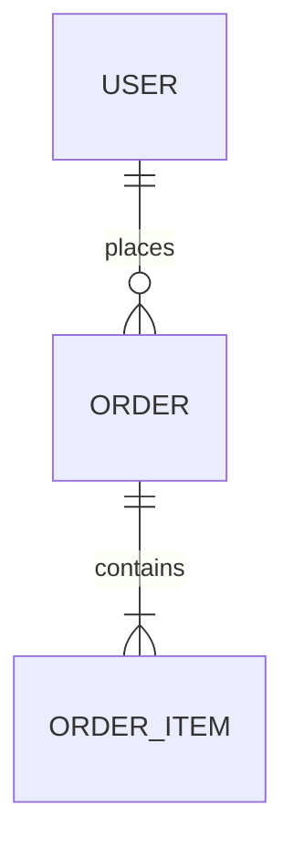

# ERD And Data Model — {{PROJECT_NAME}}

<!-- Living Truth root for ERD. Each entity is a mergeable anchored block. -->

<!-- ## Stable ID Anchor Convention (Phase 9+)
     Each ENT-NNN entity block in §4 DDL Specification MUST be preceded by `<!-- ID: ENT-NNN -->`
     on its own line above the `### Table:` heading.
     Atomic ID (all modes — Guided AND Freedom): `python .prism/core/tools/get_next_id.py --type ENT`
     Strict format: `ENT-\d{3,}` (zero-padded ≥3 digits). -->

<!-- PRISM:LT-SKELETON-END -->

## 1. Domain Entities

<!-- Bảng index. Mỗi row đối ứng với 1 ENT-NNN block ở §4. -->

| Entity ID | Entity | Mục đích | Primary key | Ghi chú |
|---|---|---|---|---|
| ENT-NNN | | | | |

## 2. Relationship Summary



## 3. Naming Conventions

<!-- Áp dụng nhất quán cho toàn bộ schema. Ghi override nếu dự án có convention khác. -->

| Item | Convention | Example |
|---|---|---|
| Table name | `snake_case`, số nhiều | `orders`, `order_items`, `user_profiles` |
| Primary key | `id` dạng UUID (default) hoặc `BIGSERIAL` nếu performance yêu cầu | `id UUID DEFAULT gen_random_uuid()` |
| Foreign key | `{referenced_table_singular}_id` | `user_id`, `order_id` |
| Audit fields | BẮT BUỘC trên mọi table: `created_at`, `updated_at` | `created_at TIMESTAMPTZ NOT NULL DEFAULT NOW()` |
| Soft delete | `deleted_at TIMESTAMPTZ NULL` (NULL = active, non-NULL = deleted) | Không dùng `is_deleted BOOLEAN` |
| Enum column | Lưu dạng `VARCHAR` với `CHECK` constraint (không dùng DB ENUM type để tránh migration phức tạp) | `status VARCHAR(20) NOT NULL CHECK (status IN ('ACTIVE','INACTIVE'))` |
| Boolean | `BOOLEAN NOT NULL DEFAULT FALSE` — không dùng nullable boolean | `is_verified BOOLEAN NOT NULL DEFAULT FALSE` |
| JSON/JSONB | Dùng `JSONB` cho PostgreSQL khi cần query vào fields; `JSON` chỉ khi store-only | |
| Index name | `idx_{table}_{columns}` | `idx_orders_user_id`, `idx_orders_status_created_at` |

> **Assumption**: <!-- Giả định về DB technology. VD: "PostgreSQL 15+. Nếu chuyển sang MySQL → cần revisit gen_random_uuid(), TIMESTAMPTZ, JSONB." -->  
> **Change trigger**: "Nếu thay đổi DB engine → update Naming Conventions và DDL section."

## 4. DDL Specification

<!-- BẮTBUỘC: Mỗi entity quan trọng PHẢI có DDL specification đủ để viết migration script và entity class. -->
<!-- Không phải chỉ "Key fields: id, email, status" — phải có type, constraint, default. -->
<!-- Nếu dùng NoSQL → điền document schema format tương đương (field name, type, required, default, index). -->

<!-- ID: ENT-NNN -->
### Table: {{TABLE_NAME}} *(VD: users)*

```sql
CREATE TABLE users (
  -- Primary key
  id            UUID          PRIMARY KEY DEFAULT gen_random_uuid(),

  -- Business fields
  email         VARCHAR(255)  NOT NULL UNIQUE,
  full_name     VARCHAR(100)  NOT NULL,
  phone         VARCHAR(20)   NULL,
  status        VARCHAR(20)   NOT NULL DEFAULT 'PENDING_VERIFICATION'
                              CHECK (status IN ('PENDING_VERIFICATION','ACTIVE','SUSPENDED','DELETED')),

  -- Audit fields (BẮT BUỘC)
  created_at    TIMESTAMPTZ   NOT NULL DEFAULT NOW(),
  updated_at    TIMESTAMPTZ   NOT NULL DEFAULT NOW(),
  deleted_at    TIMESTAMPTZ   NULL  -- NULL = active (soft delete)
);
```

**Foreign keys:**
```sql
-- Thêm FK riêng biệt sau khi tạo bảng
ALTER TABLE orders ADD CONSTRAINT fk_orders_user
  FOREIGN KEY (user_id) REFERENCES users(id)
  ON DELETE RESTRICT  -- hoặc CASCADE / SET NULL — chọn theo business rule
  ON UPDATE CASCADE;
```

**Mục đích**: <!-- Lưu trữ gì, bounded context nào là owner -->  
**Lifecycle**: <!-- Được tạo khi nào, cập nhật khi nào, soft-deleted khi nào, hard-deleted hay không -->

> **Assumption**: <!-- Giả định về table này. VD: "Email là unique identifier. Nếu cho phép multiple accounts per email → cần drop UNIQUE constraint và thêm index khác." -->  
> **Change trigger**: <!-- VD: "Nếu thêm GDPR right-to-erasure → implement hard delete cho user.deleted_at records sau 30 ngày." -->

<!-- Lặp lại section "Table:" cho mỗi entity quan trọng. -->

## 5. Indexing And Access Patterns

<!-- Mỗi index phải được justify bởi một access pattern cụ thể — không thêm index "phòng trường hợp". -->
<!-- Composite index: thứ tự column matter — column được filter/sort nhiều nhất đứng đầu. -->

| Table | Access Pattern | Index | Type | Ghi chú |
|---|---|---|---|---|
| `users` | Lookup by email (login) | `CREATE UNIQUE INDEX idx_users_email ON users(email)` | Unique B-tree | Covered bởi UNIQUE constraint |
| `users` | Active users by status | `CREATE INDEX idx_users_status ON users(status) WHERE deleted_at IS NULL` | Partial B-tree | Partial index loại trừ deleted records |
| `orders` | User's order history (sorted by date) | `CREATE INDEX idx_orders_user_created ON orders(user_id, created_at DESC)` | Composite B-tree | Composite: user_id filter trước, then sort |
| `orders` | Orders by status (dashboard) | `CREATE INDEX idx_orders_status_created ON orders(status, created_at DESC) WHERE deleted_at IS NULL` | Composite partial | |
| `order_items` | Items of an order | `CREATE INDEX idx_order_items_order ON order_items(order_id)` | B-tree | FK index — luôn cần cho JOIN |

## 6. Migration And Data Evolution Notes

<!-- Ghi nhận các thay đổi schema cần migration, chiến lược rollback, và rủi ro mất data. -->

| Khu vực thay đổi | Chiến lược | Có thể đảo ngược? | Ghi chú |
|---|---|---|---|
| | | | |

## 7. Data Ownership Matrix

<!-- Bắt buộc khi architecture style là Modular Monolith, Service-based hoặc Microservices.
     Master = bounded context sở hữu, là nguồn sự thật duy nhất (single source of truth).
     Consume = chỉ đọc bản sao / cache — không được ghi trực tiếp vào data của context khác.
     — = không có quan hệ.
     Xem thêm: prism/core/standards/architecture-solution-standards.md — mục 2.2 -->

| Entity | {{Context A}} | {{Context B}} | {{Context C}} |
|--------|---------------|---------------|---------------|
| {{Entity 1}} | Master | Consume | — |
| {{Entity 2}} | — | Master | Consume |

## 8. Data Risks

| Rủi ro | Ảnh hưởng | Giảm thiểu |
|--------|-----------|------------|
| | | |

---

## Self-Review Checklist

- [ ] Quality Contract refs satisfied: `DOC-1`, `DOC-2`, `DOC-3`, `LINK-1`, `LINK-2`, `ORB-1`, `ARCH-1`
- [ ] §3 Naming Conventions rõ ràng — hoặc ghi override nếu dự án có convention khác
- [ ] §4 DDL Specification có entry cho TẤT CẢ entity quan trọng: column names, types, NOT NULL / UNIQUE / DEFAULT, FK với cascade behavior
- [ ] Audit fields (`created_at`, `updated_at`) có mặt trong mọi table
- [ ] Soft delete pattern được áp dụng nhất quán (`deleted_at`) — hoặc ghi rõ "hard delete"
- [ ] §5 Indexing được justify bởi access patterns thực tế — không có index không có lý do
- [ ] FK indexes đã được khai báo (JOIN performance)
- [ ] Mỗi entity có Assumption block cho quyết định schema quan trọng
- [ ] Migration concerns đã được ghi nhận
- [ ] Data Ownership Matrix đã được điền khi architecture style là Modular Monolith / Service-based / Microservices
- [ ] Data risks hiển thị cho planning và implementation
