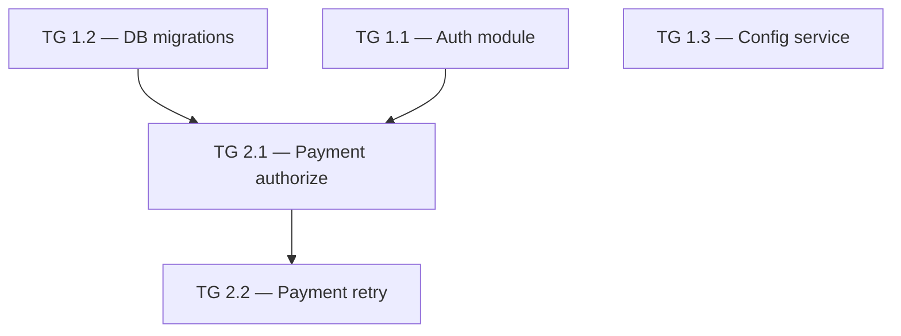

# Implementation Plan — {{PROJECT_NAME}} (Sprint v{{X}})

## 1. Planning Overview

| Attribute | Value |
|-----------|-------|
| Planning objective | {{OBJECTIVE}} |
| Delivery strategy | {{DELIVERY_STRATEGY}} |
| Team size (developers driving AI code gen in parallel) | {{TEAM_SIZE}} <!-- integer; default 1. Count only people who write prompts + review AI output + feed back. Do NOT count QA/tester, PO, designer, stakeholder — they participate via Test / Product / Design phases. --> |
| Work hours per day per developer (with AI) | {{WORK_HOURS_PER_DAY}} <!-- default 6h working with the AI (prompt + review + feedback). Remaining ~2h/day absorbs stand-ups, peer review, meetings. --> |
| Planning horizon | {{PLANNING_HORIZON}} |
| Primary risks | {{PRIMARY_RISKS}} |

## 2. Planning Assumptions

- <!-- Explicit assumptions the implementation lane will rely on -->

## 2b. Delivery Traceability Index

<!-- Đây là bridge từ upstream truth xuống execution. -->
<!-- QA Test Intent có thể là TC-xxx nếu Test đã có, hoặc `qa_test_intent_pending` nếu Test chưa hoàn tất. -->

| FR / NFR | US | Architecture Refs | QA Test Intent | External QA Readiness | Task Group | Affected Code Surfaces | Validation Commands | Repo Test Delta Target |
|---|---|---|---|---|---|---|---|---|
| FR-xxx, NFR-xxx | US-xxx | `/docs/architecture/architecture.md §...`, `/docs/architecture/project-reference.md §...` | `TC-xxx` hoặc `qa_test_intent_pending` | env/build + selectors/API/data reset, hoặc `N/A` | `1.1 {{TASK_GROUP_NAME}}` | `POST /...`, `PaymentService`, `RetryJob` | `validate implementation --mode spec`; `validate implementation --mode quality` | add / modify / `no test delta — reason` |
| | | | | | | | | |

## 3. Phase Breakdown

### Plan Phase 1: {{PHASE_NAME}}

**Goal**: <!-- One sentence describing what this execution slice delivers -->

**Scope**:
- <!-- Features / modules included in this phase -->

**Dependencies**:
- <!-- Preconditions or upstream tasks -->

### Task Group 1.1: {{TASK_GROUP_NAME}}

**Core scope**

- **Description**: <!-- Mô tả ngắn gọn tính năng / module được deliver trong task group này -->
- **User Stories**: US-xxx, US-xxx
- **Feature References**: FR-xxx, NFR-xxx
- **Tracking IDs**: <!-- Ticket / task / board IDs nếu team đã có. Ghi `none provided` nếu chưa có -->

<!-- User Stories là delivery link chính; đừng gộp chung với FR/NFR. -->

**Architecture and code boundaries**

- **target_modules_packages**: <!-- module / package / bounded context được phép chạm trong `/docs/architecture/project-reference.md` -->
- **public_entrypoints_impacted**: <!-- public APIs / events / jobs / UI routes / public service interfaces bị tác động -->
- **inherited_architecture_obligations**: <!-- idempotency, audit log, PII masking, retry contract, etc. -->
- **allowed_diff_boundary**: <!-- phần code được phép đổi; ghi rõ out-of-scope để tránh drift -->
- **code_ownership_zones**:
  - <!-- concrete file/folder/glob; e.g. src/payments/**, src/orders/payment-bridge.ts -->
  - <!-- e.g. db/migrations/2026_05_*, web/features/payment/** excluding admin/** -->
- **shared_foundation_guard**: <!-- `N/A — no shared foundation touched` hoặc `team-sync first — [TG-id] owns shared change before parallel feature lanes` -->
- **blocks**: <!-- task-group IDs blocked by this group; use `[]` if none -->
- **blocked_by**: <!-- prerequisite task-group IDs; use `[]` if none -->

<!-- `code_ownership_zones` drives PLAN-3: same-Day parallel task groups must not overlap. -->

**Affected code surfaces**

- **affected_code_surfaces**: <!-- APIs, services, handlers, jobs, migrations, UI modules; use `none` only for clearly non-code work -->
  - APIs: <!-- VD: POST /payments/authorize, PATCH /orders/{id}/status -->
  - Services / Handlers: <!-- VD: PaymentService, OrderStatusHandler -->
  - Jobs: <!-- VD: PaymentRetryJob (cron 5m) -->
  - Migrations: <!-- VD: V202604_payment_retry_state -->
  - UI Modules: <!-- VD: PaymentForm, OrderStatusBadge -->

**QA and repo test intent**

- **qa_test_refs**: <!-- TC-xxx nếu Test đã có; nếu chưa, list FR/NFR/US với `qa_test_intent_pending` -->
  - TCs: <!-- VD: TC-014, TC-015 -->
  - Pending intent (nếu có): <!-- VD: FR-018, NFR-002 → qa_test_intent_pending -->
- **repo_test_delta_target**: <!-- repo tests expected to ship, or `no test delta — [substantive reason]` -->
  - Add: <!-- VD: tests/payment/test_retry.py (unit), tests/contracts/payment_authorize.contract.test.ts -->
  - Modify: <!-- VD: tests/order/test_status_transition.py — thêm case retry-resolved -->
  - Or: `no test delta — <substantive reason>`
  <!-- Đây là test INTENT (loại test / file). Technique evidence chi tiết do Implement viết, không phải Plan — xem unit-test-standards.md. -->

  <!-- Integration test: liệt kê ngay trong Add/Modify ở trên khi task có integration surface; pure unit → no IT cần thiết. -->
- **external_qa_readiness**: <!-- nếu không áp dụng ghi `N/A — no external QA handoff for this task group` -->
  - Target env / build point: <!-- VD: QA env after Task Group 1.1 deploy; commit/version surfaced in QA Handoff Bundle -->
  - Selectors / API hooks: <!-- VD: data-testid list, route hooks, endpoint/schema refs -->
  - Data seed/reset: <!-- VD: reset API/script ref, fixture owner -->
  - Account roles / secrets: <!-- Roles only; secret source refs outside PRISM -->
  - Feature flags / config: <!-- Required flags/config before QC runs -->
  - Evidence expectation: <!-- screenshot / API response / logs / automation report -->
  - Known limitations: <!-- Or N/A -->

**Validation and references**

- **review_mode**: spec | quality | both
- **validation commands to run**: <!-- default modes implied by review_mode plus task-specific checks -->
  - validate implementation --mode spec
  - validate implementation --mode quality
  - <!-- VD task-specific: security-standards spot check on auth flow -->
- **Architecture References**:
  - Project reference: `/docs/architecture/project-reference.md §...`
  - API: `/docs/architecture/api-specs.md §...`
  - DB: `/docs/architecture/erd.md — bảng ...`
  - Sequence: `/docs/architecture/sequence.md — flow ...`
- **Design References**: <!-- Screen ID và section trong /docs/design/design-system.md. VD: SCR-003 (§4.3) -->

**Delivery shape**

- **Delivery Notes**: <!-- Ràng buộc giao hàng, handoffs cần thiết, rủi ro cho task group này. VD: "Cần API từ Payment gateway sẵn sàng trước khi test được" -->
- **Deliverable**: <!-- Tính năng / flow nào available tại môi trường nào, verified theo US-xxx. VD: "Luồng login hoạt động tại staging, QA-verified theo US-001 và US-002" -->
- **Linked Test Coverage**: TC-xxx references, QA notes, hoặc `qa_test_intent_pending` (giữ đồng bộ với `qa_test_refs` ở trên)
- **Complexity**: S *(≤ 2 ngày)* / M *(2–3 ngày — target shape)* / L *(> 3 ngày — bắt buộc split thành sub-tasks; task quá lớn sẽ làm giảm chất lượng code gen)*
- **AI context fit**: <!-- explain why Product/Design/Architecture/code/test context fits; otherwise split by US, code zone, contract, or module boundary -->
- **Estimated Start / Day Range**: Day X hoặc Day X–Y
- **Owner**: <!-- Team / role -->

**Definition of Done:**
- [ ] Tất cả US-xxx liên quan đã được implement và verified theo AC
- [ ] Touched APIs / business-facing code carry traceability markers for Feature refs, US refs, Task Group, and Tracking IDs when provided
- [ ] Code changes stay within `allowed_diff_boundary` or the divergence is explicitly approved and recorded
- [ ] Code reviewed và merged vào `main` *(hoặc delivery branch chuẩn của team — ghi rõ nếu không dùng `main`)*
- [ ] Unit tests pass; line coverage ≥ `coverage_min_new_code`% VÀ branch coverage ≥ `coverage_branch_min_new_code`% trên code mới (đều default 90; region cho Swift); tests deterministic (`CODE-3a`)
- [ ] `repo_test_delta_target` đã ship (hoặc justification "no test delta" có chất, được approve)
- [ ] Property test cho `property_required` surfaces, hoặc example-set phủ invariant/boundary (`CODE-3c`)
- [ ] QA Handoff Bundle đã được ghi khi `external_qa_readiness` không phải N/A: build/commit/version, target env URL, changed endpoints/screens, selector/API refs, seed/reset refs, account-role secret refs, feature flags/config, known limitations
- [ ] Integration tests pass cho APIs / flows bị ảnh hưởng
- [ ] Contract tests đã ship khi `quality_profile.require_contract_tests` quy định (always / conditional cho cross-service / public APIs)
- [ ] API contract khớp `/docs/architecture/api-specs.md`
- [ ] UI changes được verify khớp `/docs/design/design-system.md` *(ghi `N/A` nếu task không có UI)*
- [ ] Security review complete cho scope auth / data nhạy cảm *(ghi `N/A` nếu không áp dụng)*
- [ ] Feature flag state documented *(enabled / disabled / rollout plan — ghi `N/A` nếu không dùng feature flag)*
- [ ] Deployed lên staging hoặc environment xác minh tương đương
- [ ] QA verified theo AC của US-xxx, US-xxx; không còn defect P0/P1 open liên quan đến task group này
- [ ] `validate implementation` modes per `review_mode` đã chạy và clear blocker (thường là `spec` + `quality`)
- [ ] `validate implementation --mode spec` runtime evidence đã capture: app start không lỗi, test suite pass, screenshots / device logs lưu kèm active `validate-implementation-spec-<cycle>.md` (per `core/orchestrator.md § Validate Active Files`)

<!-- Repeat task groups as needed. -->

## 4. Task-Group Dependency Graph

<!-- BẮT BUỘC — task-group level (không phải phase level). Mỗi node là một Task Group; arrows = `blocks` / `blocked_by`. Graph này phải nhất quán với các fields `blocks` / `blocked_by` ở từng Task Group. Nếu `team_size > 1`, graph này là input để build Parallel Execution Lanes ở §4b. -->

## 4b. Parallel Execution Lanes *(conditional — required when `team_size > 1`, optional when `team_size == 1`)*

<!-- BẮT BUỘC khi team_size > 1. Một row mỗi Day, một column mỗi Lane (`Lane A`, `Lane B`, ..., tổng số column = team_size). Mỗi cell ghi 1 task group hoặc để trống. -->
<!-- Ràng buộc bắt buộc (PLAN-3): -->
<!-- 1. Hai task group cùng Day không được trùng `code_ownership_zones` (merge-conflict hazard). -->
<!-- 2. Shared-foundation work không được parallel hóa mù quáng; phải có một team-sync generation/review step trước khi tách feature / US lanes. -->
<!-- 3. Một task group chỉ xuất hiện sau khi tất cả các task trong `blocked_by` của nó đã hoàn thành ở Day trước đó. -->
<!-- 4. Mỗi task group trong §3 phải xuất hiện ít nhất 1 lần trong bảng. -->
<!-- 5. Mỗi cell = 1 work-day của 1 developer làm việc với AI = `quality_profile.work_hours_per_day` (default 6h). -->

| Day | Lane A | Lane B | Lane C | Notes (sync points, gates) |
|-----|--------|--------|--------|----------------------------|
| 1   | TG 1.1 — Auth module | TG 1.2 — DB migrations | TG 1.3 — Config service | DB migration freeze window: end of Day 1 |
| 2   | TG 1.1 cont. | (idle — waiting on TG 1.2) | TG 1.3 cont. | Lane B blocked_by TG 1.2; pick up TG 2.1 next |
| 3   | TG 2.1 — Payment authorize | TG 2.2 — Payment retry | (free for buffer / review) | Mid-sprint code review sync |
| ... | | | | |

<!-- Nếu team_size == 1, bỏ qua bảng trên hoặc dùng single-column daily schedule. -->

## 5. Risks And Mitigations

| Risk | Affected Phase / Task Group | Mitigation | Escalation Trigger |
|------|-----------------------------|-----------|--------------------|
| | | | |

## 6. Phase Acceptance Gate

<!-- Mỗi delivery phase chỉ được coi là COMPLETE khi tất cả điều kiện sau được đáp ứng. -->
<!-- Ai là người approve? Approve bằng cách nào? Không có gate rõ ràng → phase drag on indefinitely. -->

**Phase được approve khi:**
- [ ] Tất cả Task Groups trong phase có DOD đầy đủ (xem từng Task Group)
- [ ] QA sign-off: tất cả P0 test cases pass, 0 Critical defect open, 0 High defect open
- [ ] Performance baseline đo được tại staging (nếu có NFR performance)
- [ ] PO review và accept deliverables theo US acceptance criteria
- [ ] <!-- Điều kiện gate đặc thù cho phase này: VD: "Security review complete cho authentication module" -->

**Approver**: <!-- VD: PO + Tech Lead -->  
**Approval method**: <!-- VD: Comment "APPROVED" trên PR / ticket / message trong channel #deploy -->

## 7. Rollout Plan *(Optional — bỏ qua nếu deploy tất cả cùng lúc)*

<!-- Cho teams có multiple concurrent streams hoặc phased rollout. -->

| Feature / Module | Rollout Strategy | Feature Flag | Target Environment | Date |
|---|---|---|---|---|
| <!-- VD: Login v2 --> | <!-- Phased: 10% → 50% → 100% --> | <!-- flag_login_v2 --> | <!-- Production --> | |
| <!-- VD: Payment refactor --> | <!-- Blue-green deploy --> | N/A | Production | |

## 8. References

- Source / effective truth: `sprint-v{X}`; approved upstream package; change pack `none` or `<pack-id>` when this plan is from same-sprint correction.
- Product: `/docs/product/prd.md`, `/docs/product/glossary.md`, `/docs/product/personas.md`, `/docs/product/market-research.md`, and the relevant `/docs/product/epics/EP-NNN-{slug}.md` files
- Design: `/docs/design/design-system.md`
- Architecture: `/docs/architecture/architecture.md`, `/docs/architecture/nfr.md`, `/docs/architecture/sequence.md`, `/docs/architecture/erd.md`, `/docs/architecture/adr.md`, `/docs/architecture/data-flow.md`, `/docs/architecture/api-specs.md`, `/docs/architecture/events.md`, `/docs/architecture/project-reference.md`
- Testing: `/docs/testing/test-cases.md` (Living Truth); plus the sprint-only `test-plan-v{X}.md` from the active sprint

---

## Self-Review Checklist

- [ ] Quality Contract refs satisfied: `DOC-1`, `DOC-2`, `DOC-3`, `LINK-1`, `LINK-2`, `ORB-1`, `PLAN-1`, `PLAN-2`, `PLAN-3` (when `team_size > 1`), `CODE-1`, `CODE-10` (runtime task groups)
- [ ] Mọi Must Have feature đều có trong 1 plan phase, hoặc được ghi rõ là deferred
- [ ] `Delivery Traceability Index` tồn tại và nối được `FR / NFR / US -> arch refs -> qa test intent -> external QA readiness when applicable -> task group -> code surfaces -> validation -> repo test delta`
- [ ] Mỗi Task Group có US-xxx mapping nổi bật (không bundle với FR/NFR)
- [ ] Mỗi Task Group có Feature References (`FR-xxx`, `NFR-xxx`) và Tracking IDs (`none provided` nếu chưa có)
- [ ] Mỗi Task Group có `affected_code_surfaces` đủ rõ để implement gắn traceability marker vào code
- [ ] Mỗi Task Group có `target_modules_packages`, `public_entrypoints_impacted`, `inherited_architecture_obligations`, `allowed_diff_boundary`, `code_ownership_zones`, `shared_foundation_guard`, `blocks`, và `blocked_by`
- [ ] Mỗi Task Group có `qa_test_refs` (TC-xxx hoặc pending intent), `repo_test_delta_target` (test trong codebase hoặc no-test-delta justification có chất), `review_mode` (`spec` / `quality` / `both`), và `validation commands to run`; khi external QC áp dụng thì có `external_qa_readiness` cụ thể
- [ ] Mỗi Task Group có DOD checklist cụ thể — không để trống
- [ ] Complexity S/M/L đã được đánh giá; **mọi task group ≤ 3 ngày**; task L (> 3 ngày) hoặc task không fit một AI context window chất lượng cao bắt buộc split thành sub-tasks
- [ ] Mỗi Task Group có `AI context fit` giải thích vì sao scope đủ nhỏ để AI load Product / Design / Architecture / code surfaces / repo test delta cùng lúc mà không mất contract details
- [ ] Mỗi Task Group có `Estimated Start / Day Range` theo format `Day X` hoặc `Day X–Y`, nhất quán với dependencies và team capacity (mỗi Day = `work_hours_per_day`, default 6h)
- [ ] §4 Task-Group Dependency Graph tồn tại ở mức task-group (không phải phase level) và khớp với `blocks` / `blocked_by` của từng task group
- [ ] §4b Parallel Execution Lanes tồn tại khi `team_size > 1`: mỗi cell ≤ 1 task group, không có overlap `code_ownership_zones` cùng Day, shared-foundation work có team-sync / sequencing guard, mọi task group xuất hiện ít nhất 1 lần, mọi cell tôn trọng `blocked_by`
- [ ] Ngôn ngữ delivery đúng: "Delivery Notes" (không phải "Implementation Notes"), "Deliverable" (không phải "Planned Output")
- [ ] §6 Phase Acceptance Gate có approver và approval method rõ ràng
- [ ] Architecture/design references đủ chi tiết (section cụ thể, không chỉ tên file)
- [ ] Dependencies được đặt hàng rõ ràng
- [ ] Risks và escalation triggers được document
- [ ] Plan đủ chi tiết để implement không cần re-plan scope cơ bản
