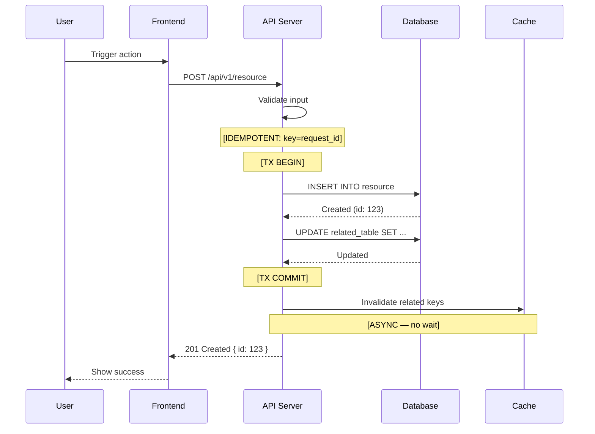
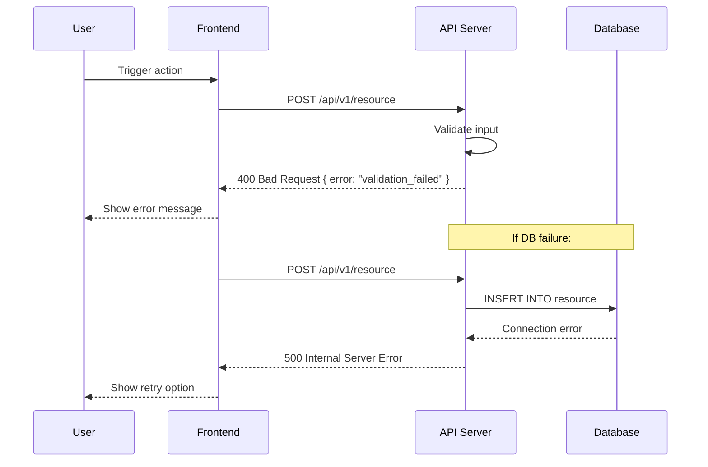
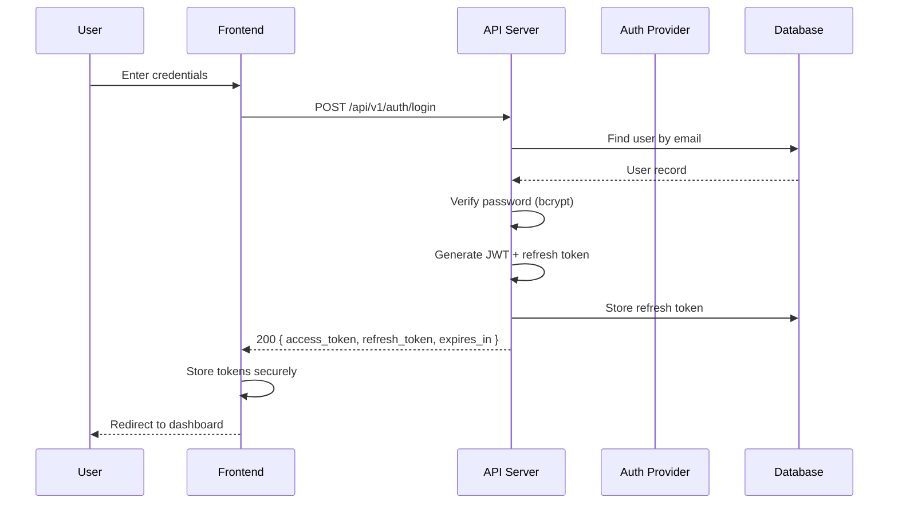
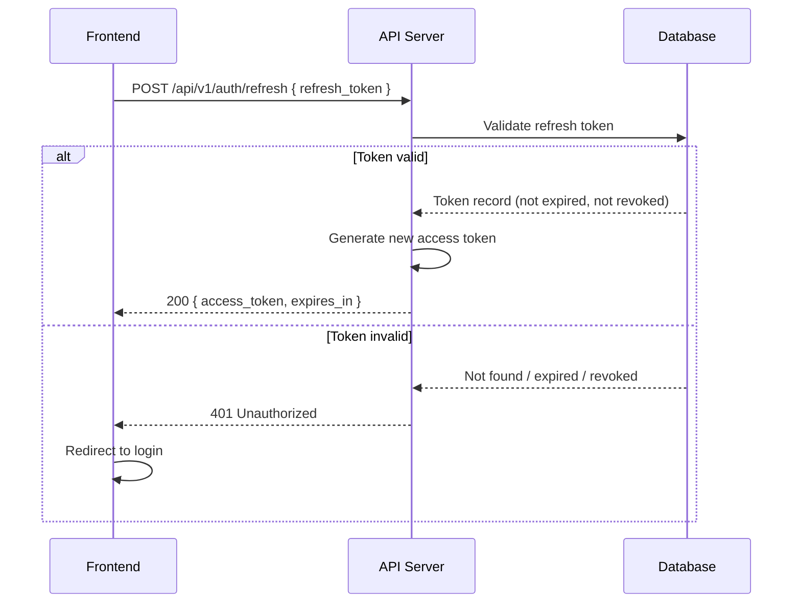

# Sequence Diagrams — {{PROJECT_NAME}}

<!-- Living Truth root for sequence diagrams. Each flow is a mergeable anchored block. -->
<!-- Create one sequence diagram per core flow. Focus on flows that involve multiple components or complex logic. -->

<!-- ## Stable ID Anchor Convention (Phase 9+)
     Each SEQ-NNN flow block in §3+ MUST be preceded by `<!-- ID: SEQ-NNN -->` on its own line
     directly above the flow heading (`### SEQ-NNN: {Flow name}`).
     Atomic ID (all modes — Guided AND Freedom): `python .prism/core/tools/get_next_id.py --type SEQ`
     Strict format: `SEQ-\d{3,}` (zero-padded ≥3 digits). -->

<!-- PRISM:LT-SKELETON-END -->

## 1. Guidelines

- Use **Mermaid** syntax for all diagrams
- Include both **happy path** and **error path** for each flow
- Show **participants** with descriptive aliases
- Include **response payloads** for key interactions
- Reference related API endpoints from `api-specs.md`

## 2. Annotation Conventions

<!-- Dùng các annotation này trong Notes và diagram text để developer biết chính xác cần implement gì. -->
<!-- Không có annotation → developer phải tự suy đoán → transaction/retry/timeout bị bỏ sót. -->

| Annotation | Nghĩa | Cách dùng trong diagram |
|---|---|---|
| `[TX BEGIN]` / `[TX COMMIT]` / `[TX ROLLBACK]` | Transaction boundary — bắt đầu/kết thúc transaction | `Note over API: [TX BEGIN]` trước DB write đầu tiên |
| `[RETRY: n, backoff]` | Retry intent — external call cần retry | `Note over API,ExtSvc: [RETRY: 3, exponential backoff 100ms]` |
| `[TO: Xms]` | Timeout cho external call | `Note over API,ExtSvc: [TO: 3000ms]` |
| `[CACHE HIT]` / `[CACHE MISS]` | Cache read path | `Note over API,Cache: [CACHE HIT → return early]` |
| `[IDEMPOTENT: key]` | Endpoint / operation có idempotency check | `Note over API: [IDEMPOTENT: key=order_id+user_id]` |
| `[ASYNC]` | Message/event sent async (fire and forget) | `Note over API,Queue: [ASYNC — no wait]` |
| `[SAGA STEP n]` | Bước trong distributed transaction saga | `Note over OrderSvc: [SAGA STEP 1/3]` |
| `[COMPENSATE]` | Compensation transaction (rollback saga step) | `Note over OrderSvc: [COMPENSATE: reverse inventory]` |

**Quy tắc bắt buộc:**
- Mọi flow có multi-step DB writes → PHẢI đánh dấu `[TX BEGIN]` và `[TX COMMIT/ROLLBACK]`
- Mọi external service call (payment gateway, email service, 3rd party API) → PHẢI có `[TO: Xms]`
- Nếu external call có retry intent → thêm `[RETRY: n, strategy]`
- Distributed flow spanning multiple services → ghi rõ `[SAGA STEP n]` hoặc đánh dấu compensation path

---

## 3. Flows (anchored, mergeable)

<!-- Each flow = 1 anchored SEQ-NNN block. -->

<!-- ID: SEQ-NNN -->
### SEQ-NNN: {{FLOW_NAME}}

<!-- Reference: FR-xxx from PRD, Endpoint: from API specs -->

### Happy Path

### Error Path

### Notes

- **Pre-conditions**: <!-- What must be true before this flow starts -->
- **Post-conditions**: <!-- What state the system is in after completion -->
- **Related endpoints**: <!-- API-xxx from api-spec -->
- **Related test cases**: <!-- TC-xxx from test-cases -->

---

<!-- ID: SEQ-NNN -->
### SEQ-NNN: Authentication

<!-- Standard auth flow — adapt to your auth method. -->

### Login (Happy Path)

### Token Refresh

---

<!-- Add more flows as needed. Common flows to document:
- CRUD operations for core entities
- Payment / transaction flows
- File upload / processing
- Notification delivery
- Background job processing
- WebSocket / real-time communication
-->

---

## Self-Review Checklist

- [ ] Quality Contract refs satisfied: `DOC-1`, `DOC-2`, `DOC-3`, `LINK-1`, `LINK-2`, `ORB-1`, `ARCH-1`
- [ ] Mọi Must Have FR có ít nhất 1 sequence diagram
- [ ] Happy path và error path đều được document cho mỗi flow
- [ ] Tất cả participants khớp với components trong architecture document
- [ ] API endpoints referenced khớp với `api-specs.md`
- [ ] Mermaid syntax valid và render được
- [ ] Pre/post conditions document cho complex flows
- [ ] Mọi flow có multi-step DB writes: `[TX BEGIN]` / `[TX COMMIT/ROLLBACK]` được đánh dấu
- [ ] External service calls có `[TO: Xms]` timeout annotation
- [ ] External calls có retry intent: `[RETRY: n, strategy]` được ghi rõ
- [ ] Cache read paths phân biệt `[CACHE HIT]` vs `[CACHE MISS]`
