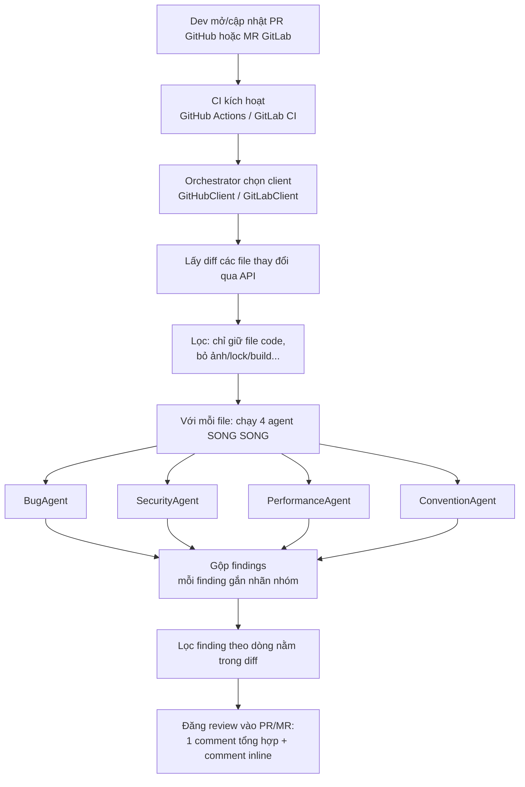

# AI Code Review Agent

Một hệ **4 AI agent chuyên biệt** tự động review code: khi có **Pull Request (GitHub)** hoặc **Merge Request (GitLab)**, mỗi file thay đổi được đưa qua 4 agent chạy song song — mỗi agent soi một mảng: **bug tiềm ẩn, bảo mật, hiệu năng, coding convention** — rồi gộp kết quả và comment ngay trong PR/MR.

Cùng một bộ agent dùng cho cả hai nền tảng; chỉ tầng client (`clients.py`) và file trigger CI là khác nhau.

> Đây là một workflow multi-agent thực tế ở mức tối giản: có đủ vòng đời **Trigger → Lấy dữ liệu → 4 agent suy luận song song → Gộp → Hành động (comment)**, nhưng không phụ thuộc hạ tầng phức tạp.
>
> Phần đối chiếu prompt với các framework có sẵn (PR-Agent, CodeRabbit, BugBot…) nằm ở `prompts_comparison.md`.

---

## 1. Luồng hoạt động



Diễn giải từng bước:

1. **Trigger** — GitHub: `.github/workflows/ai-review.yml` chạy khi PR `opened`/`synchronize`/`reopened`. GitLab: `.gitlab-ci.yml` chạy khi pipeline đến từ một Merge Request.
2. **Chọn client** — orchestrator tự nhận nền tảng (biến `GITLAB_CI` của GitLab CI, hoặc cờ `--platform`) rồi dựng `GitHubClient` hay `GitLabClient`.
3. **Lấy diff** — GitHub gọi `GET /pulls/{n}/files`; GitLab gọi `GET /merge_requests/{iid}/changes`. Cả hai trả về được chuẩn hoá thành `{filename, patch, status}`. Chỉ gửi *diff* → tiết kiệm token.
4. **Lọc** — chỉ review file có đuôi code (`.py`, `.js`, `.go`…), bỏ file bị xóa và file không phải code.
5. **4 agent phân tích** — mỗi file gửi đồng thời cho 4 agent (`agents.py`), mỗi agent có prompt riêng và trả về **JSON có cấu trúc**. Chạy song song bằng `ThreadPoolExecutor`.
6. **Lọc theo dòng** — chỉ comment inline lên dòng nằm trong diff; finding ngoài diff gom vào comment tổng hợp.
7. **Hành động** — đăng comment tổng hợp + comment inline đúng dòng. GitHub dùng *review*; GitLab dùng *note* + *discussions có position*.

---

## 2. Cấu trúc dự án

```
ai-code-review-agent/              ← GỐC repo (copy nguyên thư mục này vào repo của bạn)
│
├── agents.py                      # 4 agent chuyên biệt + base class (prompt riêng từng mảng)
├── clients.py                     # GitHubClient + GitLabClient (cùng 1 interface)
├── review_agent.py                # Orchestrator: chọn nền tảng, chạy 4 agent, gộp, comment
├── prompts_comparison.md          # So sánh prompt với PR-Agent / CodeRabbit / BugBot...
├── requirements.txt               # anthropic, requests
├── .env.example                   # mẫu biến môi trường (chạy local)
│
├── .github/                       # ── TRIGGER CHO GITHUB ──
│   └── workflows/
│       └── ai-review.yml          # đặt đúng .github/workflows/ ở gốc repo
│
└── .gitlab-ci.yml                 # ── TRIGGER CHO GITLAB ── (đặt ở GỐC repo)
```

> Lưu ý vị trí file trigger:
> - **GitHub** đọc file trong `.github/workflows/` (thư mục con, ở gốc repo).
> - **GitLab** đọc file `.gitlab-ci.yml` đặt **thẳng ở gốc repo** (không có thư mục con).
> - Để cả hai file trong repo cũng không sao: GitHub chỉ đọc của GitHub, GitLab chỉ đọc của GitLab.

Mã nguồn chia tầng rõ ràng:
- **agents.py** — `ReviewAgent` (base lo gọi LLM + parse JSON) và 4 lớp con: `BugAgent`, `SecurityAgent`, `PerformanceAgent`, `ConventionAgent`. Thêm mảng mới = viết thêm 1 class.
- **clients.py** — `GitHubClient` và `GitLabClient` cùng interface (`get_changed_files`, `post_review`). Thêm nền tảng mới = viết thêm 1 client.
- **review_agent.py** — orchestrator: tự nhận nền tảng, chạy 4 agent song song trên từng file, gộp & định dạng kết quả.

---

## 3. Cách chạy

### A. GitHub (tự động qua GitHub Actions)
1. Copy nguyên thư mục này vào repo GitHub của bạn (giữ nguyên `.github/workflows/ai-review.yml`).
2. Vào **Settings → Secrets and variables → Actions**, thêm secret `ANTHROPIC_API_KEY`.
   (`GITHUB_TOKEN` được GitHub tự cấp, không cần tạo.)
3. Mở một Pull Request → workflow tự chạy và comment vào PR.

### B. GitLab (tự động qua GitLab CI)
1. Copy nguyên thư mục này vào repo GitLab (giữ nguyên `.gitlab-ci.yml` ở **gốc** repo).
2. Vào **Settings → CI/CD → Variables**, thêm 2 biến:
   - `ANTHROPIC_API_KEY`
   - `GITLAB_TOKEN` — Project Access Token có quyền `api` (để comment được vào MR).
     *(Lưu ý: `CI_JOB_TOKEN` mặc định thường không đủ quyền tạo comment, nên cần token riêng.)*
   - `CI_PROJECT_ID`, `CI_MERGE_REQUEST_IID`, `CI_API_V4_URL` → GitLab **tự cấp**, không cần thêm.
3. Mở một Merge Request → pipeline tự chạy và comment vào MR.

### C. Chạy thử ở local
```bash
pip install -r requirements.txt
export ANTHROPIC_API_KEY=sk-ant-...

# GitHub:
export GITHUB_TOKEN=ghp_...
python review_agent.py --platform github --repo your-name/your-repo --pr 12

# GitLab:
export GITLAB_TOKEN=glpat-...
python review_agent.py --platform gitlab --project 123456 --mr 5
```

### D. Demo offline (lúc thuyết trình, không đụng PR/MR thật)
```bash
python review_agent.py --platform github --repo any/repo --pr 1 --dry-run
```
`--dry-run` chỉ in kết quả review ra màn hình, không đăng comment.
*(Lưu ý: bản `--dry-run` vẫn gọi GitHub/GitLab API để lấy diff thật; muốn demo hoàn toàn offline thì cần repo/PR có thật mà bạn có quyền đọc.)*

---

## 4. Ví dụ kết quả

Agent để lại comment dạng:

> ## 🤖 AI Code Review
> Phát hiện **2** vấn đề:
> - Bảo mật: 1
> - Bug tiềm ẩn: 1
>
> - 🔴 `auth.py:42` **[Bảo mật]** Mật khẩu đang hardcode trong source.
> - 🟡 `utils.py:13` **[Bug tiềm ẩn]** Chưa xử lý trường hợp list rỗng → IndexError.

Và comment inline ngay tại dòng tương ứng, kèm gợi ý sửa.

---

## 5. Giới hạn & hướng mở rộng

Bản này đã tách 4 agent chuyên biệt và hỗ trợ cả GitHub lẫn GitLab. Có thể nâng cấp tiếp:
- **Thêm bước verify** — hỏi lại LLM "đây có thật sự là lỗi không?" để giảm false positive (cách Anthropic & Cursor BugBot làm).
- **Khử trùng giữa các agent** — nếu 2 agent báo trùng một dòng, gộp lại.
- **Tránh spam** — khi push commit mới, cập nhật comment cũ thay vì tạo mới.
- **Thêm Bitbucket/Azure DevOps** — viết thêm 1 client cùng interface; phần 4 agent giữ nguyên.
- **Thêm context** — gửi kèm code xung quanh, hoặc index cả repo (RAG) — đây là chỗ CodeRabbit/Greptile ăn điểm.

---

## 6. Công nghệ

- **Python 3.12**
- **Anthropic Claude API** (`claude-sonnet-4-6`, đổi được sang `claude-opus-4-8`)
- **GitHub REST API** + **GitHub Actions**
- **GitLab REST API (v4)** + **GitLab CI/CD**
