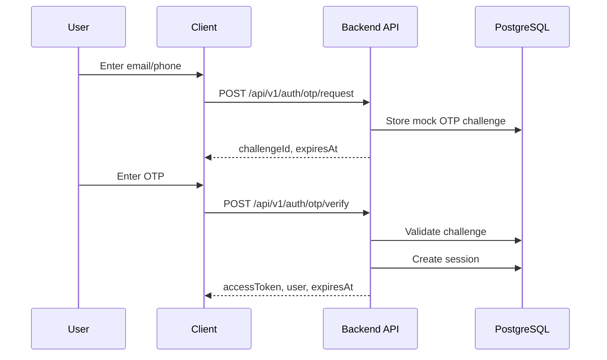
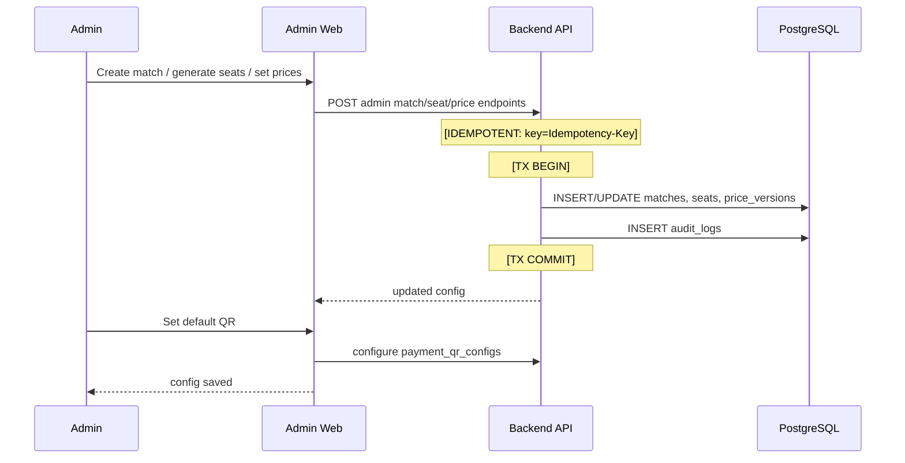
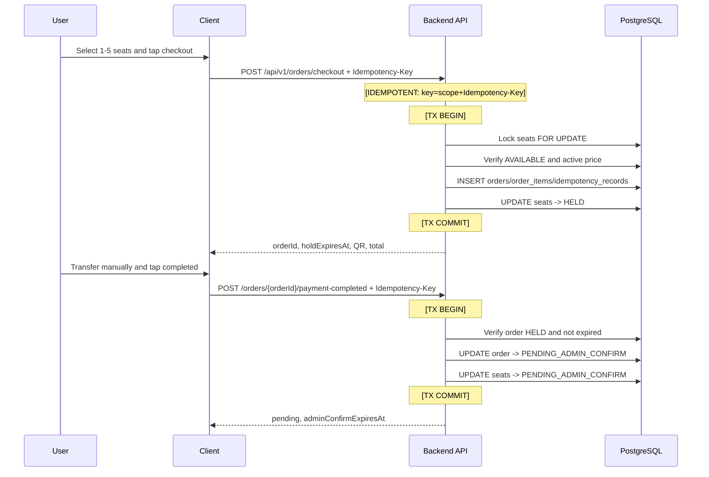
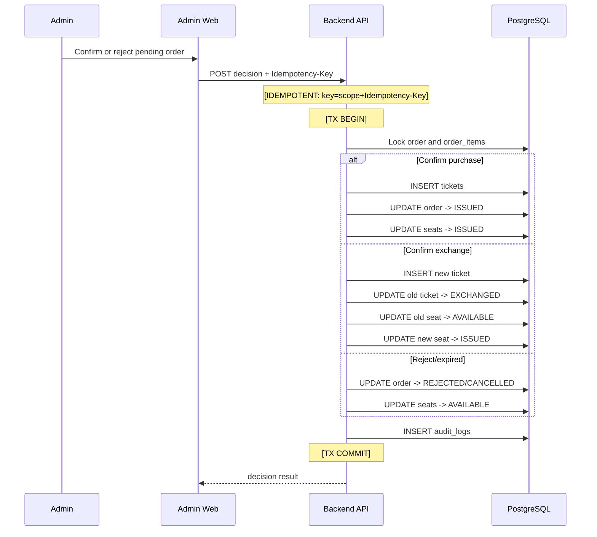
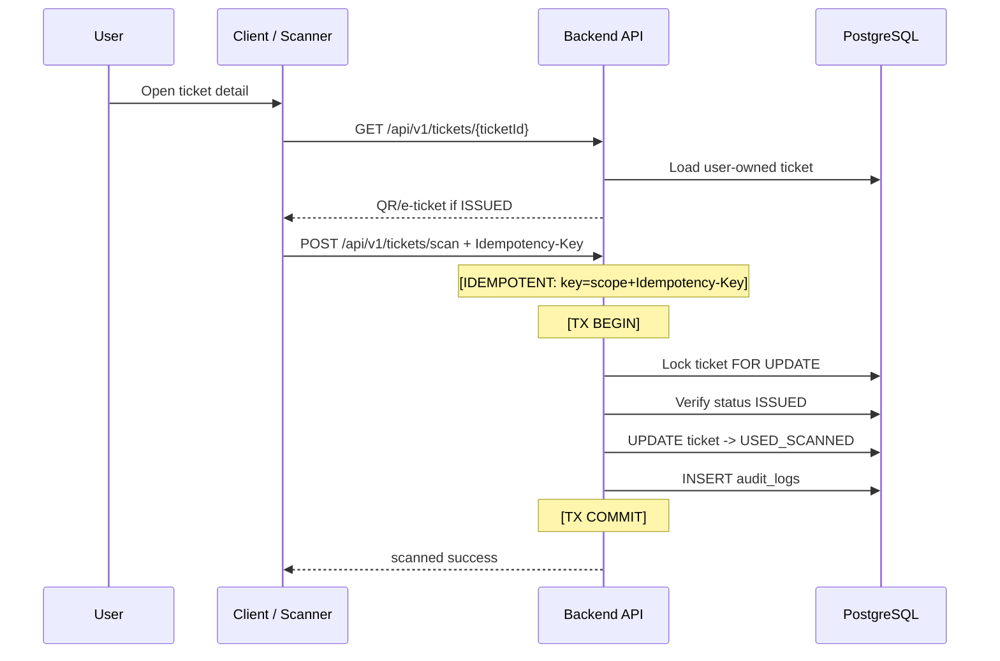

# Sequence Proposal — Sprint v1

## New

<!-- ID: SEQ-001 -->
### SEQ-001: OTP Login

Reference: FR-001, API-001, API-002.

Notes: mock OTP does not integrate SMS/email provider. Session inactive timeout is 15 minutes.

<!-- ID: SEQ-002 -->
### SEQ-002: Admin Match Inventory Setup And User Browsing

Reference: FR-002, FR-003, FR-006, FR-007; API-003, API-004, API-010, API-011, API-012.

Browsing path: user client calls `GET /matches` and `GET /matches/{id}/seats`; backend reads only open-for-sale matches and current prices.

<!-- ID: SEQ-003 -->
### SEQ-003: Checkout Hold And Payment Completion

Reference: FR-004, FR-005, FR-011; API-005, API-006, API-014.

Error path: expired hold rolls back payment completion and requires new order; duplicate idempotency key returns prior result for same request hash.

<!-- ID: SEQ-004 -->
### SEQ-004: Admin Confirmation And Exchange Confirmation

Reference: FR-008, FR-012; API-007, API-015.

Error path: non-pending order, expired confirmation, or mismatched request hash returns conflict; no ticket state changes.

<!-- ID: SEQ-005 -->
### SEQ-005: Ticket Detail And One-Time Scan

Reference: FR-009, FR-010; API-008, API-009, API-013.

Error path: already scanned/exchanged/cancelled ticket returns 409 and no state change.

## Updated

## Removed

