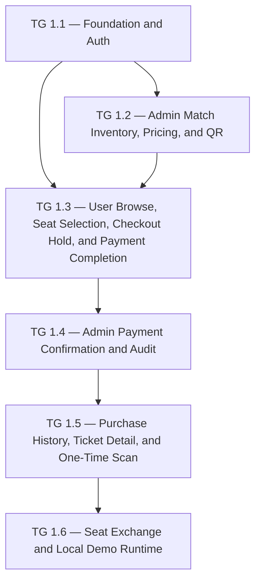

# Implementation Plan — ticket_mafia (Sprint v1)

## 1. Planning Overview

| Attribute | Value |
|-----------|-------|
| Planning objective | Deliver the v1 demo for online football ticket purchase, admin operation, QR/e-ticket, scan update, and seat exchange. |
| Delivery strategy | Foundation first, then risk-first feature slices: backend contracts and data model → admin inventory → user checkout → admin confirmation → ticket/scan → exchange + client polish + Docker. |
| Team size (developers driving AI code gen in parallel) | 1 |
| Work hours per day per developer (with AI) | 6 |
| Planning horizon | 11 working days |
| Primary risks | Seat double booking, manual payment confirmation race/expiry, idempotent mutations, one-time QR scan, price snapshot drift, demo-only auth/security exceptions. |

## 2. Planning Assumptions

- Default planning context accepted by PO: 1 developer, local Docker Compose, no external QA team, no external ticket IDs, no CI/CD requirement for demo.
- All code uses the architecture-approved monorepo shape: `backend/`, `admins/`, `website/`, `apps/`, and root `docker-compose.yml`.
- External `Idempotency-Key` is required on protected mutation endpoints that alter seat/order/ticket state, in addition to DB transactions, state guards, and unique constraints.
- QA intent is concrete because Test starts in parallel in sprint v1; task groups map to `TC-001` through `TC-024`.
- External QA readiness is `N/A` for all groups because the user selected no external QA handoff. Dev still provides local demo evidence and runtime validation outputs during Implement.

## 2b. Delivery Traceability Index

| FR / NFR | US | Architecture Refs | QA Test Intent | External QA Readiness | Task Group | Affected Code Surfaces | Validation Commands | Repo Test Delta Target |
|---|---|---|---|---|---|---|---|---|
| FR-001, NFR-003 | US-001 | ARCH-COMP-001, API-001, API-002, SEQ-001, PR-001..PR-005 | TC-001, TC-002 | N/A | TG 1.1 Foundation and auth | `POST /api/v1/auth/otp/request`, `POST /api/v1/auth/otp/verify`, auth/session modules, web/mobile login shells | `validate implementation --mode spec`; `validate implementation --mode quality` | Add backend auth unit/integration tests; add web/mobile login component tests; session timeout/security tests. |
| FR-006, FR-007, NFR-004 | US-006, US-007 | ARCH-COMP-002, ARCH-COMP-005, API-010..API-012, ENT-002, ENT-003, ENT-006, ENT-007 | TC-003, TC-004, TC-005, TC-006 | N/A | TG 1.2 Admin match inventory, pricing, QR | Admin match APIs, seat generation, price versions, QR config, admin screens | `validate implementation --mode spec`; `validate implementation --mode quality` | Add inventory service tests, price snapshot unit tests, admin API integration tests, admin UI component/e2e tests. |
| FR-002, FR-003, FR-004, FR-005, NFR-001, NFR-002 | US-002, US-003, US-004, US-005 | ARCH-COMP-002, ARCH-COMP-003, API-003..API-006, SEQ-002, SEQ-003, ENT-003..ENT-005, PR-005 | TC-007, TC-008, TC-009, TC-010, TC-011, TC-012, TC-023 | N/A | TG 1.3 User browse, seat selection, checkout hold, payment completion | User match/seat APIs, checkout/payment endpoints, hold scheduler, website user flow, Flutter user flow | `validate implementation --mode spec`; `validate implementation --mode quality` | Add checkout service unit tests, Testcontainers concurrent hold tests, API contract tests, web/mobile e2e smoke tests. |
| FR-008, NFR-004 | US-008 | ARCH-COMP-003, ARCH-COMP-005, API-007, SEQ-004, EVT-002, ENT-008, ENT-010 | TC-013, TC-014, TC-022 | N/A | TG 1.4 Admin payment confirmation and audit | Admin pending list, decision endpoint, ticket issuance, seat release, audit log | `validate implementation --mode spec`; `validate implementation --mode quality` | Add decision state-transition tests, audit log integration tests, admin UI filter/action tests. |
| FR-009, FR-010, NFR-003 | US-009, US-010, US-011 | ARCH-COMP-004, API-008, API-009, API-013, SEQ-005, EVT-003, ENT-008 | TC-015, TC-016, TC-017, TC-018, TC-019, TC-020 | N/A | TG 1.5 Purchase history, ticket detail, one-time scan | Orders/tickets read APIs, signed QR token, scan endpoint, website/mobile ticket screens | `validate implementation --mode spec`; `validate implementation --mode quality` | Add ownership/security tests, QR token tests, scan atomic update tests, UI/e2e ticket detail tests. |
| FR-011, FR-012, NFR-002, NFR-005 | US-012 | ARCH-COMP-004, ARCH-COMP-003, API-014, API-015, SEQ-003, SEQ-004, EVT-004 | TC-021, TC-022, TC-024 | N/A | TG 1.6 Exchange flow, Docker Compose, demo smoke | Exchange checkout/decision APIs, exchange screens, Docker Compose, health checks | `validate implementation --mode spec`; `validate implementation --mode quality` | Add exchange eligibility tests, exchange confirmation integration tests, docker-compose smoke/self-test. |

## 3. Phase Breakdown

### Plan Phase 1: v1 Demo Delivery

**Goal**: Build a complete local demo covering customer purchase, admin operations, issued QR/e-ticket, one-time scan update, and seat exchange.

**Scope**:
- Java Spring Boot backend, PostgreSQL schema, Next.js user/admin web, Flutter mobile app shell, and local Docker Compose runtime.
- All Must Have FRs FR-001 through FR-012 and mandatory NFRs NFR-002, NFR-003, NFR-005.

**Dependencies**:
- Product, Design, and Architecture packages are APPROVED.
- No external payment gateway, SMS/email provider, cloud deployment, CI/CD, or external QA dependency.

### Task Group TG 1.1: Foundation and Auth

**Core scope**

- **Description**: Establish monorepo source tree, backend module shell, PostgreSQL migration baseline, shared API/error/session conventions, and mock OTP login.
- **User Stories**: US-001
- **Feature References**: FR-001, NFR-003, NFR-004, NFR-005
- **Tracking IDs**: none provided

**Architecture and code boundaries**

- **target_modules_packages**: `backend` auth/shared/audit foundations; `website` and `apps` login entry shells; root local runtime.
- **public_entrypoints_impacted**: `POST /api/v1/auth/otp/request`, `POST /api/v1/auth/otp/verify`, session guard middleware/interceptors.
- **inherited_architecture_obligations**: mock/internal OTP only; 15-minute inactive session timeout; REST error envelope; no PII in logs; module boundaries per PR-001..PR-005.
- **allowed_diff_boundary**: create foundational folders/config/auth/session only; do not implement ticket inventory or payment flows beyond guards.
- **code_ownership_zones**:
  - `backend/src/main/java/**/auth/**`
  - `backend/src/main/java/**/shared/**`
  - `backend/src/main/resources/db/migration/**`
  - `backend/src/test/**/auth/**`
  - `website/src/**/login/**`
  - `apps/**/login/**`
  - `docker-compose.yml`
- **shared_foundation_guard**: team-sync first — TG 1.1 owns shared source tree, common error/session conventions, and initial migration conventions before feature task groups.
- **blocks**: [TG 1.2, TG 1.3, TG 1.4, TG 1.5, TG 1.6]
- **blocked_by**: []

**Affected code surfaces**

- **affected_code_surfaces**:
  - APIs: `POST /api/v1/auth/otp/request`, `POST /api/v1/auth/otp/verify`
  - Services / Handlers: `OtpService`, `SessionService`, auth guards, error mapper, request logging filter
  - Jobs: none
  - Migrations: users/session/idempotency/audit baseline
  - UI Modules: login OTP screens for website/mobile; admin login shell if needed

**QA and repo test intent**

- **qa_test_refs**:
  - TCs: TC-001, TC-002
  - Pending intent: none
- **repo_test_delta_target**:
  - Add: backend JUnit 5 auth unit tests, MockMvc auth integration tests, session timeout tests, Vitest login component tests, Flutter widget login smoke tests.
- **external_qa_readiness**: N/A — no external QA handoff for this task group

**Validation and references**

- **review_mode**: both
- **validation commands to run**:
  - validate implementation --mode spec
  - validate implementation --mode quality
- **Architecture References**:
  - Project reference: `project-reference-v1.md §PR-001`, `§PR-002`, `§PR-003`, `§PR-005`
  - API: `api-specs-v1.md §API-001`, `§API-002`, `§API-016`
  - DB: `erd-v1.md — ENT-001 users`, `ENT-009 idempotency_records`, `ENT-010 audit_logs`
  - Sequence: `sequence-v1.md — SEQ-001`
- **Design References**: SCREEN-001 Login OTP, DS-COMP-005 Status Chip

**Delivery shape**

- **Delivery Notes**: This is the only shared-foundation task; downstream feature tasks must consume its conventions.
- **Deliverable**: Local backend starts with auth APIs and login screens wired to mock OTP.
- **Linked Test Coverage**: TC-001, TC-002
- **Complexity**: M (2–3 days)
- **AI context fit**: Fits one context window because it touches auth/shared foundation only and uses a small API/schema set.
- **Estimated Start / Day Range**: Day 1–2
- **Owner**: Dev

**Definition of Done:**
- [ ] US-001 implemented and verified against AC-001 and AC-002
- [ ] Touched APIs/business code carry traceability markers for FR-001, US-001, TG 1.1, and Tracking IDs `none provided`
- [ ] Code changes stay within `allowed_diff_boundary` or divergence is approved and recorded
- [ ] Code reviewed and merged into `main` or the team's delivery branch
- [ ] Unit tests pass; line coverage >= 90% and branch coverage >= 90% on new code
- [ ] `repo_test_delta_target` shipped
- [ ] Property/example tests cover identifier and OTP validation invariants where applicable
- [ ] Integration tests pass for auth APIs
- [ ] API contract matches `api-specs-v1.md`
- [ ] UI changes verified against SCREEN-001
- [ ] Security review complete for auth/session behavior
- [ ] Feature flag state documented as N/A
- [ ] Local Docker/backend starts without errors
- [ ] QA verified TC-001 and TC-002; no P0/P1 defect remains open
- [ ] `validate implementation --mode spec` and `validate implementation --mode quality` clear blockers

### Task Group TG 1.2: Admin Match Inventory, Pricing, and QR

**Core scope**

- **Description**: Implement admin creation/status management for matches, seat generation, price version updates, and default transfer QR configuration.
- **User Stories**: US-006, US-007
- **Feature References**: FR-006, FR-007, BR-004, BR-008, NFR-004
- **Tracking IDs**: none provided

**Architecture and code boundaries**

- **target_modules_packages**: `backend` match_inventory/audit modules; `admins` match/seat/price/QR screens.
- **public_entrypoints_impacted**: `POST /api/v1/admin/matches`, `POST /api/v1/admin/matches/{matchId}/seats/generate`, `POST /api/v1/admin/matches/{matchId}/prices`.
- **inherited_architecture_obligations**: admin-only authorization; audit logs for price/status changes; price updates apply only to future checkout; one default QR active.
- **allowed_diff_boundary**: admin inventory/pricing/QR only; user checkout writes are out of scope for this task.
- **code_ownership_zones**:
  - `backend/src/main/java/**/match_inventory/**`
  - `backend/src/test/**/match_inventory/**`
  - `admins/src/**/matches/**`
  - `admins/src/**/inventory/**`
  - `admins/src/**/pricing/**`
  - `admins/src/**/qr/**`
- **shared_foundation_guard**: consumes TG 1.1 shared API/auth conventions; no new shared foundation changes unless coordinated.
- **blocks**: [TG 1.3, TG 1.4, TG 1.5, TG 1.6]
- **blocked_by**: [TG 1.1]

**Affected code surfaces**

- **affected_code_surfaces**:
  - APIs: `POST /api/v1/admin/matches`, `POST /api/v1/admin/matches/{matchId}/seats/generate`, `POST /api/v1/admin/matches/{matchId}/prices`
  - Services / Handlers: `MatchAdminService`, `SeatGenerationService`, `PriceVersionService`, `PaymentQrConfigService`, `AuditService`
  - Jobs: none
  - Migrations: matches, seats, price_versions, payment_qr_configs
  - UI Modules: SCREEN-006, SCREEN-007, admin tables/forms

**QA and repo test intent**

- **qa_test_refs**:
  - TCs: TC-003, TC-004, TC-005, TC-006
  - Pending intent: none
- **repo_test_delta_target**:
  - Add: price version unit tests, seat generation boundary tests, admin API integration tests, audit log persistence tests, admin UI component tests.
- **external_qa_readiness**: N/A — no external QA handoff for this task group

**Validation and references**

- **review_mode**: both
- **validation commands to run**:
  - validate implementation --mode spec
  - validate implementation --mode quality
- **Architecture References**:
  - Project reference: `project-reference-v1.md §PR-002`, `§PR-003`, `§PR-005`
  - API: `api-specs-v1.md §API-010`, `§API-011`, `§API-012`
  - DB: `erd-v1.md — ENT-002`, `ENT-003`, `ENT-006`, `ENT-007`, `ENT-010`
  - Sequence: `sequence-v1.md — SEQ-002`
- **Design References**: SCREEN-006, SCREEN-007, DS-COMP-004, DS-COMP-005

**Delivery shape**

- **Delivery Notes**: Demo seed can be generated through admin APIs/screens after this task.
- **Deliverable**: Admin can create an OPEN_FOR_SALE match, generate seat codes, set prices, and choose default transfer QR.
- **Linked Test Coverage**: TC-003, TC-004, TC-005, TC-006
- **Complexity**: M (2–3 days)
- **AI context fit**: Fits one context window by staying inside match_inventory and admin inventory screens.
- **Estimated Start / Day Range**: Day 3–4
- **Owner**: Dev

**Definition of Done:**
- [ ] US-006 and US-007 implemented and verified against AC-011 through AC-014
- [ ] Traceability markers include FR-006, FR-007, US-006, US-007, TG 1.2
- [ ] Code stays within inventory/admin boundary
- [ ] Code reviewed and merged
- [ ] Unit tests pass with >=90% line and branch coverage on new code
- [ ] `repo_test_delta_target` shipped
- [ ] Property/example tests cover seat-code generation invariants and active-default QR invariant
- [ ] Integration tests pass for admin inventory APIs
- [ ] Contract tests cover public admin API schemas
- [ ] API contract matches `api-specs-v1.md`
- [ ] UI verified against SCREEN-006 and SCREEN-007
- [ ] Security review complete for admin-only mutations
- [ ] Feature flag state documented as N/A
- [ ] Local demo seed path documented in implementation evidence
- [ ] QA verified TC-003 through TC-006; no P0/P1 defect remains open
- [ ] `validate implementation` modes clear blockers

### Task Group TG 1.3: User Browse, Seat Selection, Checkout Hold, and Payment Completion

**Core scope**

- **Description**: Implement user match list, seat map selection, 5-seat limit, checkout hold, price snapshot, active QR display, payment-completed transition, and expired hold release.
- **User Stories**: US-002, US-003, US-004, US-005
- **Feature References**: FR-002, FR-003, FR-004, FR-005, BR-001, BR-002, BR-003, BR-004, NFR-001, NFR-002
- **Tracking IDs**: none provided

**Architecture and code boundaries**

- **target_modules_packages**: `backend` match_inventory read APIs and order_payment module; `website` user match/seat/checkout; `apps` equivalent user flow.
- **public_entrypoints_impacted**: `GET /api/v1/matches`, `GET /api/v1/matches/{matchId}/seats`, `POST /api/v1/orders/checkout`, `POST /api/v1/orders/{orderId}/payment-completed`, hold expiry scheduler.
- **inherited_architecture_obligations**: auth before checkout; max 5 seats; 10-minute hold; transaction + unique/lock constraints; `Idempotency-Key`; price snapshot in order item; default QR only.
- **allowed_diff_boundary**: user browse/checkout and order hold only; admin decision and issued ticket QR are out of scope.
- **code_ownership_zones**:
  - `backend/src/main/java/**/order_payment/**`
  - `backend/src/test/**/order_payment/**`
  - `website/src/**/matches/**`
  - `website/src/**/checkout/**`
  - `apps/**/matches/**`
  - `apps/**/checkout/**`
- **shared_foundation_guard**: consumes TG 1.1 and TG 1.2; no shared foundation rewrite.
- **blocks**: [TG 1.4, TG 1.5, TG 1.6]
- **blocked_by**: [TG 1.1, TG 1.2]

**Affected code surfaces**

- **affected_code_surfaces**:
  - APIs: `GET /api/v1/matches`, `GET /api/v1/matches/{matchId}/seats`, `POST /api/v1/orders/checkout`, `POST /api/v1/orders/{orderId}/payment-completed`
  - Services / Handlers: `MatchBrowseService`, `SeatAvailabilityService`, `CheckoutService`, `PaymentCompletionService`
  - Jobs: `ExpiredHoldReleaseJob`
  - Migrations: orders, order_items active hold indexes
  - UI Modules: SCREEN-002, SCREEN-003, SCREEN-004, SCREEN-005

**QA and repo test intent**

- **qa_test_refs**:
  - TCs: TC-007, TC-008, TC-009, TC-010, TC-011, TC-012, TC-023
  - Pending intent: none
- **repo_test_delta_target**:
  - Add: checkout service state tests, concurrent hold Testcontainers tests, idempotency integration tests, scheduler expiry tests, web/mobile e2e smoke for checkout.
- **external_qa_readiness**: N/A — no external QA handoff for this task group

**Validation and references**

- **review_mode**: both
- **validation commands to run**:
  - validate implementation --mode spec
  - validate implementation --mode quality
- **Architecture References**:
  - Project reference: `project-reference-v1.md §PR-003`, `§PR-005`
  - API: `api-specs-v1.md §API-003` through `§API-006`
  - DB: `erd-v1.md — ENT-002` through `ENT-005`, `ENT-009`
  - Sequence: `sequence-v1.md — SEQ-002`, `SEQ-003`
- **Design References**: SCREEN-002, SCREEN-003, SCREEN-004, SCREEN-005, DS-COMP-001, DS-COMP-002

**Delivery shape**

- **Delivery Notes**: This task carries the highest consistency risk; prioritize backend integration tests before client polish.
- **Deliverable**: User can browse an open match, select up to 5 seats, start checkout, see payment QR/countdown, and mark payment completed.
- **Linked Test Coverage**: TC-007, TC-008, TC-009, TC-010, TC-011, TC-012, TC-023
- **Complexity**: M (2–3 days)
- **AI context fit**: Fits one context window as one checkout slice with related APIs, screens, and tests.
- **Estimated Start / Day Range**: Day 5–7
- **Owner**: Dev

**Definition of Done:**
- [ ] US-002 through US-005 implemented and verified against AC-003 through AC-010
- [ ] Traceability markers include FR-002 through FR-005 and TG 1.3
- [ ] Code stays within user checkout boundary
- [ ] Code reviewed and merged
- [ ] Unit tests pass with >=90% line and branch coverage on new code
- [ ] `repo_test_delta_target` shipped
- [ ] Property/example tests cover selection limit, price snapshot, and hold state invariants
- [ ] Integration tests pass for checkout, payment completion, idempotency, and expiry scheduler
- [ ] Contract tests cover public user API schemas
- [ ] API contract matches `api-specs-v1.md`
- [ ] UI verified against SCREEN-002 through SCREEN-005
- [ ] Security review complete for auth, ownership, and state mutation paths
- [ ] Feature flag state documented as N/A
- [ ] Local demo checkout flow verified end to end
- [ ] QA verified mapped TCs; no P0/P1 defect remains open
- [ ] `validate implementation` modes clear blockers

### Task Group TG 1.4: Admin Payment Confirmation and Audit

**Core scope**

- **Description**: Implement pending admin confirmation list, confirm/reject decision, ticket issuance, seat release, 10-minute pending expiry, and audit logs.
- **User Stories**: US-008
- **Feature References**: FR-008, BR-005, BR-008, NFR-004
- **Tracking IDs**: none provided

**Architecture and code boundaries**

- **target_modules_packages**: `backend` order_payment/ticket_scan/audit; `admins` pending confirmation screen.
- **public_entrypoints_impacted**: `POST /api/v1/admin/orders/{orderId}/decision`, admin pending query if implemented in same module.
- **inherited_architecture_obligations**: admin-only; `Idempotency-Key`; transaction state guard; issue tickets only from pending; reject/expiry releases seats; audit decision.
- **allowed_diff_boundary**: admin decision for purchase orders only; exchange decision waits for TG 1.6.
- **code_ownership_zones**:
  - `backend/src/main/java/**/order_payment/**`
  - `backend/src/main/java/**/ticket_scan/**`
  - `backend/src/main/java/**/audit/**`
  - `backend/src/test/**/admin_confirmation/**`
  - `admins/src/**/confirmations/**`
- **shared_foundation_guard**: consumes TG 1.3 order state model and TG 1.1 audit/session conventions.
- **blocks**: [TG 1.5, TG 1.6]
- **blocked_by**: [TG 1.1, TG 1.2, TG 1.3]

**Affected code surfaces**

- **affected_code_surfaces**:
  - APIs: `POST /api/v1/admin/orders/{orderId}/decision`
  - Services / Handlers: `AdminOrderDecisionService`, `TicketIssuanceService`, `AuditService`
  - Jobs: pending confirmation expiry release if separate from hold release
  - Migrations: tickets/audit indexes if not completed earlier
  - UI Modules: SCREEN-008 Admin Payment Confirmation

**QA and repo test intent**

- **qa_test_refs**:
  - TCs: TC-013, TC-014, TC-022
  - Pending intent: none
- **repo_test_delta_target**:
  - Add: admin decision unit/state tests, integration tests for confirm/reject/expiry, audit log persistence tests, admin UI filter/action tests.
- **external_qa_readiness**: N/A — no external QA handoff for this task group

**Validation and references**

- **review_mode**: both
- **validation commands to run**:
  - validate implementation --mode spec
  - validate implementation --mode quality
- **Architecture References**:
  - Project reference: `project-reference-v1.md §PR-003`, `§PR-005`
  - API: `api-specs-v1.md §API-007`
  - DB: `erd-v1.md — ENT-004`, `ENT-005`, `ENT-008`, `ENT-010`
  - Sequence: `sequence-v1.md — SEQ-004`
- **Design References**: SCREEN-008, DS-COMP-004, DS-COMP-005

**Delivery shape**

- **Delivery Notes**: Admin confirms after the user marks payment completed; no bank gateway is implemented.
- **Deliverable**: Admin can confirm a pending order to issue tickets or reject it to release seats.
- **Linked Test Coverage**: TC-013, TC-014, TC-022
- **Complexity**: S (<= 2 days)
- **AI context fit**: Fits one context window because it is a focused admin state transition slice.
- **Estimated Start / Day Range**: Day 8
- **Owner**: Dev

**Definition of Done:**
- [ ] US-008 implemented and verified against AC-015 and AC-016
- [ ] Traceability markers include FR-008, US-008, TG 1.4
- [ ] Code stays within admin confirmation boundary
- [ ] Code reviewed and merged
- [ ] Unit tests pass with >=90% line and branch coverage on new code
- [ ] `repo_test_delta_target` shipped
- [ ] Property/example tests cover state transition invariants
- [ ] Integration tests pass for confirm, reject, expiry, and audit
- [ ] Contract tests cover admin decision schema
- [ ] API contract matches `api-specs-v1.md`
- [ ] UI verified against SCREEN-008
- [ ] Security review complete for admin-only decision path
- [ ] Feature flag state documented as N/A
- [ ] QA verified TC-013, TC-014, TC-022; no P0/P1 defect remains open
- [ ] `validate implementation` modes clear blockers

### Task Group TG 1.5: Purchase History, Ticket Detail, and One-Time Scan

**Core scope**

- **Description**: Implement purchase history, issued ticket detail with signed opaque QR token, ownership checks, and atomic one-time scan update.
- **User Stories**: US-009, US-010, US-011
- **Feature References**: FR-009, FR-010, BR-001, BR-006, BR-008, NFR-003
- **Tracking IDs**: none provided

**Architecture and code boundaries**

- **target_modules_packages**: `backend` ticket_scan module and user ticket reads; `website` and `apps` history/ticket screens.
- **public_entrypoints_impacted**: `GET /api/v1/orders`, `GET /api/v1/tickets/{ticketId}`, `POST /api/v1/tickets/scan`.
- **inherited_architecture_obligations**: user ownership; signed opaque QR token; no PII in QR; atomic `ISSUED -> USED/SCANNED`; reject repeated scan.
- **allowed_diff_boundary**: ticket read/scan behavior only; exchange flow waits for TG 1.6.
- **code_ownership_zones**:
  - `backend/src/main/java/**/ticket_scan/**`
  - `backend/src/test/**/ticket_scan/**`
  - `website/src/**/orders/**`
  - `website/src/**/tickets/**`
  - `apps/**/orders/**`
  - `apps/**/tickets/**`
- **shared_foundation_guard**: consumes TG 1.4 ticket issuance and TG 1.1 security/session.
- **blocks**: [TG 1.6]
- **blocked_by**: [TG 1.1, TG 1.3, TG 1.4]

**Affected code surfaces**

- **affected_code_surfaces**:
  - APIs: `GET /api/v1/orders`, `GET /api/v1/tickets/{ticketId}`, `POST /api/v1/tickets/scan`
  - Services / Handlers: `OrderHistoryService`, `TicketDetailService`, `QrTokenService`, `TicketScanService`
  - Jobs: none
  - Migrations: ticket token/status indexes if not completed earlier
  - UI Modules: SCREEN-009, SCREEN-010, SCREEN-011

**QA and repo test intent**

- **qa_test_refs**:
  - TCs: TC-015, TC-016, TC-017, TC-018, TC-019, TC-020
  - Pending intent: none
- **repo_test_delta_target**:
  - Add: ownership tests, QR token signing/PII tests, scan atomic update integration tests, UI component/e2e tests for history and ticket detail.
- **external_qa_readiness**: N/A — no external QA handoff for this task group

**Validation and references**

- **review_mode**: both
- **validation commands to run**:
  - validate implementation --mode spec
  - validate implementation --mode quality
- **Architecture References**:
  - Project reference: `project-reference-v1.md §PR-003`, `§PR-005`
  - API: `api-specs-v1.md §API-008`, `§API-009`, `§API-013`
  - DB: `erd-v1.md — ENT-008`, `ENT-009`
  - Sequence: `sequence-v1.md — SEQ-005`
- **Design References**: SCREEN-009, SCREEN-010, SCREEN-011, DS-COMP-003, DS-COMP-005

**Delivery shape**

- **Delivery Notes**: Scanner UI is out of scope; implement scan as API behavior plus status result evidence.
- **Deliverable**: User can see history and QR details; first scan succeeds and repeated scan fails.
- **Linked Test Coverage**: TC-015 through TC-020
- **Complexity**: S (<= 2 days)
- **AI context fit**: Fits one context window because it is a ticket read/scan slice after issuance exists.
- **Estimated Start / Day Range**: Day 9
- **Owner**: Dev

**Definition of Done:**
- [ ] US-009, US-010, and US-011 implemented and verified against AC-017 through AC-022
- [ ] Traceability markers include FR-009, FR-010, US-009, US-010, US-011, TG 1.5
- [ ] Code stays within ticket read/scan boundary
- [ ] Code reviewed and merged
- [ ] Unit tests pass with >=90% line and branch coverage on new code
- [ ] `repo_test_delta_target` shipped
- [ ] Property/example tests cover QR token verification and scan state invariants
- [ ] Integration tests pass for history, ticket detail, and scan
- [ ] Contract tests cover ticket APIs
- [ ] API contract matches `api-specs-v1.md`
- [ ] UI verified against SCREEN-009 through SCREEN-011
- [ ] Security review complete for ownership, QR token, and scan mutation
- [ ] Feature flag state documented as N/A
- [ ] QA verified TC-015 through TC-020; no P0/P1 defect remains open
- [ ] `validate implementation` modes clear blockers

### Task Group TG 1.6: Seat Exchange and Local Demo Runtime

**Core scope**

- **Description**: Implement exchange checkout and admin exchange decision, retire old ticket after successful exchange, release old seat, and finish local Docker Compose demo smoke.
- **User Stories**: US-012
- **Feature References**: FR-011, FR-012, BR-007, BR-008, NFR-002, NFR-005
- **Tracking IDs**: none provided

**Architecture and code boundaries**

- **target_modules_packages**: `backend` ticket_scan/order_payment/match_inventory interaction; `website` and `apps` exchange screens; root Docker Compose.
- **public_entrypoints_impacted**: `POST /api/v1/tickets/{ticketId}/exchange/checkout`, `POST /api/v1/admin/exchanges/{orderId}/decision`, local health/smoke scripts if added.
- **inherited_architecture_obligations**: equal-or-higher price only; new seat hold 10 minutes; old ticket remains valid until admin confirms; old ticket becomes `EXCHANGED` after confirmation; old seat returns `AVAILABLE`; `Idempotency-Key` and audit.
- **allowed_diff_boundary**: exchange flow and local runtime polish only; no refund/downgrade/transfer support.
- **code_ownership_zones**:
  - `backend/src/main/java/**/ticket_scan/**`
  - `backend/src/main/java/**/order_payment/**`
  - `backend/src/test/**/exchange/**`
  - `website/src/**/exchange/**`
  - `apps/**/exchange/**`
  - `docker-compose.yml`
  - `docs/**/runtime-smoke*`
- **shared_foundation_guard**: consumes all previous task groups; Docker changes must not rewrite feature code.
- **blocks**: []
- **blocked_by**: [TG 1.1, TG 1.2, TG 1.3, TG 1.4, TG 1.5]

**Affected code surfaces**

- **affected_code_surfaces**:
  - APIs: `POST /api/v1/tickets/{ticketId}/exchange/checkout`, `POST /api/v1/admin/exchanges/{orderId}/decision`
  - Services / Handlers: `ExchangeCheckoutService`, `AdminExchangeDecisionService`, `TicketExchangeService`
  - Jobs: exchange hold expiry if separate from existing hold expiry
  - Migrations: no new tables expected; may add indexes only if required
  - UI Modules: SCREEN-012, exchange portions of SCREEN-004/005/008

**QA and repo test intent**

- **qa_test_refs**:
  - TCs: TC-021, TC-022, TC-024
  - Pending intent: none
- **repo_test_delta_target**:
  - Add: exchange eligibility unit tests, exchange checkout/decision integration tests, idempotency tests, Docker Compose health/smoke test.
- **external_qa_readiness**: N/A — no external QA handoff for this task group

**Validation and references**

- **review_mode**: both
- **validation commands to run**:
  - validate implementation --mode spec
  - validate implementation --mode quality
- **Architecture References**:
  - Project reference: `project-reference-v1.md §PR-001`, `§PR-003`, `§PR-005`
  - API: `api-specs-v1.md §API-014`, `§API-015`
  - DB: `erd-v1.md — ENT-003`, `ENT-004`, `ENT-005`, `ENT-008`
  - Sequence: `sequence-v1.md — SEQ-003`, `SEQ-004`
- **Design References**: SCREEN-012, SCREEN-004, SCREEN-005, SCREEN-008, DS-COMP-001, DS-COMP-002

**Delivery shape**

- **Delivery Notes**: Complete the final full-flow demo only after ticket issuance and scan behavior are stable.
- **Deliverable**: User can exchange an issued ticket to an eligible seat; local Docker Compose demo starts and smoke path is documented by implementation evidence.
- **Linked Test Coverage**: TC-021, TC-022, TC-024
- **Complexity**: M (2–3 days)
- **AI context fit**: Fits one context window because it reuses existing checkout/admin confirmation contracts and focuses on exchange-specific state changes.
- **Estimated Start / Day Range**: Day 10–11
- **Owner**: Dev

**Definition of Done:**
- [ ] US-012 implemented and verified against AC-023 and AC-024
- [ ] Traceability markers include FR-011, FR-012, US-012, TG 1.6
- [ ] Code stays within exchange/runtime boundary
- [ ] Code reviewed and merged
- [ ] Unit tests pass with >=90% line and branch coverage on new code
- [ ] `repo_test_delta_target` shipped
- [ ] Property/example tests cover exchange eligibility and state invariants
- [ ] Integration tests pass for exchange checkout, admin exchange decision, expiry, and idempotency
- [ ] Contract tests cover exchange APIs
- [ ] API contract matches `api-specs-v1.md`
- [ ] UI verified against SCREEN-012 and reused checkout/admin states
- [ ] Security review complete for ownership and admin exchange confirmation
- [ ] Feature flag state documented as N/A
- [ ] Docker Compose self-test passes locally
- [ ] QA verified TC-021, TC-022, TC-024; no P0/P1 defect remains open
- [ ] `validate implementation` modes clear blockers

## 4. Task-Group Dependency Graph

## 4b. Single-Developer Daily Schedule

Parallel Execution Lanes are N/A because `team_size == 1`.

| Day | Task Group | Notes |
|-----|------------|-------|
| Day 1 | TG 1.1 | Foundation, migrations, auth API skeleton |
| Day 2 | TG 1.1 | Auth/session tests and login UI shells |
| Day 3 | TG 1.2 | Admin match/seat/price/QR backend |
| Day 4 | TG 1.2 | Admin UI and inventory tests |
| Day 5 | TG 1.3 | User browse/seat selection and checkout backend |
| Day 6 | TG 1.3 | Payment completion, hold expiry, idempotency tests |
| Day 7 | TG 1.3 | Website/mobile checkout flow and e2e smoke |
| Day 8 | TG 1.4 | Admin confirmation, audit, ticket issuance |
| Day 9 | TG 1.5 | History, ticket detail, QR token, scan |
| Day 10 | TG 1.6 | Exchange checkout/admin decision |
| Day 11 | TG 1.6 | Docker Compose self-test and full demo smoke |

## 5. Risks And Mitigations

| Risk | Affected Phase / Task Group | Mitigation | Escalation Trigger |
|------|-----------------------------|-----------|--------------------|
| Double booking under concurrent checkout | TG 1.3, TG 1.6 | PostgreSQL constraints, transaction locks, Testcontainers concurrent tests, `Idempotency-Key` records | Any test shows two active holds/order items for the same seat |
| Manual payment timing ambiguity | TG 1.3, TG 1.4 | Explicit state guards for HELD and PENDING_ADMIN_CONFIRM windows; scheduler tests | Pending order can be confirmed after expiry without explicit allowed transition |
| Price snapshot drift after admin price update | TG 1.2, TG 1.3 | Store price in order item at checkout; test old/new price split | Existing order reads active price after snapshot |
| QR token leaks PII or can be reused | TG 1.5 | Signed opaque token, ownership checks, atomic scan update | QR payload contains email/phone/name or repeated scan succeeds |
| Demo runtime becomes too broad for one sprint | TG 1.6 | Keep production CI/CD, payment gateway, SMS/email, queue, and scanner UI out of scope | Any new scope requires external integration or cloud dependency |

## 6. Phase Acceptance Gate

**Phase được approve khi:**
- [ ] All task groups TG 1.1 through TG 1.6 meet their DOD.
- [ ] All P0 QA test cases TC-001 through TC-024 pass or have explicit PO/QA sign-off for deferral.
- [ ] No Critical or High defect remains open for auth, checkout, admin confirmation, ticket scan, or exchange.
- [ ] NFR-002 and NFR-005 verification evidence is captured; NFR-001 smoke/load evidence captured for demo scope.
- [ ] PO reviews the local demo flow and accepts US-001 through US-012.
- [ ] Tech Lead confirms module boundaries and validation modes passed.

**Approver**: PO + Tech Lead + QA Lead  
**Approval method**: Written sign-off in the PRISM thread after `validate plan`, `validate test`, and later implementation validation are clean.

## 7. Rollout Plan

| Feature / Module | Rollout Strategy | Feature Flag | Target Environment | Date |
|---|---|---|---|---|
| v1 demo | Single local/demo rollout after full smoke pass | N/A | Local Docker Compose | TBD during Implement |

## 8. References

- Source / effective truth: sprint-v1 approved Product, Design, and Architecture proposals; change pack `none`.
- Product: `docs/sprint-v1/product/proposals/prd-v1.md`, `glossary-v1.md`, `personas-v1.md`, and epic proposal files EP-001 through EP-007.
- Design: `docs/sprint-v1/design/proposals/design-system-v1.md`.
- Architecture: `docs/sprint-v1/architecture/proposals/architecture-v1.md`, `nfr-v1.md`, `sequence-v1.md`, `erd-v1.md`, `adr-v1.md`, `data-flow-v1.md`, `api-specs-v1.md`, `events-v1.md`, `project-reference-v1.md`.
- Testing: `docs/sprint-v1/testing/test-plan-v1.md` and `docs/sprint-v1/testing/proposals/test-cases-v1.md`.

---

## Self-Review Checklist

- [x] Quality Contract refs satisfied: `DOC-1`, `DOC-2`, `DOC-3`, `LINK-1`, `LINK-2`, `ORB-1`, `PLAN-1`, `PLAN-2`, `CODE-1`, `CODE-10`
- [x] PLAN-3 N/A because `team_size == 1`; single-developer schedule provided.
- [x] All Must Have features FR-001 through FR-012 are planned.
- [x] Delivery Traceability Index links FR/NFR/US to architecture refs, QA test intent, task group, surfaces, validation, and repo test delta.
- [x] Every Task Group has prominent US mapping, feature refs, tracking IDs, architecture handoff fields, code surfaces, ownership zones, dependencies, QA refs, repo test delta, review mode, validation commands, DOD, complexity, AI context fit, and day range.
- [x] All task groups are S/M and <= 3 days.
- [x] Dependency graph is task-group level and consistent with `blocks` / `blocked_by`.
- [x] Phase Acceptance Gate includes approver roles and approval method.
