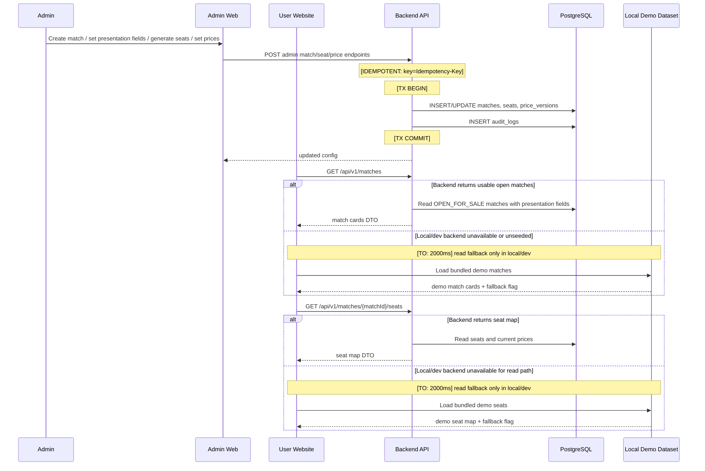
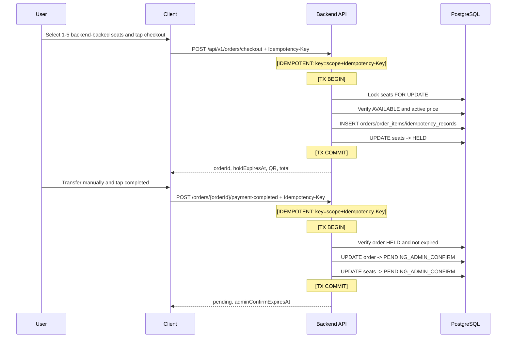

# Sequence Proposal — Sprint v2

## New

## Updated

<!-- ID: SEQ-002 -->
### SEQ-002: Admin Match Inventory Setup And User Browsing

Reference: FR-002, FR-003, FR-006, FR-007; API-003, API-004, API-010, API-011, API-012.

Notes:
- Local fallback is read-only and owned by User Website service layer.
- Fallback does not create holds, orders, tickets, payment state, audit logs, or idempotency records.
- Checkout from fallback seat map is disabled or returns explicit backend-required UI copy.

<!-- ID: SEQ-003 -->
### SEQ-003: Checkout Hold And Payment Completion

Reference: FR-004, FR-005, FR-011; API-005, API-006, API-014.

Error path: expired hold rolls back payment completion and requires a new order; duplicate idempotency key returns prior result for same request hash. No fallback path is allowed for checkout or payment completion.

## Removed
