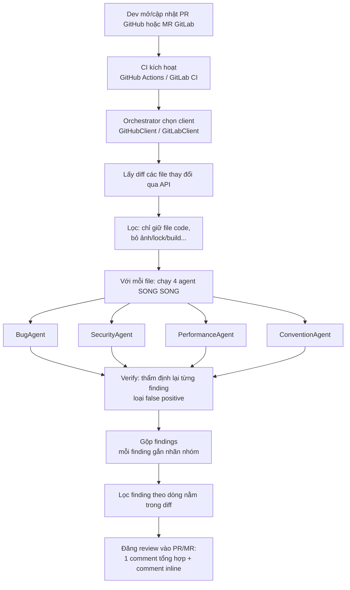

# AI Code Review Agent

Một hệ **4 AI agent chuyên biệt** tự động review code: khi có **Pull Request (GitHub)** hoặc **Merge Request (GitLab)**, mỗi file thay đổi được đưa qua 4 agent chạy song song — mỗi agent soi một mảng: **bug tiềm ẩn, bảo mật, hiệu năng, coding convention** — rồi gộp kết quả và comment ngay trong PR/MR.

Cùng một bộ agent dùng cho cả hai nền tảng; chỉ tầng client (`clients.py`) và file trigger CI là khác nhau.

> Đây là một workflow multi-agent thực tế ở mức tối giản: có đủ vòng đời **Trigger → Lấy dữ liệu → 4 agent suy luận song song → Gộp → Hành động (comment)**, nhưng không phụ thuộc hạ tầng phức tạp.
>
> Phần đối chiếu prompt với các framework có sẵn (PR-Agent, CodeRabbit, BugBot…) nằm ở `prompts_comparison.md`.

---

## 1. Luồng hoạt động



Diễn giải từng bước:

1. **Trigger** — GitHub: `.github/workflows/ai-review.yml` chạy khi PR `opened`/`synchronize`/`reopened`. GitLab: `.gitlab-ci.yml` chạy khi pipeline đến từ một Merge Request.
2. **Chọn client** — orchestrator tự nhận nền tảng (biến `GITLAB_CI` của GitLab CI, hoặc cờ `--platform`) rồi dựng `GitHubClient` hay `GitLabClient`.
3. **Lấy diff** — GitHub gọi `GET /pulls/{n}/files`; GitLab gọi `GET /merge_requests/{iid}/changes`. Cả hai trả về được chuẩn hoá thành `{filename, patch, status}`. Chỉ gửi *diff* → tiết kiệm token.
4. **Lọc** — chỉ review file có đuôi code (`.py`, `.js`, `.go`…), bỏ file bị xóa và file không phải code.
5. **4 agent phân tích** — mỗi file gửi đồng thời cho 4 agent (`agents.py`), mỗi agent có prompt riêng và trả về **JSON có cấu trúc**. Chạy song song bằng `ThreadPoolExecutor`.
6. **Verify (lọc false positive)** — gom findings theo từng file rồi hỏi lại LLM một lượt (`verifier.py`) đóng vai người kiểm định nghiêm khắc: finding nào chỉ là suy đoán / lý thuyết / trùng lặp thì **loại bỏ**, finding nào chỉ ra được đường code cụ thể thì **giữ** (và chỉnh lại severity nếu cần). Bật/tắt bằng `REVIEW_VERIFY`. Xem mục 6.
7. **Lọc theo dòng** — chỉ comment inline lên dòng nằm trong diff; finding ngoài diff gom vào comment tổng hợp.
8. **Hành động** — đăng comment tổng hợp + comment inline đúng dòng. GitHub dùng *review*; GitLab dùng *note* + *discussions có position*.

---

## 2. Cấu trúc dự án

```
repo-của-bạn/                      ← GỐC repo
│
├── .github/                       # ── TRIGGER CHO GITHUB (ở GỐC) ──
│   └── workflows/
│       └── ai-review.yml          # đọc từ .github/workflows/ — KHÔNG nhét vào folder con
│
├── .gitlab-ci.yml                 # ── TRIGGER CHO GITLAB (ở GỐC) ── KHÔNG nhét vào folder con
│
└── merge_checker/                 # ── TẤT CẢ CODE GOM VÀO ĐÂY ──
    ├── review_agent.py            # Orchestrator: chọn nền tảng, chạy 4 agent, verify, gộp, comment
    ├── agents.py                  # 4 agent chuyên biệt + base class (prompt riêng từng mảng)
    ├── verifier.py                # Bước verify: LLM-as-judge lọc false positive
    ├── clients.py                 # GitHubClient + GitLabClient (cùng 1 interface)
    ├── requirements.txt           # anthropic, requests
    ├── prompts_comparison.md      # So sánh prompt với PR-Agent / CodeRabbit / BugBot...
    └── README_REVIEW_AGENT.md     # file này
```

> **Vì sao 2 file trigger phải nằm ở GỐC, không gom được vào `merge_checker/`:**
> - **GitHub** chỉ đọc workflow trong `.github/workflows/` ở gốc repo.
> - **GitLab** chỉ đọc `.gitlab-ci.yml` đặt **thẳng ở gốc repo**.
> - Đặt sai chỗ = CI không chạy. Nên code gom vào `merge_checker/`, còn 2 file CI ở gốc và **trỏ lệnh vào trong folder** (`python merge_checker/review_agent.py`).
> - Để cả hai file CI trong repo cũng không sao: GitHub chỉ đọc của GitHub, GitLab chỉ đọc của GitLab.

> **Import giữa các file Python KHÔNG cần sửa.** Khi chạy `python merge_checker/review_agent.py`, Python tự thêm thư mục `merge_checker/` vào đầu `sys.path`, nên `from agents import ...`, `from verifier import ...`, `from clients import ...` vẫn tìm thấy các file anh em cùng folder.

Mã nguồn chia tầng rõ ràng:
- **agents.py** — `ReviewAgent` (base lo gọi LLM + parse JSON) và 4 lớp con: `BugAgent`, `SecurityAgent`, `PerformanceAgent`, `ConventionAgent`. Thêm mảng mới = viết thêm 1 class. `ConventionAgent` còn **tự nhận ngôn ngữ qua đuôi file** để áp đúng quy ước đặt tên (snake_case cho Python/Ruby/Rust, camelCase cho TS/JS/Java/Kotlin…) và **kiểm chính tả** trong tên định danh + comment.
- **clients.py** — `GitHubClient` và `GitLabClient` cùng interface (`get_changed_files`, `post_review`). Thêm nền tảng mới = viết thêm 1 client.
- **review_agent.py** — orchestrator: tự nhận nền tảng, chạy 4 agent song song trên từng file, gộp & định dạng kết quả.

---

## 3. Cách chạy

### A. GitHub (tự động qua GitHub Actions)
1. Copy thư mục `merge_checker/` vào gốc repo GitHub, và đặt `ai-review.yml` vào `.github/workflows/`.
2. Vào **Settings → Secrets and variables → Actions**, thêm secret `ANTHROPIC_API_KEY`.
   (`GITHUB_TOKEN` được GitHub tự cấp, không cần tạo.)
3. Mở một Pull Request → workflow tự chạy và comment vào PR.

### B. GitLab (tự động qua GitLab CI)
1. Copy thư mục `merge_checker/` vào gốc repo GitLab, và đặt `.gitlab-ci.yml` ở **gốc** repo.
2. Vào **Settings → CI/CD → Variables**, thêm 2 biến:
   - `ANTHROPIC_API_KEY`
   - `GITLAB_TOKEN` — Project Access Token có quyền `api` (để comment được vào MR).
     *(Lưu ý: `CI_JOB_TOKEN` mặc định thường không đủ quyền tạo comment, nên cần token riêng.)*
   - `CI_PROJECT_ID`, `CI_MERGE_REQUEST_IID`, `CI_API_V4_URL` → GitLab **tự cấp**, không cần thêm.
3. Mở một Merge Request → pipeline tự chạy và comment vào MR.

### C. Chạy thử ở local
```bash
pip install -r merge_checker/requirements.txt
export ANTHROPIC_API_KEY=sk-ant-...

# GitHub:
export GITHUB_TOKEN=ghp_...
python merge_checker/review_agent.py --platform github --repo your-name/your-repo --pr 12

# GitLab:
export GITLAB_TOKEN=glpat-...
python merge_checker/review_agent.py --platform gitlab --project 123456 --mr 5
```

### D. Demo offline (lúc thuyết trình, không đụng PR/MR thật)
```bash
python merge_checker/review_agent.py --platform github --repo any/repo --pr 1 --dry-run
```
`--dry-run` chỉ in kết quả review ra màn hình, không đăng comment.
*(Lưu ý: bản `--dry-run` vẫn gọi GitHub/GitLab API để lấy diff thật; muốn demo hoàn toàn offline thì cần repo/PR có thật mà bạn có quyền đọc.)*

---

## 4. Ví dụ kết quả

Agent để lại comment dạng:

> ## 🤖 AI Code Review
> Phát hiện **2** vấn đề:
> - Bảo mật: 1
> - Bug tiềm ẩn: 1
>
> - 🔴 `auth.py:42` **[Bảo mật]** Mật khẩu đang hardcode trong source.
> - 🟡 `utils.py:13` **[Bug tiềm ẩn]** Chưa xử lý trường hợp list rỗng → IndexError.

Và comment inline ngay tại dòng tương ứng, kèm gợi ý sửa.

---

## 5. Chặn merge (merge gate)

Quy tắc: nếu agent phát hiện **bug / bảo mật / hiệu năng** → **chặn merge**. Nếu chỉ có **coding convention** → **cho phép merge** (chỉ là góp ý).

Việc này gồm **2 phần**, phải có cả hai mới chặn được thật:

### Phần 1 — Code (đã làm sẵn)
`review_agent.py` luôn đăng đầy đủ comment, rồi **thoát với mã lỗi** theo phán quyết:
- Có finding thuộc nhóm chặn → `exit 1` → job CI **fail** (check đỏ).
- Chỉ convention / không có gì → `exit 0` → job **pass** (check xanh).

Nhóm chặn mặc định là `bug,security,performance`, đổi được bằng biến môi trường:
```bash
REVIEW_BLOCKING_CATEGORIES="bug,security"   # ví dụ: bỏ performance khỏi nhóm chặn
```

### Phần 2 — Cấu hình nền tảng (BẮT BUỘC, phải tự bật)
Chỉ `exit 1` thôi thì check đỏ **nhưng nút merge vẫn bấm được**. Muốn chặn thật:

**GitHub** — Settings → **Branches** → **Add branch protection rule**:
1. Branch name pattern: `main` (nhánh cần bảo vệ).
2. Tích **Require status checks to pass before merging**.
3. Tìm và chọn check **AI Code Review** vào danh sách required.
→ Từ đó, PR nào check đỏ sẽ bị khoá nút merge.

**GitLab** — Settings → **Merge requests** → tích **Pipelines must succeed**.
→ MR nào pipeline fail sẽ không merge được.

> Tóm lại: code quyết định *đỏ hay xanh*; cấu hình nền tảng quyết định *đỏ thì có chặn hay không*.

---

## 6. Bước verify (lọc false positive)

Agent đi tìm lỗi có xu hướng "thà báo nhầm còn hơn bỏ sót" → dễ sinh **false positive**. Bước verify (`verifier.py`) là một lượt LLM thứ hai đóng vai **người kiểm định nghiêm khắc**, chỉ làm một việc: **bác bỏ những phát hiện không đáng tin**, không tìm thêm lỗi mới. Đây là cách Anthropic (multi-agent) và Cursor BugBot hạ false positive — tách hẳn bước phát hiện và bước hậu kiểm.

Cách hoạt động:
- Sau khi 4 agent xong, findings được **gom theo từng file** rồi gửi cho verifier **một lượt/file** (rẻ hơn hỏi từng finding, lại cho verifier thấy các finding cùng file để bắt trùng lặp).
- Verifier **loại** finding khi: suy đoán về code ngoài diff, lo ngại lý thuyết không có kịch bản cụ thể, nitpick style đội lốt bug, trùng nội dung finding khác, hoặc số dòng/mô tả không khớp diff.
- Verifier **giữ** finding khi chỉ ra được đường code cụ thể trong diff + kịch bản kích hoạt rõ ràng; khi giữ có thể **chỉnh lại severity** cho đúng mức.
- **Fail-open**: nếu verifier lỗi (API/JSON hỏng) → giữ nguyên findings, không lọc. Thà để lọt false positive còn hơn nuốt mất lỗi thật.

Bật/tắt:
```bash
REVIEW_VERIFY=0     # tắt verify (mặc định là bật)
# hoặc trên dòng lệnh:
python review_agent.py --no-verify ...
```

Comment tổng hợp sẽ hiện thêm dòng `🔍 Bước verify đã loại N báo động giả` khi có lọc được.

> Đánh đổi: thêm ~1 lượt gọi LLM mỗi file (chỉ những file có findings), đổi lấy ít comment rác hơn và merge gate đáng tin hơn. Token tốn thêm tỉ lệ với số file có lỗi, không phải toàn bộ PR.

---

## 7. Giới hạn & hướng mở rộng

Bản này đã tách 4 agent chuyên biệt, có bước verify lọc false positive, và hỗ trợ cả GitHub lẫn GitLab. Có thể nâng cấp tiếp:
- **Khử trùng giữa các agent** — nếu 2 agent báo trùng một dòng, gộp lại (verifier hiện chỉ khử trùng trong phạm vi cùng file, chưa gộp chéo agent một cách chủ động).
- **Tránh spam** — khi push commit mới, cập nhật comment cũ thay vì tạo mới.
- **Thêm Bitbucket/Azure DevOps** — viết thêm 1 client cùng interface; phần 4 agent giữ nguyên.
- **Thêm context** — gửi kèm code xung quanh, hoặc index cả repo (RAG) — đây là chỗ CodeRabbit/Greptile ăn điểm.

---

## 8. Công nghệ

- **Python 3.12**
- **Anthropic Claude API** (`claude-sonnet-4-6`, đổi được sang `claude-opus-4-8`)
- **GitHub REST API** + **GitHub Actions**
- **GitLab REST API (v4)** + **GitLab CI/CD**
